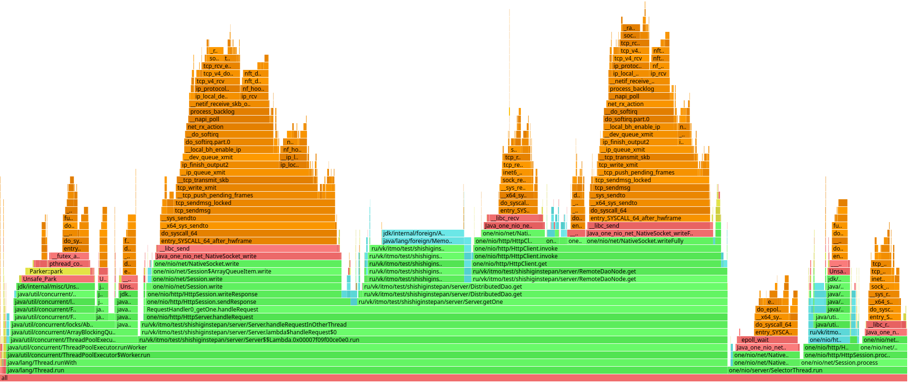
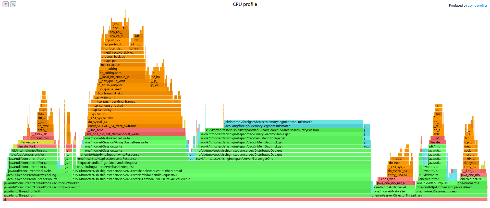
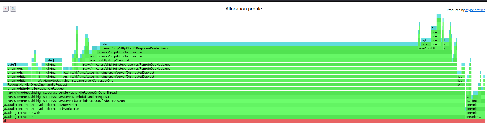
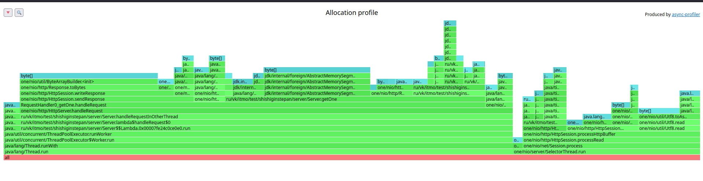

В рамках сравнительного профилирования результатов второго и третьего этапа, я проведу повторные замеры для второй лабы,
учитывая советы по поиску и анализу точки разладки от Александра Пащенко.

**Переосмысление данных прошлого этапа**

Точки разладки будем рассматривать для двух сценариев нагрузки

1. Очень много рандомных вставок
2. Очень много рандомных чтений на большом количестве ss-tables (около 600)

Значения второго этапа (будем считать их точкой отсчета)

1. **запись**

| %     | l        |
|-------|----------|
| 90    | 17.17 ms |
| 99    | 65.66 ms |
| 99.99 | 90 ms    |

Requests/sec:  94905.13

данные на запись вопросов не вызвали, оставлю как есть

2. **чтение**

   Первым делом меня смутило то что запросы на чтение отрабатывают в разы быстрее, хотя по своей сути являются сложнее
   простой вставки.

90.000% 2.13ms
99.000% 6.54ms
99.999% 18.32ms

| %     | l       |
|-------|---------|
| 90    | 2.13ms  |
| 99    | 6.54ms  |
| 99.99 | 18.32ms |

Requests/sec:  99931.35

Сначала я предположил что я тестирую mem таблицу вместо доступа к данным на диске. Рестартанув сервис и не прогревая mem
таблицу я получил те же самые результаты.
Следующим я подумал на page cache.
Я очистид page кеш и провел замеры заново.

Замеры после очистки page cache:

| %     | l      |
|-------|--------|
| 90    | 1.67 s |
| 99    | 1.79 s |
| 99.99 | 1.8 s  |

Requests/sec:  92007.16

Мои 100000 RPS с максимальными 18 ms задержки превратились в тыкву.

Итеративно очищая page cache я выяснил новую точку разладки - она находится на 10000 рпс ниже и от неё я решил
отталкиваться в сравнении

| %     | l        |
|-------|----------|
| 90    | 55.67 ms |
| 99    | 89.79 ms |
| 99.99 | 97.8 ms  |

Requests/sec:  91942.13

**Измерения третьего этапа**

Короткое резюме моего решения:

1. Использую consistent hashing для определения места ключа в системе (murmur3 в кач-ве hash функции)
2. Исползую клиент one nio
3. Решил немного запариться и написал класс который имплементирует интерфейс dao, так что в сервере почти ничего не
   поменялось, а вся работы по распределению по нодам и поиск на других нодах выпонляется в отдельном классе.

Подход к проведению замеров:

Каждая нода - отдельный java процесс на локальной машине со своим ограничением памяти в 128m.
После каждого замера выполняется перезапуск процессов с очищением page cache.

**Начнем с наполнения БД с помощью распределения данных одной нодой на другие.**

Примерно в точке 42-43 тыс. RPS находится точка разладки, это примерно 45% от RPS данного профиля нагрузки из второго
этапа.

| %     | l       |
|-------|---------|
| 90    | 2.02 ms |
| 99    | 4.45 ms |
| 99.99 | 16.1 ms |

Requests/sec:  41990.99

**Замеры чтения:**

| %     | l        |
|-------|----------|
| 90    | 2.69 ms  |
| 99    | 22.30 ms |
| 99.99 | 31.98 ms |

Requests/sec:  52988.70

Операции чтения потеряля меньше в процентом соотношении, RPS составил порядка 55% от тех же показателей на 1 ноде.

Я решил проверить соотношение количества данных на нодах:

31K db-data-0  
31K db-data-1  
33K db-data-2  

Благодаря концепции v-node которую я реализовал получается очень близкое к равномерному распределение данных.

Я решил проэксперементировать и уменьшить количество v-nodes до 3 (сейчас стоит 256)

32K db-data-0 
60K db-data-1 
19K db-data-2 

несмотря на испольование murmur3 хеширования, маленькое количество V-nod не дает хорошего распределения ключей.
Тайминги причем остались те же (погрешность 5-10%) при записи через ноду 0, т.к. она записывала примерно тот-же объем к
себе и остальное распределялось на другие ноды.

Чтение я решил проверить с двух нод:
с той в которой больше всего данных и в самой "обделенной" распределением ключей.

Нода с наибольшим владением ключами показала кратный выигрыш по задержке относительно почти "пустой" ноды(порядка 80% на
одинаковых rps), что еще раз подтверждает важность равномерного распределения данных

**Profiling**

При профилировании я решил посмотреть на профили ноды через которую идет нагрузка, а так же ноды которая обслуживает
только запросы от первой ноды.

**CPU**
Нода под пользовательской нагрузкой:

Относительно прошлого этапа на флеймграфе теперь красуются последствия походов по сети к другим нодам. Судя по
количеству семплов относящихся к вызовам методов http client'а можно сделать вывод о том насколько поход в локальное
хранилище бвстрее похода к соседней ноде.
Считал следующим образом: Всего 2000 семплов было в методе обработки get запроса. примерно 500 и них - выборка из
локального дао, 1500 - походы в соседние ноды. при этом распределение ключей стремится к равномерному, значит 1500
семплов распределились на 2 удаленные ноды равномерно. поделим на 2 и получим 750 семлов на поход в удаленную ноду.
При том что операции чтения с диска явно быстрее чем поход в сеть, можно сделать вывод что в полтора раза дольше нода
будет запрос к соседу, чем в локальное хранилище.

Нода обслуживающая запросы от первой ноды:

Можно заметить, что профиль второй ноды почти не отличается от профилей прошлого этапа, что логично.  
Добавилось чуть больше столбцов в флеймграфе из-за появившейся абстракции, но распределение семплов между основными
видами операций примерно такое же.  
Едва заметными на графе являются вызовы методов для определения ноды по алгоритму consistent hashing, 1.5% семплов
посвящены им. Значит алгоритм работает достаточно быстро и не требует доработок с точки зрения перфоманса.  
Хотя в условиях консистентной топологии нод можно было бы обойтись без вычисления хэшей второй раз, допустим, добавив
заголовок который явно говорит ноде чтобы использовалось локальное хранилище.  

Аллокации:

Нода под пользовательской нагрузкой:

Нода обслуживающая запросы от первой ноды:

Здесь картина та же - у второй ноды аллокации ничем не отличаются от прошлого этапа.

Я переживал что из-за красивой (как минимум на мой взгляд) абстракции которую я решил построить я потеряю в аллокациях
памяти из-за сериализации и десериализации ключей, но на флеймграфе видно, что операции связанные с этим аллоцируют
суммарно в двух процентах семплов, что намного лучше чем я ожидал, так что я не пожалел, что сделал (попробовал
сделать?) код немного более читаемым.

**Выводы**

Несмотря на несовершенство моего дао, сетевое взаимодействие между нодами намного сильнее влияет на производительность базы данных. 
Мне еще повезло использовать более легковесный http клиент от one nio. При беглом анализе и сравнении с джавовым клиентом с лекции, я заметил примерно двукратную разницу в аллокациях и цпу, это печально.
