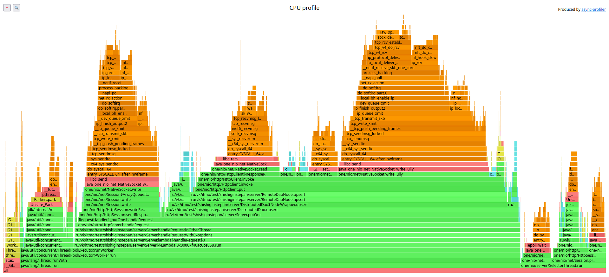
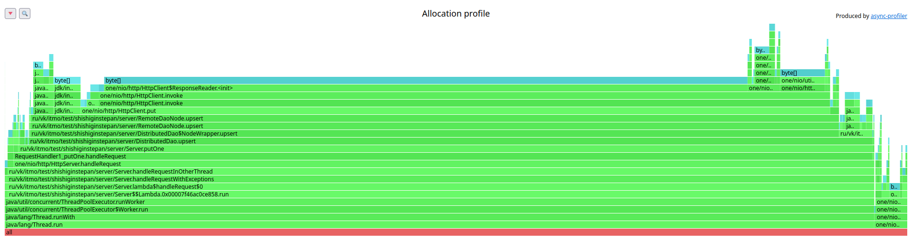
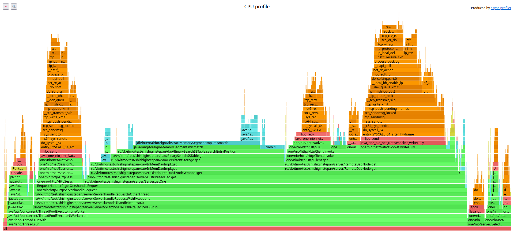
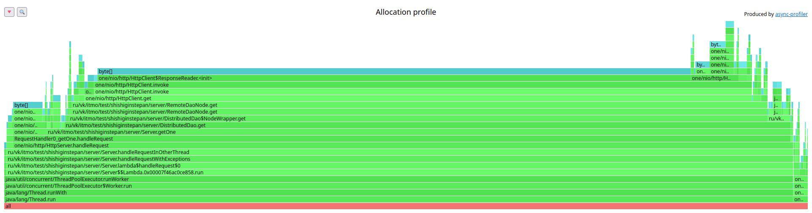

# **Этап 4. Репликация**

## Вступление

В рамках 4 этапа было реализовано репликация данных, управляемая клиентом через query параметры запросов.
Поскольку теперь запись может лежать сразу на нескольких нодах, пришлось прибегнуть к версионированию записей через timestamp при записи.

### Сложности при выполнении этапа

1. Интересно и не просто было спустя столько времени залезть в Dao и добавить поддержку сохранения временных меток на диск
2. Одной из важных задач было при репликации не допустить случая когда выбирается одна и та же Нода для сохранения значения (у меня V ноды и это было возможно)

### С чем я плохо справился
Поддерживать абстракцию в виде интерфейса Dao стало невозможно из-за появившихся параметров и мой код к сожалению стал больше похож на спагетти. В основном считаю что справился неплохо.

## Профилирование
Всех эксперименты проводитились на одной машине, ноды поднимались в разных процессах с ограничением памяти по 128 mb.
Во время всех экспериментов каждая нода читала только с диска, без мем таблицы.

Для проверки оверхеда на логику репликации я провел эксперимент и делал чтения/записи с коэффициентом репликации 1 и профили ожидаемо почти не отличались от профилей прошлого этапа.

При проведения тестов на стандартных значениях параметров (в моем случае это ack 2 from 3), количество семплов относящихся к работе локального дао увеличилось примерно в 2.5 раз.  
Это происходит так как теперь каждое чтение в данной конфигурации затрагивает все три ноды.
С алокациями еще интереснее, я еле нашел на флеймграфе аллокации происходящие в дао, они занимают меньше процента от всех семплов, в то время как аллокации на обработку ответов остальных нод 86%.

## Нагрузочное тестирование

**Замеры чтения:**

| %     | l        |
|-------|----------|
| 90    | 2.62 ms  |
| 99    | 44.86 ms |
| 99.99 | 70.46 ms |
Requests/sec:  17492.53

При поиске новой точки разладки я немного расстроился, так как чтобы вернуться к хотя бы близким значениям latency которые показывала моя БД на прошлом этапе, пришлось больше чем в два раза снизить частоту запросов.
Это как раз связано с тем что теперь и сами дао чаще работают, а так же нода буквально на каждый запрос обязана сходить по сети к соседям. Думаю что для того чтобы это починить нужно приходить к асинхронным вызовам через HTTP клиент.

## Выводы

Репликация заметно повлияла как на цпу нагрузку, так как теперь ноды в n раз чаще должны искать в dao записи (где N это коеф. репликации выбранный клиентом). Очевидной становится потребность в асинхронном взаимодействии между нодами по сети.  
Что еще печальнее, пока что не вижу способов бороться с тем, как много для сетевого взаимодействия между нодами приходится аллоцировать.  
Зато моя база данных стала более надежной, и оказалось что минимальную (самую базовую) репликацию делать не так уж и сложно.

**Приложение**:
### PUT запросы
##### СPU

##### ALLOC

### GET запросы
##### СPU

##### ALLOC

