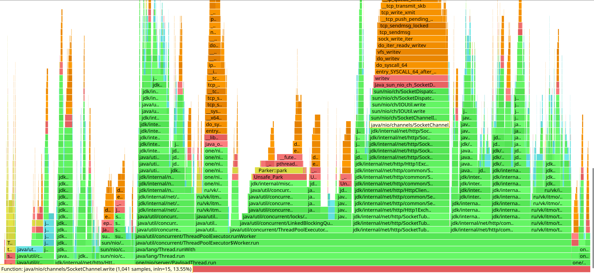
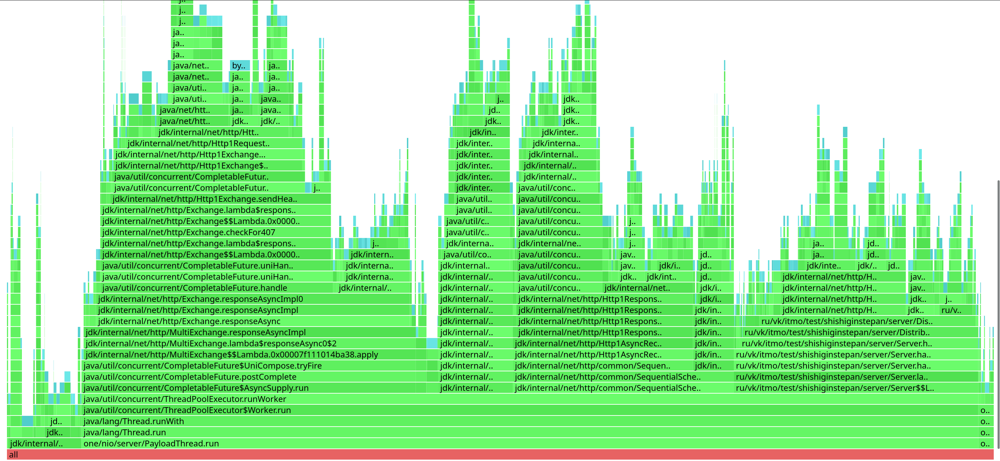
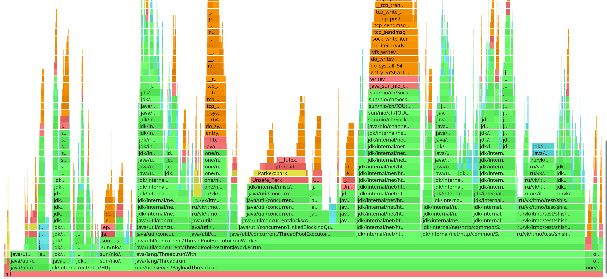
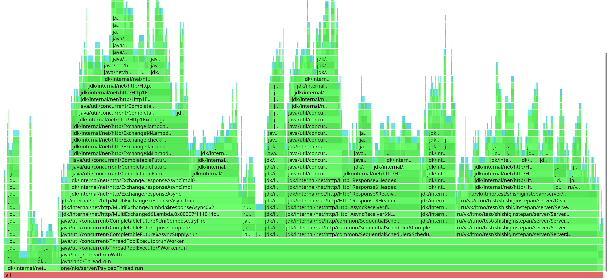

# **Этап 5. Асинхронщина*уащ*

## Вступление

Этот этап оказался самым сложным для меня. Для его реализации мне понадобилось примерно в 3 раза больше времени.

### Сложности при выполнении этапа

1. Знакомство с Future's для меня прошло достаточно гладко, но потребовало много времени чтобы разобраться в тонкостях   
(особенно как мне не получить ошибку сборки\код климат) 
2. Переход на джава клиент был не простым, но это скорее больше связано с асинхронностью, чем с самим клиентом.

### С чем я плохо справился

Так и не получилось исправить асбтракции которые я пытался рефакторить на основе прошлого этапа, более того рефакторинг сервера занял много времени и дебага.

## Профилирование
Всех эксперименты проводитились на одной машине, ноды поднимались в разных процессах с ограничением памяти по 128 mb.
Во время всех экспериментов каждая нода читала только с диска, без мем таблицы.

Профили этого этапа заполнены джавовым клиентом, особенно много он аллоцирует (в сравнении с клиентом one nio).

## Нагрузочное тестирование

**Замеры чтения:**

| %     | l        |
|-------|----------|
| 90    | 6.01 ms  |
| 99    | 43.39 ms |
| 99.99 | 49.66 ms |
Requests/sec:  11545.53

Я рассчитывал что получится понизить латенси засчет перехода на асинхронное взаимодействие,  
но переход на джава http клиент привнес его оверхед и миллионы интересных столбиков на профиле, из-за чего  
для сохранения latency прошлого этапа пришлось понизить RPS примерно в 1.5 раза (печаль)
## Выводы

Я дуамю что если бы изначально выбрал java http клиент то мог бы провести более качественное сравнение.  
В общем я считаю что задержка запросов могла бы уменьшиться, но ценой большого количества вспомогательных потоков, так что в принципе  
это хороший способ ускорить приложение и утилизировать ресурсы. Но проблемы с синхронизацией потоков могут повлиять  
( и сильно повлияли) на работоспособность системы, так как увеличилось количество блокировок.

**Приложение**:
### PUT запросы
##### СPU

##### ALLOC

### GET запросы
##### СPU

##### ALLOC

