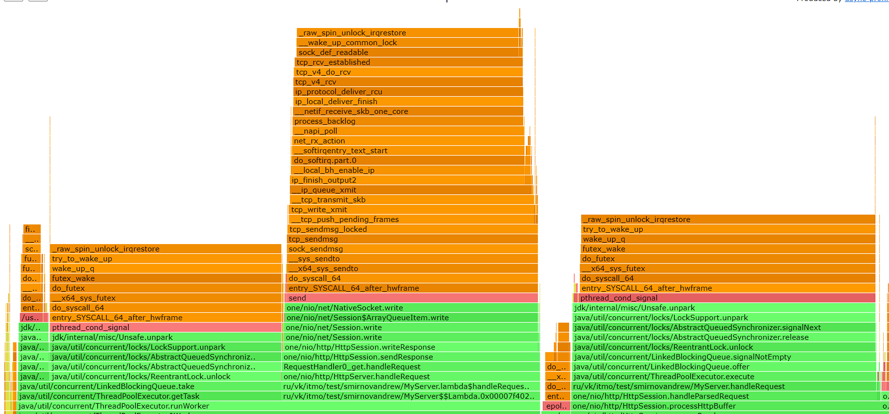
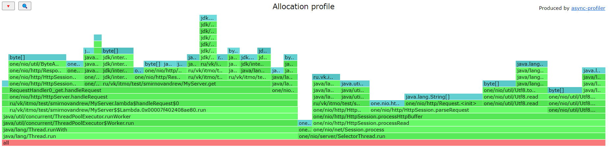
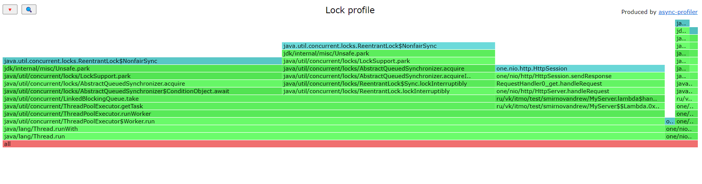
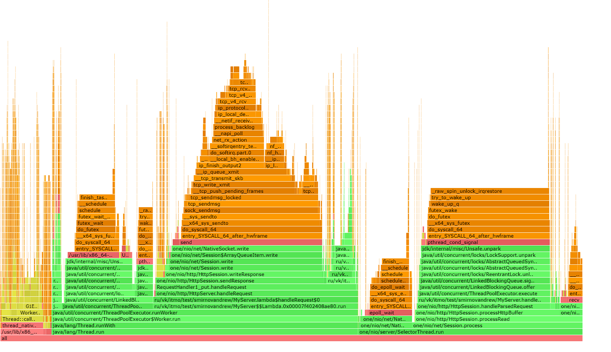
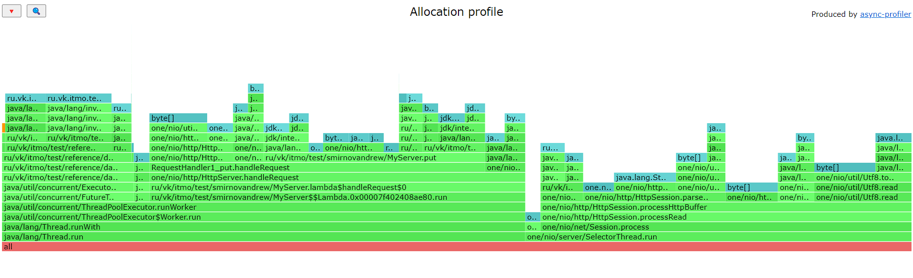
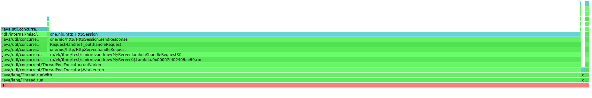

# Отчет о тестировании
## Использованные методы
Все методы реализованы так же как и методы в stage1,
как именно они реализованы можно посмотреть либо в отчете
stage1.md или в папке lua


### GET запросы

Запрос:
```agsl
./wrk -d 240 -t 1 -c 64 -R 3000 -L -s C:\JavaProjects\2024-highload-dht\src\main\java\ru\vk\itmo\test\smirnovandrew\lua\get.lua http://localhost:8080
```

На графике latency при rate=3000, также довольно хорошая и заметно увеличивается
только к 99.99%


На графике latency при rate=30000, плавно проседает от 90% и до конца


Большая нагрузка на cpu случается при lock/unlock на очереди


Аллокация так же как и в stage1 происходит в основном при преобразовании 
данных в объекты класса MemorySegment


lock берется в основном на очереди, а также при handleRequest()


### PUT запросы

Запрос:
```agsl
./wrk -d 240 -t 1 -c 64 -R 3000 -L -s C:\JavaProjects\2024-highload-dht\src\main\java\ru\vk\itmo\test\smirnovandrew\lua\put.lua http://localhost:8080
```


На графике latency при rate=3000, также довольно хорошая и заметно увеличивается
только к 99.99%


На графике latency при rate=30000, между 90% и 99% заметен резкий скачок latenency,
значение которого сохраняется до самого конца графика


Большая нагрузка на cpu случается при lock/unlock на очереди


Аллокация так же как и в stage1 происходит в основном при преобразовании
данных в объекты класса MemorySegment


lock берется в основном на очереди, а также при handleRequest()


### Сравнение на количество потоков
Запрос:
```agsl
./wrk -d 120 -t 1 -c 64 -R 3000 -L -s /home/andrew/2024-highload-dht/src/main/java/ru/vk/itmo/test/smirnovandrew/lua/get.lua http://localhost:8080
```


Как видно из графиков и на сравнении, лучше всего на большом перцентиле работает
программа с 10 потоками

Однако на перцентиле, который ближе к 99% лучше всего проявляет себя программа
с 100 потоками


### Сравнение с stage1
Запрос:
```agsl
./wrk -d 120 -t 1 -c 64 -R 3000 -L -s /home/andrew/2024-highload-dht/src/main/java/ru/vk/itmo/test/smirnovandrew/lua/get.lua http://localhost:8080
```


Используем точно такой же запрос с `64` подключениями

Оказывается, что на больших перцентилях (который большее 99.99%) программа из
stage1 тоже оказывается лучше, так как у нее меньшее latency

Однако на перцентиле, который ближе к 99% лучше всего проявляет себя программа
с 100 потоками