# Report stage 1
## Нагрузочное тестирование с помощью wrk2 в одно соединение

### Тестирование `PUT` запросами

1. **RPS: 100**, Duration: 10s

| Stats       | Time (ms) |
|-------------|-----------|
| Mean        | 1.519     |
| Max         | 5.320     |
| Total count | 1000      |

Все запросы завершились. Заметим, что примерно 99.8% запросов завершились примерно за 2.5ms. Оставшиеся 0.2% можно считать выбросами

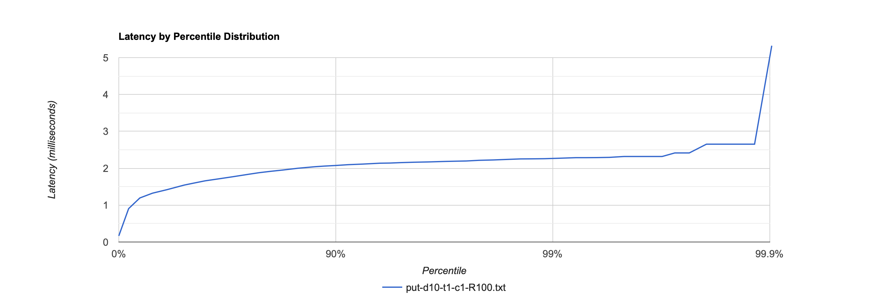

2. **RPS: 10000**, Duration: 10s

| Stats       | Time (ms) |
|-------------|-----------|
| Mean        | 0.684     |
| Max         | 7.176     |
| Total count | 99988     |

Увеличив RPS в 100 раз, можем заметить, что мы потеряли 12 запросов. Также время выполнения одного запроса уже менее стабильно, значит приближаемся к точке разладки

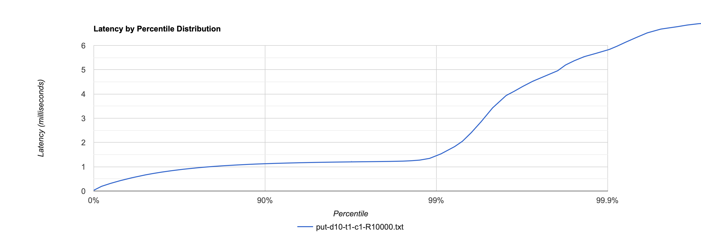

3. **RPS: 40000**, Duration: 10s

| Stats       | Time (ms) |
|-------------|-----------|
| Mean        | 3.967     |
| Max         | 28.624    |
| Total count | 399814    |

Пока всё ещё относительно хорошо

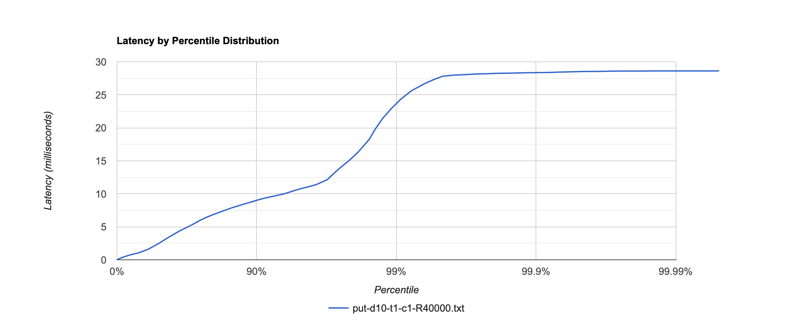

4. **RPS: 50000**, Duration: 10s

| Stats       | Time (ms) |
|-------------|-----------|
| Mean        | 1834.378  |
| Max         | 3614.720  |
| Total count | 319185    |

Здесь сервер уже не выдержал, не выполнил значительное количество запросов, а среднее время выполнения одного запроса взлетело до 2 секунд. Будем считать точкой разладки **RPS 40000**

5. **RPS: 40000**, Duration: 60s

Убедимся, что результаты стабильны во времени

| Stats       | Time (ms) |
|-------------|-----------|
| Mean        | 15.927    |
| Max         | 172.800   |
| Total count | 1999639   |

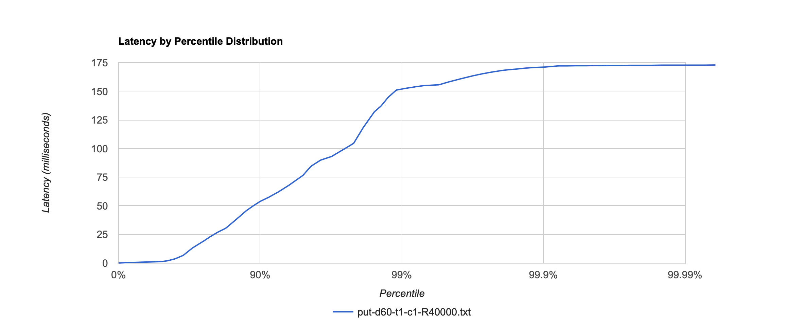

6. **RPS: 40000**, Duration: 120s

| Stats       | Time (ms) |
|-------------|-----------|
| Mean        | 8.598     |
| Max         | 187.520   |
| Total count | 4400179   |

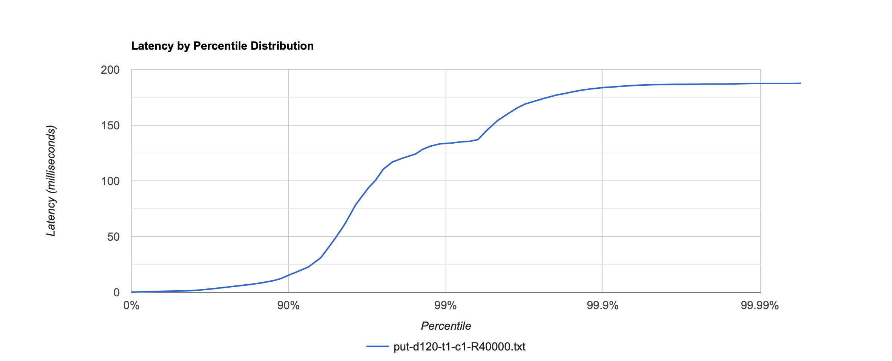

### Тестирование `GET` запросами

1. **RPS: 100**, Duration: 10s

| Stats       | Time (ms) |
|-------------|-----------|
| Mean        | 1.608     |
| Max         | 2.354     |
| Total count | 1000      |

Всё хорошо!

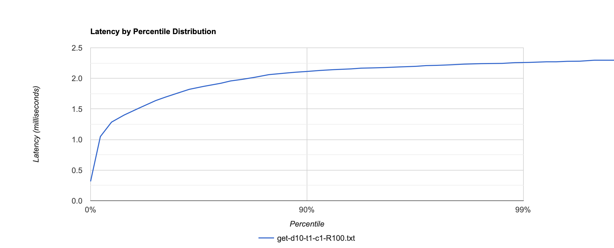

2. **RPS: 10000**, Duration: 10s

| Stats       | Time (ms) |
|-------------|-----------|
| Mean        | 0.677     |
| Max         | 5.300     |
| Total count | 99985     |

Потеряли 15 запросов. Время выполнения одного запроса менее стабильно

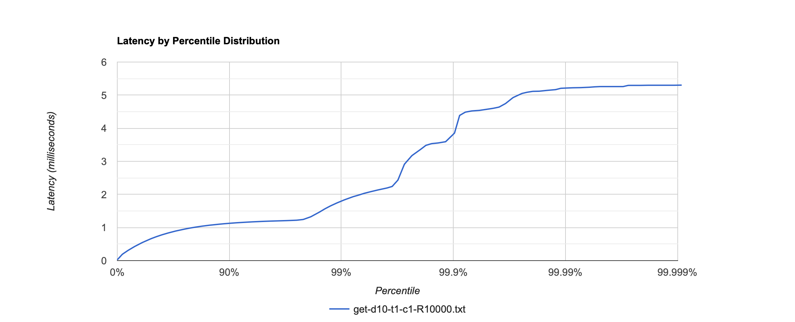

3. **RPS: 40000**, Duration: 10s

| Stats       | Time (ms) |
|-------------|-----------|
| Mean        | 1.048     |
| Max         | 16.336    |
| Total count | 399915    |

Всё хорошо!

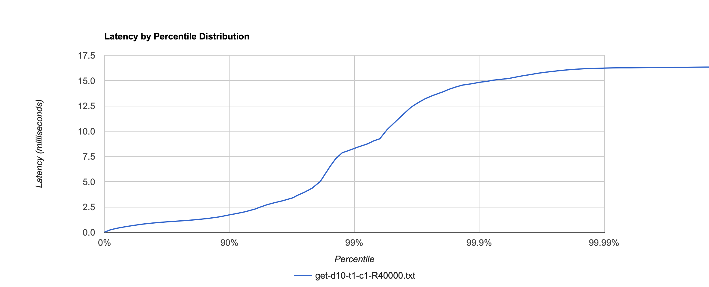

4. **RPS: 50000**, Duration: 10s

| Stats       | Time (ms) |
|-------------|-----------|
| Mean        | 723.890   |
| Max         | 1489.920  |
| Total count | 425442    |

На RPS 50000 опять сломались, однако выполнилось больше запросов, чем в случае с `PUT`-запросами, и время исполнения одного запроса меньше. Так же будем считать точкой разладки **RPS 40000**

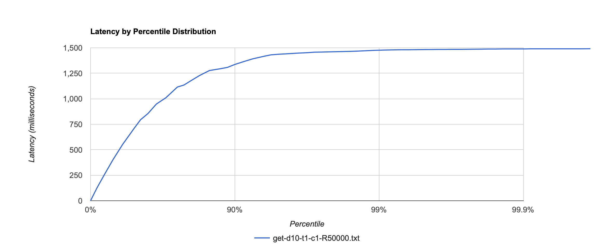

5. **RPS: 40000**, Duration: 60s

Убедимся, что результаты стабильны во времени

| Stats       | Time (ms) |
|-------------|-----------|
| Mean        | 0.890     |
| Max         | 4.492     |
| Total count | 1999807   |

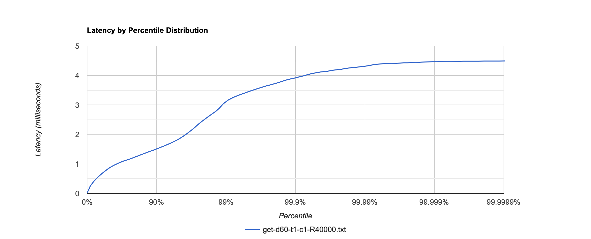

6. **RPS: 40000**, Duration: 120s

| Stats       | Time (ms) |
|-------------|-----------|
| Mean        | 7.034     |
| Max         | 155.904   |
| Total count | 4399819   |

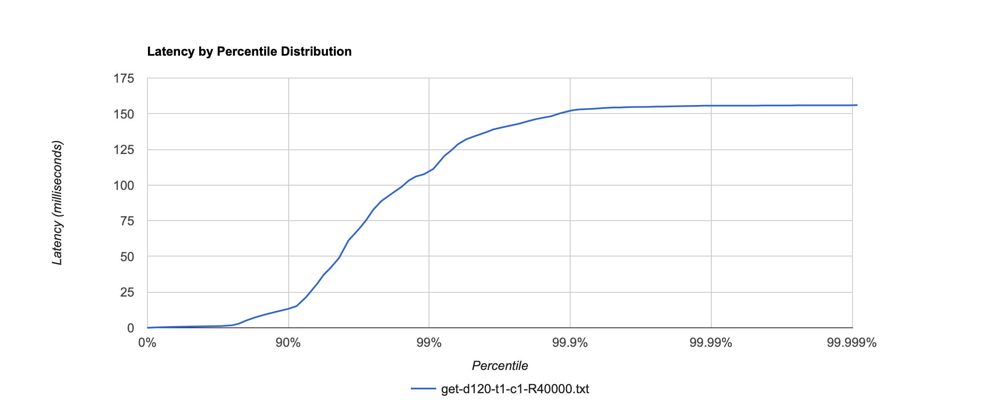

## Профилирование с помощью async-profiler

### Профилирование под нагрузкой `GET` запросами

Рассмотрим [flame graph для CPU](flame_graphs/get_cpu.html). Больше всего CPU используется при поиске `entry` в памяти,
а именно во время сравнения `MemorySegment`-ов.

Рассмотрим [flame graph для аллокаций](flame_graphs/get_alloc.html). Большинство 
аллокаций происходит в процессе поиска значения по ключу в dao на диске, что логично, так как мы аллоцируем много 
сегментов для сравнения между собой и сопоставления с ключом.

### Профилирование под нагрузкой `PUT` запросами

Рассмотрим [flame graph для CPU](flame_graphs/put_cpu.html). Здесь у нас много CPU используется для обработки
`PUT`-запроса: примерно поровну между методами `dao.upsert()` и `sendResponse()`.

Рассмотрим [flame graph для аллокаций](flame_graphs/put_alloc.html). Тут у нас нет такого большого и ярко-выраженного 
количества аллокаций, как при `GET`-запросах, так как в при `PUT` запросе мы аллоцируем только 2 `MemorySegment`-а для
`key` и `value`.

Для всех графов можно заметить, что большинство сценариев начинается с ожидания запроса в методе `SelectorThread.run()`.