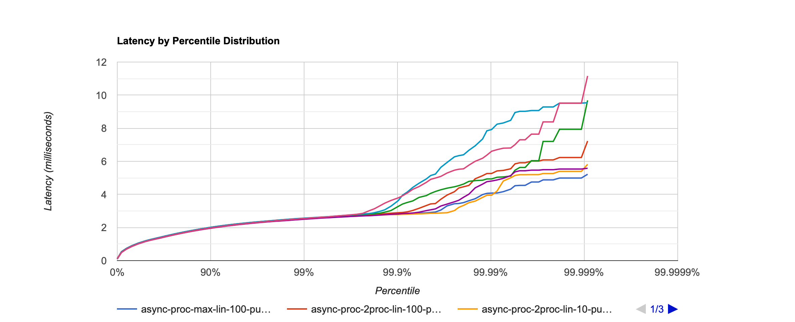
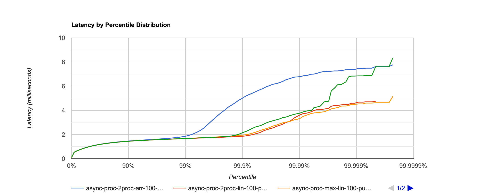
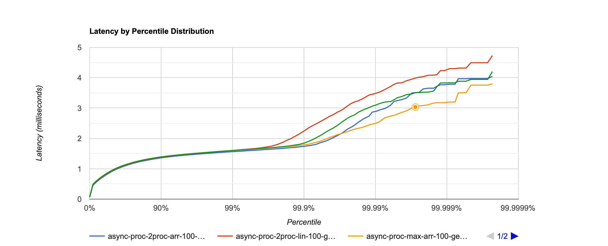
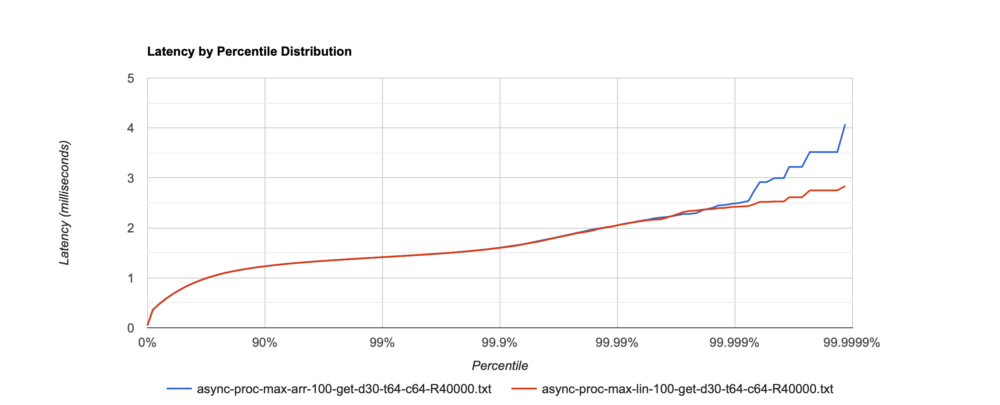
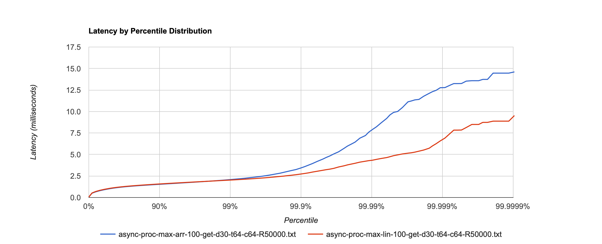
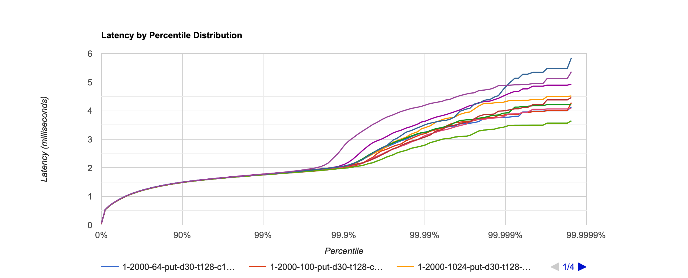
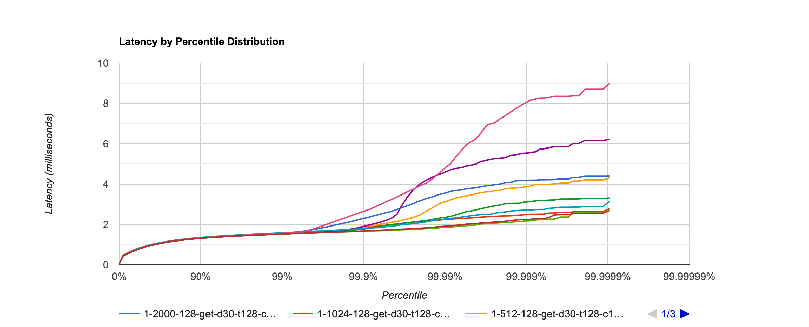
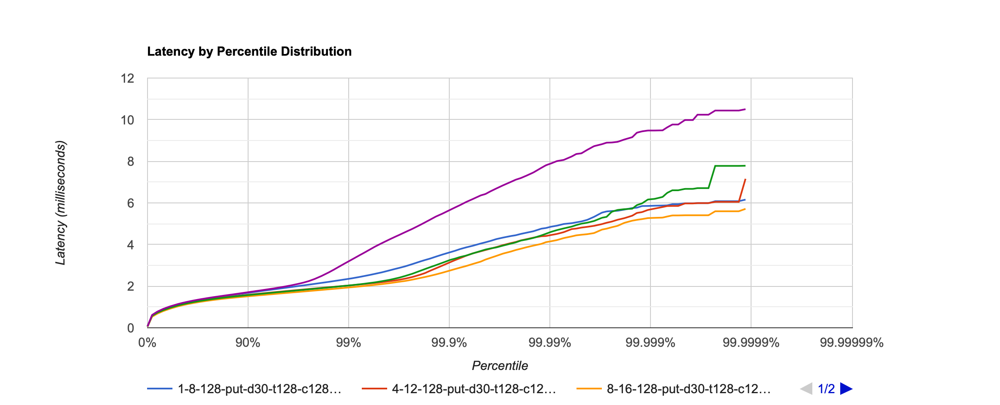
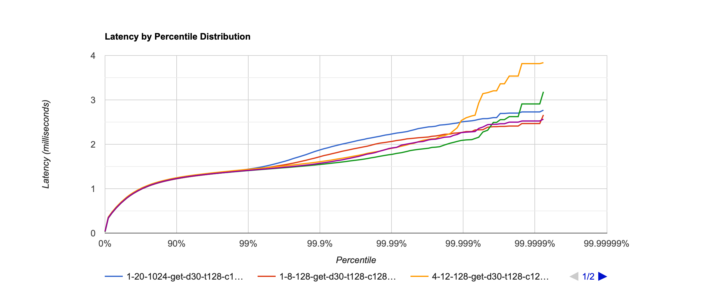

# Report stage 2
## Подбор параметров `ExecutorService`

Посмотрим, стал ли сервер работать лучше после того, как мы разгрузили `SelectorThread`ы. Будем изменять параметры и 
сравнивать с предыдущим этапом с помощью нагрузочного тестирования. На момент начала тестирования база заполнена 
примерно на 230mb. Для тестирования используем скрипт [`put.lua`](../wrk_scripts/put.lua). В качестве `id` используются
рандомные строки длины 3, в качестве `body` - рандомные строки длины 300. Рандомные строки генерируются из словаря
длины 62, т.е. у нас примерно 240.000 возможных ключей.

### SynchronousQueue

```java
int corePoolSize = 1
int maximumPoolSize = Integer.MAX_VALUE
BlockingQueue<Runnable> workQueue = new SynchronousQueue<>()
```

В качестве очереди используем `SynchronousQueue`, а количество воркеров разрешим любое. Таким образом, когда будет
прилетать новая задачка, она будет делегироваться любому активному треду или сразу будет создаваться новый тред. Сравним
с последовательным сервером на одних параметрах.

#### `PUT` requests, RPS: 5000, Connections: 64, Threads: 64, Duration: 30s

Ожидаемо, асинхронный сервер обрабатывает запросы быстрее. Однако с таким подходом однажды мы достигнем максимального
количества потоков и получим reject. Попробуем взять другую очередь.


### LinkedBlockingQueue

```java
int corePoolSize = 1
BlockingQueue<Runnable> workQueue = new LinkedBlockingQueue<>()
```

Так как `LinkedBlockingQueue` в данном случае не ограничена по размеру, то она никогда не заполнится, а значит 
`maxPoolSize` не имеет значения, всегда будет использоваться фиксированное количество тредов `corePoolSize`.

#### `PUT` requests, RPS: 5000, Connections: 64, Threads: 64, Duration: 30s

Ожидаемо этот вариант работает медленнее, чем все рассмотренные прежде, потому что, он пускает все задачи в 1 поток,
тогда как в предыдущем этапе задачи выполняются в тредах-селекторах, которых фиксированное количество, а в случае с
`SynchronousQueue` тредов вообще сколько угодно.


Заметим, что если не указывать явно количество селекторов при создании [`MyHttpServer`](../MyHttpServer.java), в
конструкторе `Server` их аллоцируется столько же, сколько и доступных процессоров. Поставим столько же воркеров.

```java
int corePoolSize = Runtime.getRuntime().availableProcessors()
BlockingQueue<Runnable> workQueue = new LinkedBlockingQueue<>()
```

Как и ожидалось, этот вариант будет работать примерно так же, как и вариант из предыдущего этапа.


Сделаем вывод, что чем больше `corePoolSize`, тем лучше latency. Однако вариант с неограниченной очередью нас тоже не
устраивает, потому что однажды мы можем получить `OutOfMemoryException`. Рассмотрим очереди с capacity.

### LinkedBlockingQueue with capacity and ArrayBlockingQueue

Если мы ограничиваем размер очереди, у нас появляется новый сценарий - максимальное количество тредов загружено и 
очередь заполнена. В таком случае введём `RejectedExecutionHandler` чтобы корректно обрабатывать такие случаи. Завернём
`Runnable` в `Task`, чтобы передавать в `ExecutorService` сессию, а в `reject()` будем отправлять в сессию
`Response.PAYMENT_REQUIRED`.

Попробуем нагрузить `LinkedBlockingQueue` и fair `ArrayBlockingQueue` `PUT` запросами при разных 
параметрах `queue capacity` (10 и 100) и `maxPoolSize` (`Integer.MAX_VALUE` и `2 * corePoolSize`). `corePoolSize = 
Runtime.getRuntime().availableProcessors()`

#### `PUT` requests, RPS: 5000, Connections: 64, Threads: 64, Duration: 30s

Интересно, что при использовании обеих очередей, с `queue capacity = 10` и `maxPoolSize = 2 * corePoolSize` мы получили
небольшое количество rejectов (меньше 0,001% от всех запросов). Сделаем вывод, что для такого размера очереди pool
должен быть больше. 

Лучше всех в данном сравнении себя показала `LinkedBlockingQueue` с `queue capacity = 100` и `maxPoolSize = 
Integer.MAX_VALUE`.



Продолжим сравнение на более высоких RPS исключив варианты с rejectами и добавив non-fair `ArrayBlockingQueue`.

#### `PUT` requests, RPS: 20.000, Connections: 64, Threads: 64, Duration: 30s

Fair `ArrayBlockingQueue` показала себя очень неэффективной, улетев до средней latency в 100ms, поэтому для наглядности
на графике результатов с ней нет. `LinkedBlockingQueue` и non-fair `ArrayBlockingQueue` с `queue capacity = 10` и 
`maxPoolSize = Integer.MAX_VALUE` привели к`OutOfMemoryError`: сервер пытался выделить больше потоков, чем физически 
позволяло железо, а при ограничении `maxPoolSize = 2000` (примерно такой предел) выдавал много rejectов, поэтому
этих ситуаций также нет на графике. Интересно, что такого не произошло только с fair `ArrayBlockingQueue` с такими же
параметрами: она ответила на все запросы, но опять же очень медленно.

Лучше всех отработала `LinkedBlockingQueue` с `queue capacity = 100` независимо от `maxPoolSize`.



### Сравнение очередей на профилях

Мне стало интересно, почему `LinkedBlockingQueue` работает лучше, чем non-fair `ArrayBlockingQueue`, поэтому я решила
посмотреть на профили.

#### `PUT` requests, RPS: 20.000, Connections: 64, Threads: 64, Duration: 30s

Профили CPU и аллокаций не показали никаких существенных различий ([lin-cpu.html](flame_graphs/stage2/lin-cpu.html), 
[arr-cpu.html](flame_graphs/stage2/arr-cpu.html), [lin-alloc.html](flame_graphs/stage2/lin-alloc.html),
[arr-alloc.html](flame_graphs/stage2/arr-alloc.html)). Разница была замечена только на профилях блокировок 
([lin-lock.html](flame_graphs/stage2/lin-lock.html), [arr-lock.html](flame_graphs/stage2/arr-lock.html)): в
`ArrayBlockingQueue` сервер тратит больше времени на то, чтобы взять блокировку. Я связываю это с тем, что в реализации
`ArrayBlockingQueue` используется 1 lock для операций вида put и poll, а в `LinkedBlockingQueue` их два: каждый для
своего вида операций. Поэтому при использовании `ArrayBlockingQueue` времени ожидания блокировки в 2 раза больше.

Итак, делаю вывод, что эффективнее всего использовать `LinkedBlockingQueue`.

### Сравнение очередей на больших нагрузках

#### `GET` requests, RPS: 20.000, Connections: 64, Threads: 64, Duration: 30s

На `GET` запросах разница сперва вообще не видна. Ответа на вопрос, почему так, я не нашла.



Попробуем увеличить RPS и поменять количество соединений

#### `GET` requests, RPS: 40.000, Connections: 64, Threads: 64, Duration: 30s



#### `GET` requests, RPS: 50.000, Connections: 64, Threads: 64, Duration: 30s



#### `GET` requests, RPS: 50.000, Connections: 128, Threads: 128, Duration: 30s


Из экспериментов видим, что лидер сменяется. Остановимся на `LinkedBlockingQueue` исходя из результатов `PUT` запросов.

### Сравнение разных размеров пулов и очередей

Быстрее всего отвечали и на `PUT`, и на `GET` запросы серверы с маленьким пулом воркеров и большим размером очереди.
Маленький пул позволяет экономить на ресурсах процессора и уменьшает оверхед на переключение между тредами. Большая 
очередь нужна, чтобы хранить таски, которые пока не могут быть взяты в работу воркерами.





### Нахождение наилучшего соотношения размеров пула и очереди

При обоих типов запросов одинаковое.

```java
int corePoolSize = 8
int maximumPoolSize = 16
int queueCapacity = 128
```





Вывод: наилучшие параметры `ExecutorService` следующие:

```java
int corePoolSize = 8
int maximumPoolSize = 16
BlockingQueue<Runnable> workQueue = new LinkedBlockingQueue<>(128)
```
