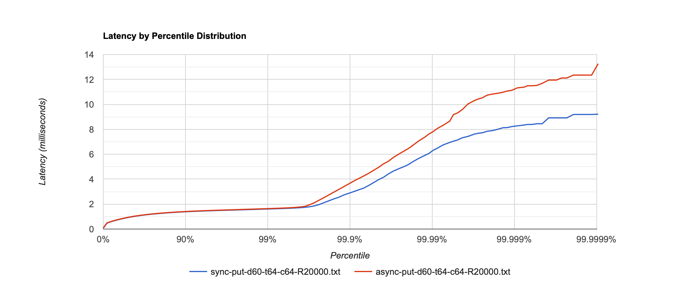
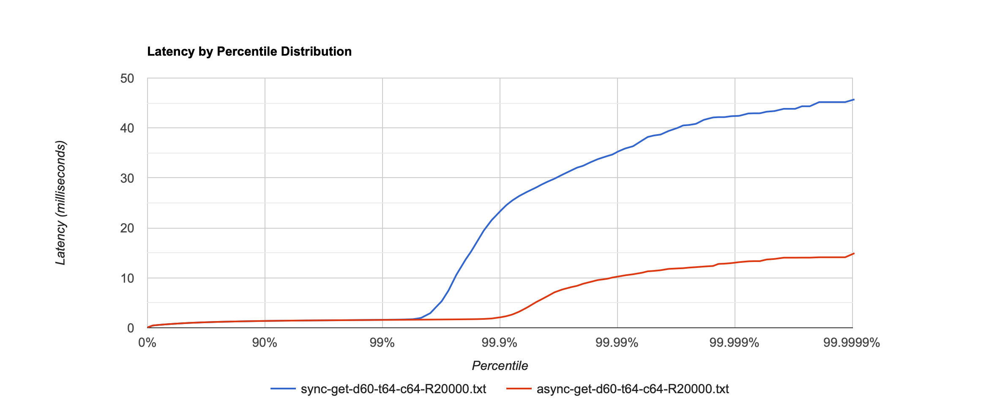
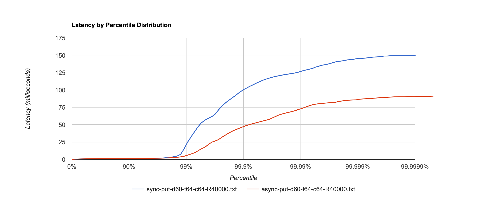

# Report stage 5
## Нагрузочное тестирование в несколько соединений, сравнение с предыдущей неасинхронной версией

Посмотрим, стал ли сервер работать лучше после того, как мы сделали все потоки неблокируещимися. Будем сравнивать с 
предыдущим этапом с помощью нагрузочного тестирования. На момент начала тестирования база заполнена 
примерно на 100mb. Для тестирования используем скрипт [`put.lua`](../wrk_scripts/put.lua). В качестве `id` используются
рандомные строки длины 3, в качестве `body` - рандомные строки длины 300. Рандомные строки генерируются из словаря
длины 62, т.е. у нас примерно 240.000 возможных ключей.

#### PUT запросы, RPS: 20000, Connections: 64, Threads: 64, Duration: 60s

Неожиданно, асинхронный сервер обрабатывает запросы медленнее неасинхронного.

#### GET запросы, RPS: 20000, Connections: 64, Threads: 64, Duration: 60s

На GET-запросах ситуация обратная.

#### PUT запросы, RPS: 40000, Connections: 64, Threads: 64, Duration: 60s

Посмотрим на максимальную нагрузку, которую выдерживал сервер на предыдущих этапах.
На точке разладки асинхронный сервер работает гораздо быстрее неасинхронного.

## Профилирование под нагрузкой, сравнение с предыдущей неасинхронной версией

#### PUT запросы, RPS: 30000, Connections: 64, Threads: 64, Duration: 30s

На профилях CPU можем заметить, что в асинхронной версии доставание тасок из очереди, их выполнение и отсылку респонсов
делает другой поток (PayloadThread). Это логично: ведь SelectorThread-ы сразу возвращаются с Future
([async-put-cpu.html](flame_graphs/stage5/cpu/async-put-cpu.html), [sync-put-cpu.html](flame_graphs/stage5/cpu/sync-put-cpu.html))

Профили аллокаций показали такую же ситуацию ([async-put-alloc.html](flame_graphs/stage5/alloc/async-put-alloc.html), [sync-put-alloc.html](flame_graphs/stage5/alloc/sync-put-alloc.html)).
В остальном кажется, что ресурсы (что ресурсы процессора, что выделение памяти) распределены так же как в неасинхронном
сервере, разве что методы распределились между разными типами тредов.

Главное различие заметно на профилях блокировок: асинхронный сервер почти не блокирует потоки, когда задача попадает в
`ThreadPoolExecutor`, это доказательство того, что всё сделано правильно ([async-put-lock.html](flame_graphs/stage5/lock/async-put-lock.html), [sync-put-lock.html](flame_graphs/stage5/lock/sync-put-lock.html))