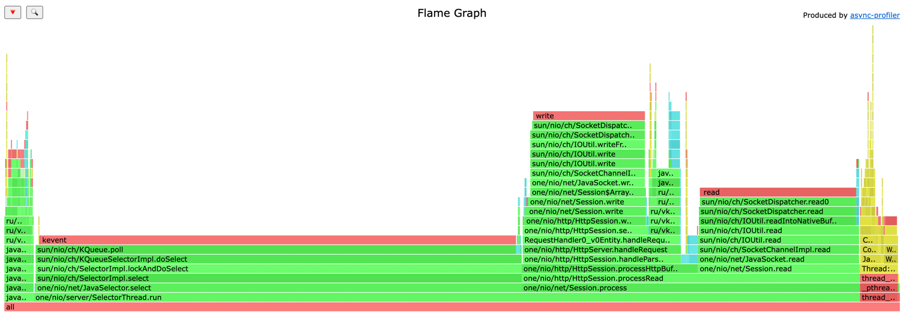
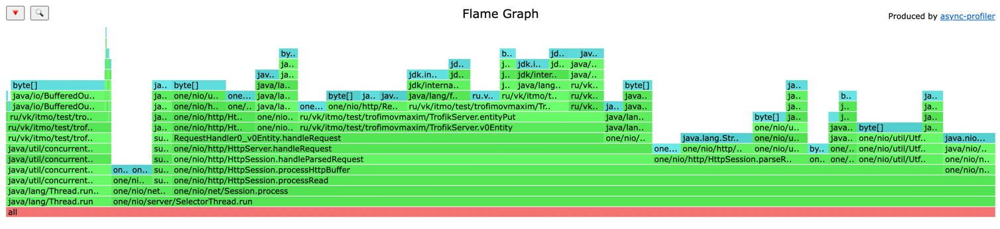
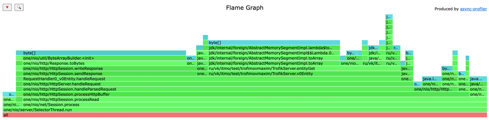

## PUT

```
i111433450:wrk2-arm trofik00777$ ./wrk -c 1 -t 1 -s /Users/trofik00777/Documents/itmo_s6/highload/2024-highload-dht/src/main/java/ru/vk/itmo/test/trofimovmaxim/lua/stage1/check_put.lua -d 1m -R 20000 "http://localhost:8080" 
Running 1m test @ http://localhost:8080
  1 threads and 1 connections
  Thread calibration: mean lat.: 2.417ms, rate sampling interval: 10ms
  Thread Stats   Avg      Stdev     Max   +/- Stdev
    Latency     1.51ms    1.17ms  19.20ms   75.72%
    Req/Sec    16.04k     9.56k   42.33k    69.00%
  961459 requests in 1.00m, 61.43MB read
  Socket errors: connect 0, read 0, write 0, timeout 5
Requests/sec:  16022.38
Transfer/sec:      1.02MB
```

Можем заметить что при `rps=20k` наш сервер обрабатывает лишь `16k` запросов. Будем проводить профилирование на `10k rps`

```
i111433450:wrk2-arm trofik00777$ ./wrk -c 1 -t 1 -s /Users/trofik00777/Documents/itmo_s6/highload/2024-highload-dht/src/main/java/ru/vk/itmo/test/trofimovmaxim/lua/stage1/check_put.lua -d 1m -R 10000 "http://localhost:8080" 
Running 1m test @ http://localhost:8080
  1 threads and 1 connections
  Thread calibration: mean lat.: 1.424ms, rate sampling interval: 10ms
  Thread Stats   Avg      Stdev     Max   +/- Stdev
    Latency     1.42ms    2.18ms  50.85ms   98.13%
    Req/Sec    10.55k     1.62k   40.40k    86.14%
  599981 requests in 1.00m, 38.34MB read
Requests/sec:   9999.62
Transfer/sec:    654.27KB
```



Замечаем, что 50% времени тратится на select, 20% на чтение запроса, 15% на запись ответа и ~5% на поход в бд



Замечаем, что 50% аллокаций происходит в handleRequest, тк там происходят конвертации String в MemorySegment, 10% на поход в бд, 15% на парсинг запроса


## GET

Заполнил базу 600к значениями

```
i111433450:wrk2-arm trofik00777$ ./wrk -c 1 -t 1 -s /Users/trofik00777/Documents/itmo_s6/highload/2024-highload-dht/src/main/java/ru/vk/itmo/test/trofimovmaxim/lua/stage1/check_get.lua -d 1m -R 50000 "http://localhost:8080" 
Running 1m test @ http://localhost:8080
  1 threads and 1 connections
  Thread calibration: mean lat.: 1250.495ms, rate sampling interval: 4448ms
  Thread Stats   Avg      Stdev     Max   +/- Stdev
    Latency     9.14s     3.97s   15.88s    56.33%
    Req/Sec    36.55k     1.43k   37.90k    81.82%
  2205527 requests in 1.00m, 1.33GB read
  Non-2xx or 3xx responses: 4
Requests/sec:  36758.78
Transfer/sec:     22.62MB
```

Будем профилировать на 20к rps

```
i111433450:wrk2-arm trofik00777$ ./wrk -c 1 -t 1 -s /Users/trofik00777/Documents/itmo_s6/highload/2024-highload-dht/src/main/java/ru/vk/itmo/test/trofimovmaxim/lua/stage1/check_get.lua -d 1m -R 20000 "http://localhost:8080" 
Running 1m test @ http://localhost:8080
  1 threads and 1 connections
  Thread calibration: mean lat.: 1.776ms, rate sampling interval: 10ms
  Thread Stats   Avg      Stdev     Max   +/- Stdev
    Latency     1.89ms    9.37ms 143.62ms   98.57%
    Req/Sec    21.11k     3.30k   42.00k    80.82%
  1199973 requests in 1.00m, 738.49MB read
  Non-2xx or 3xx responses: 3
Requests/sec:  19999.56
Transfer/sec:     12.31MB
```


50% времени тратится на select, 12% на отправку ответа, 23% на поход в бд, 12% на чтение запроса



35% аллокаций происходит при отправке ответа, 39% при обработке запроса (из них <5% на поход в бд)

## вывод

Из всего проанализированного можно сделать вывод, что бОльшая часть аллокаций происходит при конвертации строк из запроса в memory segment. Чтобы это соптимизировать можно напрямую с байтами из запроса работать
