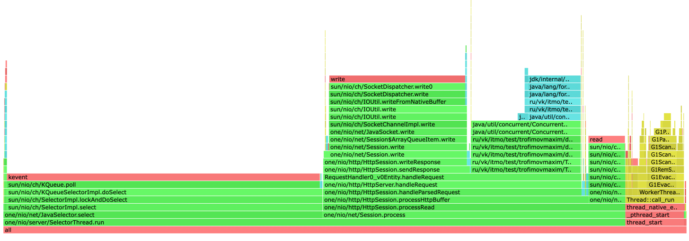
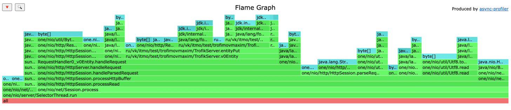
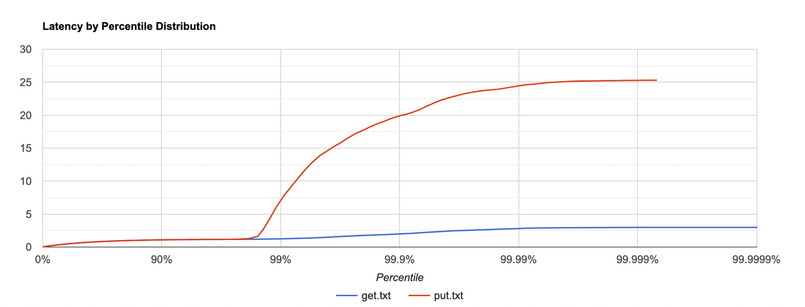
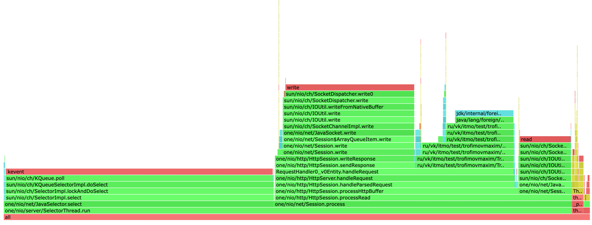
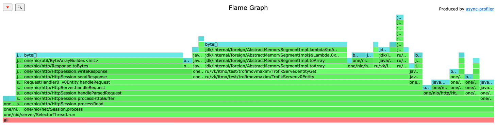

## PUT

```
i111433450:wrk2-arm trofik00777$ ./wrk -c 1 -t 1 -s /Users/trofik00777/Documents/itmo_s6/highload/2024-highload-dht/src/main/java/ru/vk/itmo/test/trofimovmaxim/lua/stage1/check_put.lua -d 1m -R 35000 "http://localhost:8080" 
Running 1m test @ http://localhost:8080
  1 threads and 1 connections
  Thread calibration: mean lat.: 62.996ms, rate sampling interval: 284ms
  Thread Stats   Avg      Stdev     Max   +/- Stdev
    Latency   341.24ms  156.37ms 635.39ms   59.73%
    Req/Sec    34.74k     1.56k   41.80k    86.93%
  2077981 requests in 1.00m, 132.78MB read
Requests/sec:  32633.09
Transfer/sec:      2.21MB
```

Можем заметить что при `rps>35k` наш сервер обрабатывает лишь `32k` запросов. Будем проводить профилирование на `30k rps`

```
i111433450:wrk2-arm trofik00777$ ./wrk -c 1 -t 1 -s /Users/trofik00777/Documents/itmo_s6/highload/2024-highload-dht/src/main/java/ru/vk/itmo/test/trofimovmaxim/lua/stage1/check_put.lua -d 1m -R 30000 "http://localhost:8080" 
Running 1m test @ http://localhost:8080
  1 threads and 1 connections
  Thread calibration: mean lat.: 2.677ms, rate sampling interval: 10ms
  Thread Stats   Avg      Stdev     Max   +/- Stdev
    Latency   767.68us    1.47ms  25.52ms   98.47%
    Req/Sec    31.71k     2.98k   47.00k    79.11%
  1799966 requests in 1.00m, 115.01MB read
Requests/sec:  29999.35
Transfer/sec:      1.92MB
```



Замечаем, что 46% времени тратится на select, 5% на чтение запроса, 21% на запись ответа и 16% на поход в бд



Замечаем, что 50% аллокаций происходит в handleRequest, тк там происходят конвертации String в MemorySegment, 17% на парсинг запроса


## GET

Заполнил базу 600к значениями

```
i111433450:wrk2-arm trofik00777$ ./wrk -c 1 -t 1 -s /Users/trofik00777/Documents/itmo_s6/highload/2024-highload-dht/src/main/java/ru/vk/itmo/test/trofimovmaxim/lua/stage1/check_get.lua -d 1m -R 50000 "http://localhost:8080" 
Running 1m test @ http://localhost:8080
  1 threads and 1 connections
  Thread calibration: mean lat.: 1250.495ms, rate sampling interval: 4448ms
  Thread Stats   Avg      Stdev     Max   +/- Stdev
    Latency     9.14s     3.97s   15.88s    56.33%
    Req/Sec    36.55k     1.43k   37.90k    81.82%
  2205527 requests in 1.00m, 1.33GB read
  Non-2xx or 3xx responses: 4
Requests/sec:  36758.78
Transfer/sec:     22.62MB
```

Будем профилировать на 35к rps

```
i111433450:wrk2-arm trofik00777$ ./wrk -c 1 -t 1 -s /Users/trofik00777/Documents/itmo_s6/highload/2024-highload-dht/src/main/java/ru/vk/itmo/test/trofimovmaxim/lua/stage1/check_get.lua -d 1m -R 35000 "http://localhost:8080" 
Running 1m test @ http://localhost:8080
  1 threads and 1 connections
  Thread calibration: mean lat.: 1.044ms, rate sampling interval: 10ms
  Thread Stats   Avg      Stdev     Max   +/- Stdev
    Latency   637.86us  433.86us   8.30ms   73.83%
    Req/Sec    36.95k     2.90k   46.78k    56.26%
  2099971 requests in 1.00m, 1.26GB read
  Non-2xx or 3xx responses: 4
Requests/sec:  34999.22
Transfer/sec:     21.54MB
```





46% времени тратится на select, 24% на отправку ответа, 16% на поход в бд, 10% на чтение запроса



34% аллокаций происходит при отправке ответа, 41% при обработке запроса (из них <3% на поход в бд)

## вывод

Из всего проанализированного можно сделать вывод, что бОльшая часть аллокаций происходит при конвертации строк из запроса в memory segment.
БОльшая часть cpu тратится на select/read_request/write_response, тут оптимизировать мало что получится, но конечно основное ускорение можно дать с помощью увеличения ресурсов (сделать несколько обрабатывающих машинок) и/или более "тонко подходящими" настройками сервера нашего. А вот 16% cpu которые тратятся на поход в бд потенциально можно немного ускорить подправив реализацию DAO.
