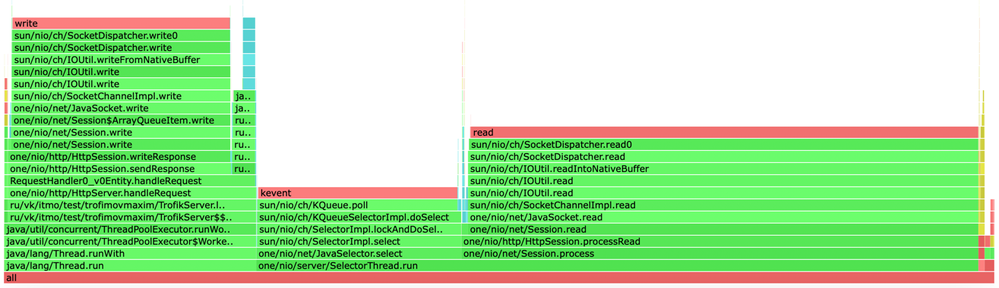
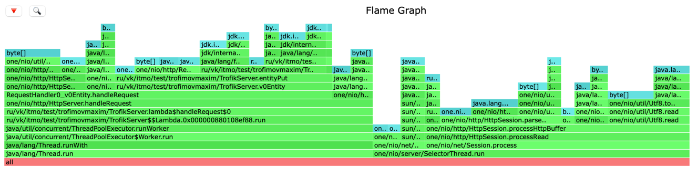
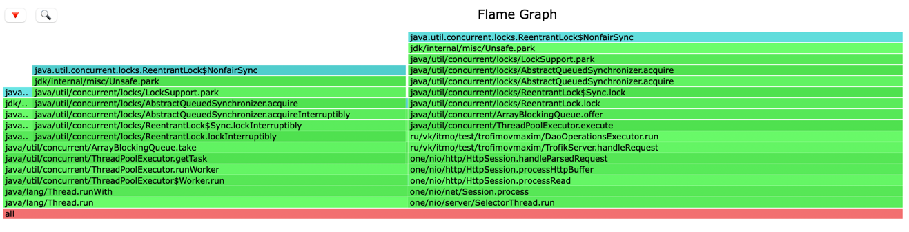
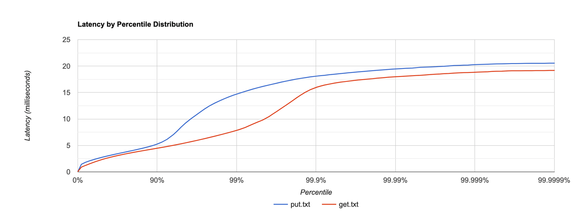
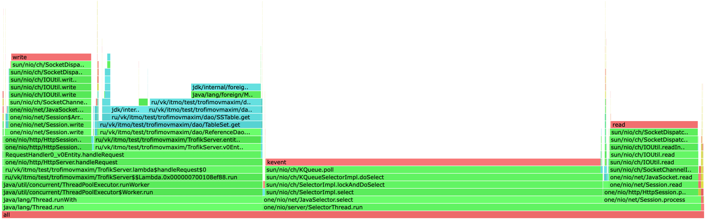
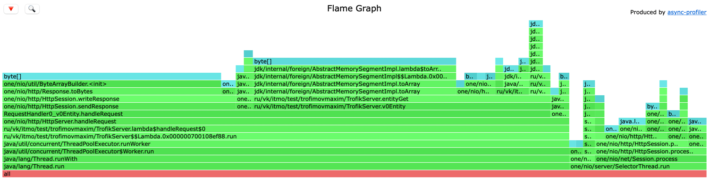
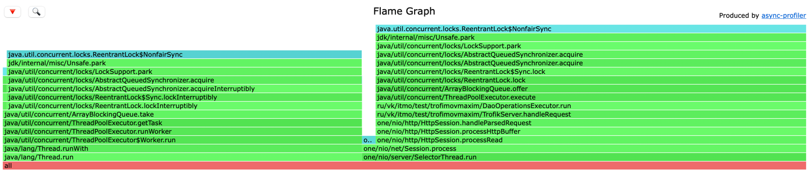

## PUT

```
i111433450:wrk2-arm trofik00777$ ./wrk -c 64 -t 4 -s /Users/trofik00777/Documents/itmo_s6/highload/2024-highload-dht/src/main/java/ru/vk/itmo/test/trofimovmaxim/lua/stage1/check_put.lua -d 1m -R 55000 "http://localhost:8080" -L 
Running 1m test @ http://localhost:8080
  4 threads and 64 connections
  Thread calibration: mean lat.: 104.359ms, rate sampling interval: 395ms
  Thread calibration: mean lat.: 111.724ms, rate sampling interval: 405ms
  Thread calibration: mean lat.: 112.485ms, rate sampling interval: 414ms
  Thread calibration: mean lat.: 120.041ms, rate sampling interval: 425ms
  Thread Stats   Avg      Stdev     Max   +/- Stdev
    Latency    56.49ms   49.71ms 255.36ms   76.22%
    Req/Sec    13.78k   820.51    19.36k    85.80%
  3292173 requests in 1.00m, 210.68MB read
Requests/sec:  52953.05
Transfer/sec:      3.51MB
```

Можем заметить что при `rps>55k` сильно вырос latency. Будем проводить профилирование на `50k rps`

```
i111433450:wrk2-arm trofik00777$ ./wrk -c 64 -t 4 -s /Users/trofik00777/Documents/itmo_s6/highload/2024-highload-dht/src/main/java/ru/vk/itmo/test/trofimovmaxim/lua/stage1/check_put.lua -d 1m -R 50000 "http://localhost:8080" -L 
Running 1m test @ http://localhost:8080
  4 threads and 64 connections
  Thread calibration: mean lat.: 4.451ms, rate sampling interval: 20ms
  Thread calibration: mean lat.: 4.202ms, rate sampling interval: 18ms
  Thread calibration: mean lat.: 4.757ms, rate sampling interval: 22ms
  Thread calibration: mean lat.: 4.655ms, rate sampling interval: 21ms
  Thread Stats   Avg      Stdev     Max   +/- Stdev
    Latency     2.63ms    1.65ms  18.08ms   88.05%
    Req/Sec    12.83k   831.49    22.47k    75.94%
  2997989 requests in 1.00m, 191.56MB read
Requests/sec:  49966.93
Transfer/sec:      3.19MB
```



Замечаем, что 20% времени тратится на select, 51% на чтение запроса, 22% на запись ответа и 2% на поход в бд



Замечаем, что 53% аллокаций происходит в handleRequest, тк там происходят конвертации String в MemorySegment, 38% на парсинг запроса



Значимую часть блокировок занимает работа с очередями

## GET

Заполнил базу 600к значениями

```
i111433450:wrk2-arm trofik00777$ ./wrk -c 64 -t 4 -s /Users/trofik00777/Documents/itmo_s6/highload/2024-highload-dht/src/main/java/ru/vk/itmo/test/trofimovmaxim/lua/stage1/check_get.lua -d 1m -R 90000 "http://localhost:8080" -L 
Running 1m test @ http://localhost:8080
  4 threads and 64 connections
  Thread calibration: mean lat.: 44.391ms, rate sampling interval: 146ms
  Thread calibration: mean lat.: 43.891ms, rate sampling interval: 146ms
  Thread calibration: mean lat.: 43.916ms, rate sampling interval: 146ms
  Thread calibration: mean lat.: 43.686ms, rate sampling interval: 144ms
  Thread Stats   Avg      Stdev     Max   +/- Stdev
    Latency    13.26ms   26.05ms 124.03ms   88.64%
    Req/Sec    22.62k   387.36    23.35k    73.27%
  5391544 requests in 1.00m, 3.24GB read
  Non-2xx or 3xx responses: 16
Requests/sec:  86942.82
Transfer/sec:     55.35MB
```

Видим так же большой latency, будем профилировать на 85к rps

```
i111433450:wrk2-arm trofik00777$ ./wrk -c 64 -t 4 -s /Users/trofik00777/Documents/itmo_s6/highload/2024-highload-dht/src/main/java/ru/vk/itmo/test/trofimovmaxim/lua/stage1/check_get.lua -d 1m -R 85000 "http://localhost:8080" -L 
Running 1m test @ http://localhost:8080
  4 threads and 64 connections
  Thread calibration: mean lat.: 3.237ms, rate sampling interval: 11ms
  Thread calibration: mean lat.: 3.273ms, rate sampling interval: 12ms
  Thread calibration: mean lat.: 3.253ms, rate sampling interval: 12ms
  Thread calibration: mean lat.: 3.222ms, rate sampling interval: 11ms
  Thread Stats   Avg      Stdev     Max   +/- Stdev
    Latency     2.59ms    1.64ms  19.25ms   76.03%
    Req/Sec    22.25k     2.43k   29.82k    67.40%
  5096476 requests in 1.00m, 3.06GB read
  Non-2xx or 3xx responses: 12
Requests/sec:  84991.57
Transfer/sec:     52.28MB
```





48% времени тратится на select, 12% на отправку ответа, 23% на поход в бд, 14% на чтение запроса



34% аллокаций происходит при отправке ответа, 42% при обработке запроса (из них ~3% на поход в бд)



Значимую часть блокировок занимает работа с очередями

## вывод

Получилось добиться сильно бОльшей пропускной способности сервера, нежели на первом этапе

put: 30k -> 50k

get: 35k -> 85k
