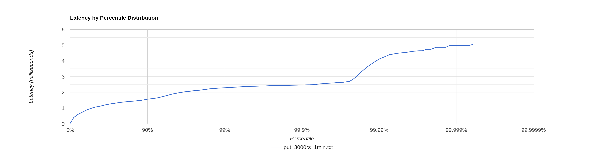
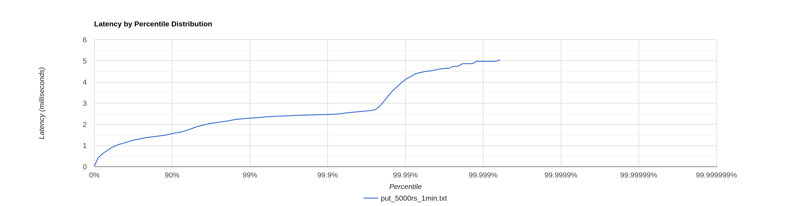
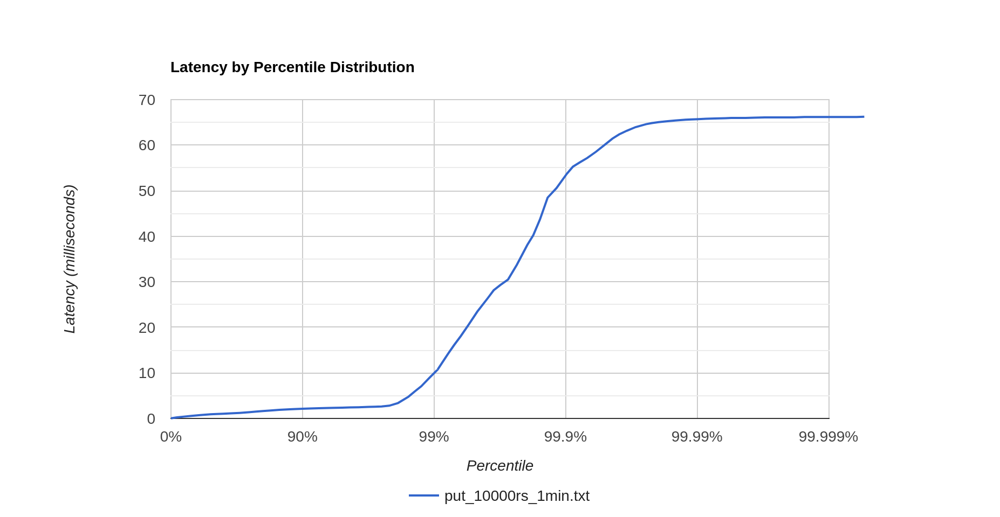
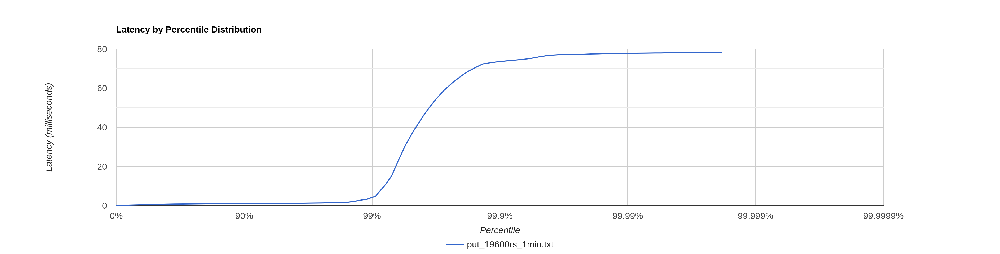
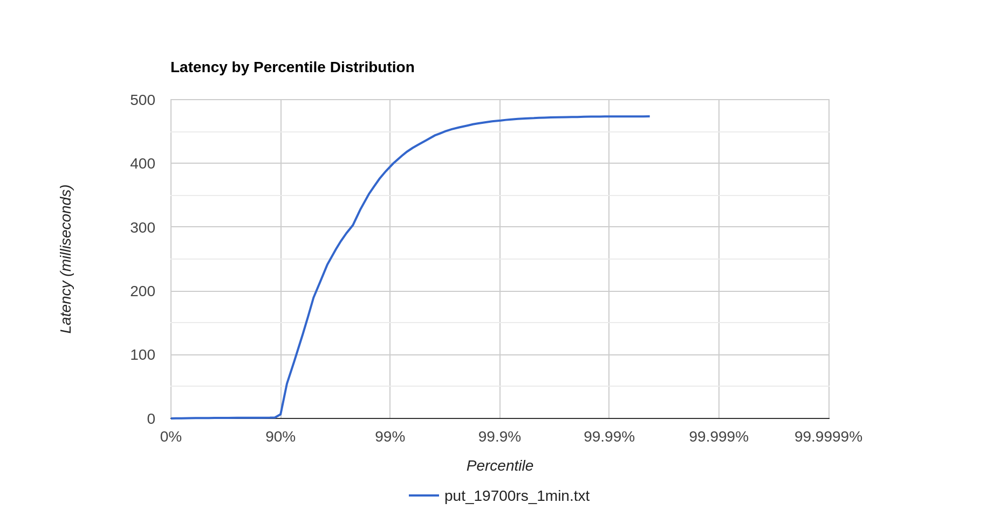
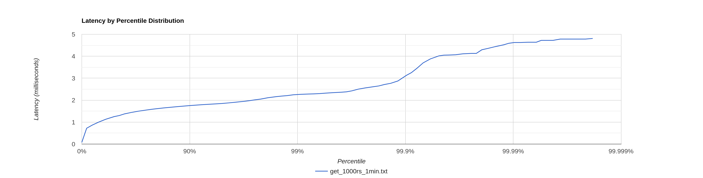
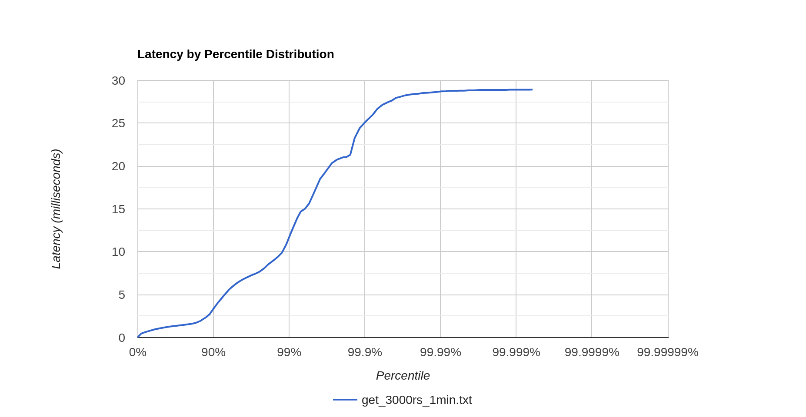
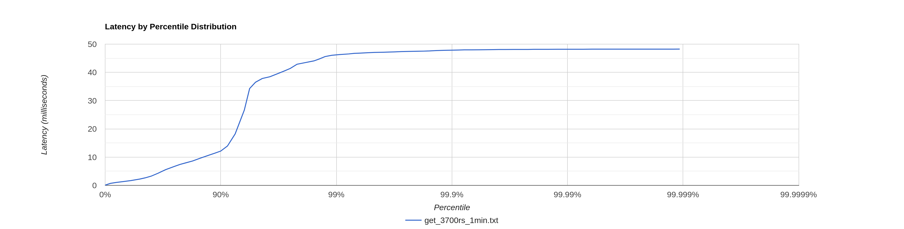
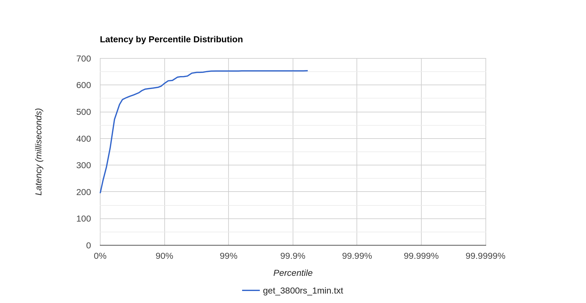

#Отчет
Для проведения экспериментов были написаны 2 скрипта: get.lua и put.lua.

## Нагрузочное тестирование put

В каждом запросе был добавлен случайный ключ в диапазоне от 1 до 1000000. А также значение случайной длины от 5 до 20, 
состоящее из букв латинского алфавита(строчных или заглавных). 

1. 3000 запросов в секунду на протяжении 1 минуты: Сервер без проблем держит нагрузку, stables накапливаются.
  
2. 5000 запросов в секунду на протяжении 1 минуты: Сервер без проблем держит нагрузку, stables накапливаются.
   
3. 10000 запросов в секунду на протяжении 1 минуты: У сервера появились проблемы. На последнем персентиль
резко возрастает время. Однако все время пока остается в пределах 100мс.
   
4. 19600 запросов в секунду на протяжении 1 минуты: Сервер продолжает держать нагрузку. На последнем персентиль
   резко возрастает время. Однако все время пока остается в пределах 100мс. Найдена точка разладки.
   
5. 19700 запросов в секунду на протяжении 1 минуты: Сервер поначалу держал нагрузку, но на последних 10 персентиль
резкий скачек времени выполнения, превышающий 100мс. То есть сервер перестает справляться.
   
6. 30000 запросов в секунду на протяжении 1 минуты: Сервер перестал справляться.
```
dmitrij@MY-PC ~/Д/J/w/wrk2 (master)> ./wrk -d 60 -t 1 -c 1 -R 30000 -L -s 
/home/dmitrij/Документы/JavaProjects/highload/2024-highload-dht/src/main/java/ru/vk/itmo/test/tyapuevdmitrij/
wrk2_scripts/put.lua http://localhost:8080
   Running 1m test @ http://localhost:8080
   1 threads and 1 connections
   Thread calibration: mean lat.: 552.170ms, rate sampling interval: 2988ms
   Thread Stats   Avg      Stdev     Max   +/- Stdev
   Latency     4.24s     1.91s    7.18s    56.74%
   Req/Sec    26.38k     5.15k   35.56k    43.75%
   Latency Distribution (HdrHistogram - Recorded Latency)
   50.000%    4.22s
   75.000%    5.87s
   90.000%    6.67s
   99.000%    7.12s
   99.900%    7.18s
   99.990%    7.18s
   99.999%    7.18s
   100.000%    7.18s 
```
В результате профилирования в точке разладки стало видно: 2.75% времени процессора тратится на flush, 16% на select,
45% на sendResponse, 19% на upsert в базу, 9% на NativeSocket.read.

Аллокации: 60% handleRequest (18% обработка запроса и отправка ответа, 16% перевод из строки в memorySegment,
4% на upsert и 5% на обработку аннотации Path), 5% на getHeader, который не используем.

## Нагрузочное тестирование get
 В каждом запросе проверялся случайный ключ в диапазоне от 1 до 1000000. Эксперименты проводились на заполненной базе. 

1. 1000 запросов в секунду на протяжении 1 минуты: Сервер без проблем держит нагрузку.
   
2. 3000 запросов в секунду на протяжении 1 минуты: У сервера появились проблемы. На последних 10 персентиль
   резко возрастает время. Однако все время пока остается в пределах 100мс.
   
3. 3700 запросов в секунду на протяжении 1 минуты: У сервера появились проблемы. На последних 10 персентиль
   резко возрастает время. Однако все время пока остается в пределах 100мс. Это точка разладки.
   
4. 3800 запросов в секунду на протяжении 1 минуты: Сервер почти перестал держать нагрузку. Выполнение запросов занимает
больше 100мс. 
   
5. 10000 запросов в секунду на протяжении 1 минуты: Сервер перестал справляться
```
Latency Distribution (HdrHistogram - Recorded Latency)
   50.000%    23.6s
   75.000%    31.93s
   90.000%    36.92s
   99.000%    39.97s
   99.900%    40.18s
   99.990%    40.2s
   99.999%    40.23s
   100.000%    40.28s 

```
В результате профилирования в точке разладки стало видно: 96% времени работы процессора тратится на handleRequest 
(из них 5% sendResponse, 10% работа mergeIterator, 80% поиск ключа в базе).
Аллокации: 17% на работу mergeIterator, 6% на хранение dao.storage, 74% на поиск ключа (MemorySegment.asSlice)


## Вывод
По результатам экспериментов выяснилось, что база может держать на запись максимум 19600 запросов в секунду,
а на чтение всего 3700 запросов в секунду. Таким образом чтение выдерживает примерно в 5 раза меньшую нагрузку,
чем запись. Использование аннотации Path() дает 5% аллокаций. Так же в методе handleRequest 5% аллокаций на обработку
header, который не используется. Для улучшения ситуации требуется разгрузить селектор и переписать handleRequest().
