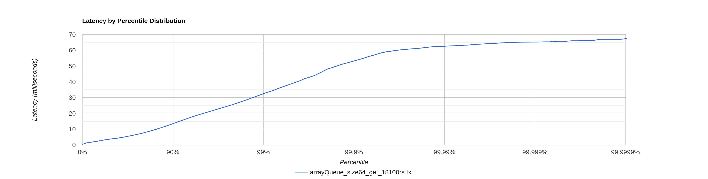
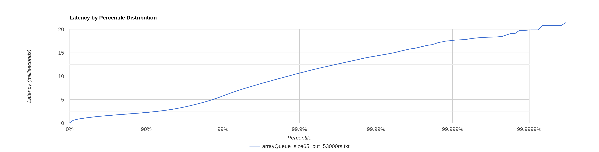
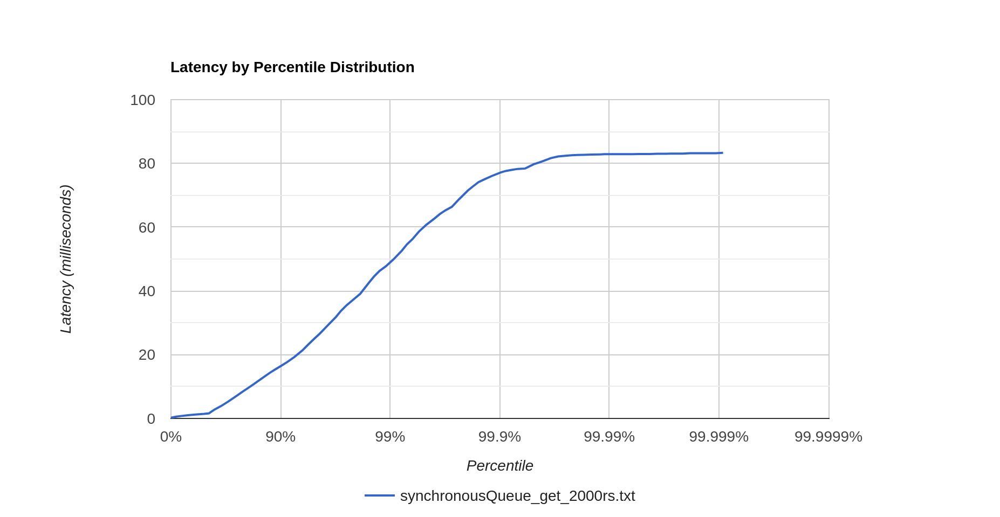
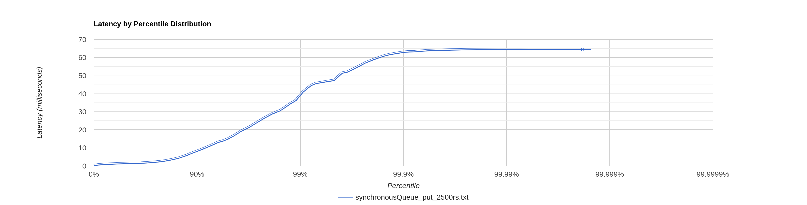
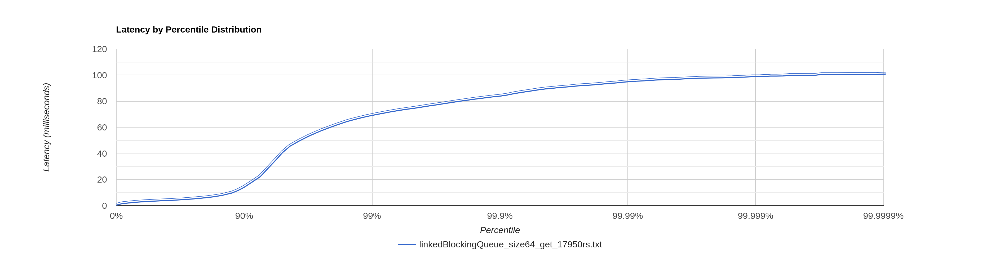
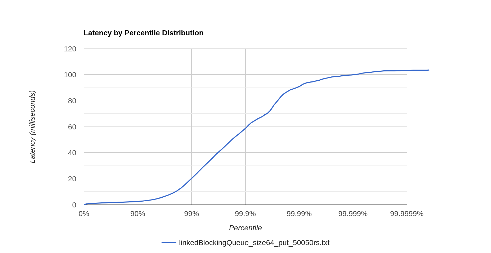

## arrayQueue размером 64 и THREAD_POOL_SIZE = Runtime.getRuntime().availableProcessors();

1. Для get была найдена точка разладки в 18100 запросов в секунду в течение 1 минуты.
   

При проверке 18150 запросов в секунду в течение 1 минуты на последнем персентиль наблюдается скачек latency и уже
превышает допустимые 100мс:
``
Latency Distribution (HdrHistogram - Recorded Latency)
50.000% 4.66ms
75.000% 15.39ms
90.000% 28.90ms
99.000% 79.10ms
99.900% 102.59ms
99.990% 114.30ms
99.999% 118.85ms
100.000% 121.02ms
``
По сравнению с прошлой стадией,
теперь база держит почти в 5 раз больше get-запросов. На ноутбуке 4 ядра физических и 4 виртуальных, при том часть
ресурсов тратилась на wrk2, так что результаты вполне ожидаемые.

Из профилирования видно, что теперь селекторы разгружены и их процессорное время занимает всего 4%.
Все остальное время занимает работа пула потоков. Аллокации почти не отличаются от прошлой стадии.

2. Для put была найдена точка разладки в 53000 запросов в секунду в течение 1 минуты.
   
   При проверке 53100 запросов в секунду в течение 1 минуты на последнем персентиль наблюдается скачек latency и уже
   превышает допустимые 100мс:
   ``
   Latency Distribution (HdrHistogram - Recorded Latency)
   50.000% 4.66ms
   75.000% 15.39ms
   90.000% 28.90ms
   99.000% 79.10ms
   99.900% 102.59ms
   99.990% 114.30ms
   99.999% 118.85ms
   100.000% 121.02ms
   ``
   По сравнению с прошлой стадией, теперь база держит почти в 3 раза больше put-запросов. Результаты тоже вполне
   ожидаемые,
   часть ресурсов тратится еще и при записи на диск(flash).

Из профилирования видно, что теперь селекторы разгружены и время занимает работа пула потоков.
Аллокации почти не отличаются от прошлой стадии.

## SynchronousQueue и THREAD_POOL_SIZE = Runtime.getRuntime().availableProcessors();

1. Для get была найдена точка разладки в 2000 запросов в секунду в течение 1 минуты при 1 соединении.
   

При проверке 2500 запросов в секунду в течение 1 минуты наблюдается резкая деградация latency и уже
превышает допустимые 100мс:
``
Latency Distribution (HdrHistogram - Recorded Latency)
50.000% 5.65s
75.000% 7.57s
90.000% 8.65s
99.000% 9.25s
99.900% 9.31s
99.990% 9.32s
99.999% 9.33s
100.000% 9.33s
``
При проверке на 64 соединения время выполнения уменьшается, но сразу появляются постоянные исключения, связанные
с переполнением очереди.
По сравнению с прошлой стадией, теперь база держит примерно в 2 раза меньше get-запросов.

Профилирование показало аналогичные результаты, как и в прошлом разделе.

2. Для put была найдена точка разладки в 2500 запросов в секунду в течение 1 минуты.
   
   При проверке 3000 запросов в секунду в течение 1 минуты на последних 10 персентиль наблюдается скачек latency и уже
   превышает допустимые 100мс:
   ``
   Latency Distribution (HdrHistogram - Recorded Latency)
   50.000% 1.86ms
   75.000% 13.41ms
   90.000% 58.40ms
   99.000% 222.46ms
   99.900% 254.46ms
   99.990% 258.56ms
   99.999% 258.69ms
   100.000% 258.69ms
   ``
   При проверке на 64 соединения сразу появляются постоянные исключения, связанные с переполнением очереди.
   По сравнению с прошлой стадией, теперь база держит почти в 3 раза меньше put-запросов.
   Профилирование показало аналогичные результаты, как и в прошлом разделе.
   Потоки в пуле постоянно ожидают новую задачу, поэтому это самая медленная реализация

## LinkedBlockingQueue и THREAD_POOL_SIZE = Runtime.getRuntime().availableProcessors();

1. Для get была найдена точка разладки в 17950 запросов в секунду в течение 1 минуты при 1 соединении.
   

При проверке 18000 запросов в секунду в течение 1 минуты наблюдается резкая деградация latency и уже
превышает допустимые 100мс:
``
Latency Distribution (HdrHistogram - Recorded Latency)
Latency Distribution (HdrHistogram - Recorded Latency)
50.000% 1.34ms
75.000% 2.15ms
90.000% 6.70ms
99.000% 48.93ms
99.900% 84.54ms
99.990% 139.52ms
99.999% 149.50ms
100.000% 152.57ms
``
Данная очередь уступает по производительности arrayQueue на 150 get-запросов в секунду
Профилирование показало аналогичные результаты, как и в прошлом разделе.

2. Для put была найдена точка разладки в 50050 запросов в секунду в течение 1 минуты.
   
   При проверке 50100 запросов в секунду в течение 1 минуты на последнем персентиль наблюдается скачек latency и уже
   превышает допустимые 100мс:
   ``
   Latency Distribution (HdrHistogram - Recorded Latency)
   50.000% 1.36ms
   75.000% 1.81ms
   90.000% 2.36ms
   99.000% 6.41ms
   99.900% 11.69ms
   99.990% 704.51ms
   99.999% 973.31ms
   100.000% 1.00s
   ``
   Данная очередь уступает по производительности arrayQueue на 2950 put-запросов в секунду
   Профилирование показало аналогичные результаты, как и в прошлом разделе.

## Зависимость latency от размера очереди

В ходе эксперимента за основу была взята arrayQueue и точка разладки в 18100rs. Менялся размер данной очереди и
проводились исследования на прогретой jvm. Выяснилось, что на такой большой нагрузке при размере очереди меньшем, чем
количество соединений производительность падает и вылетают постоянные исключения о переполнении очереди. При большем
размере очереди, производительность тоже падала.

## Вывод

При числе потоков в пуле, меньшем, чем максимально возможное число на ноутбуке не достигалась максимальная
производительность, так как на большом числе запросов в секунду процессор работал не на 100%.
Максимальной производительности удалось достичь при использовании arrayQueue размером 64
и кол-ва потоков в пуле = Runtime.getRuntime().availableProcessors();

