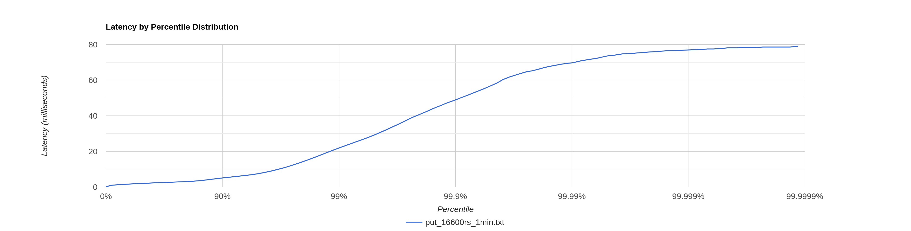
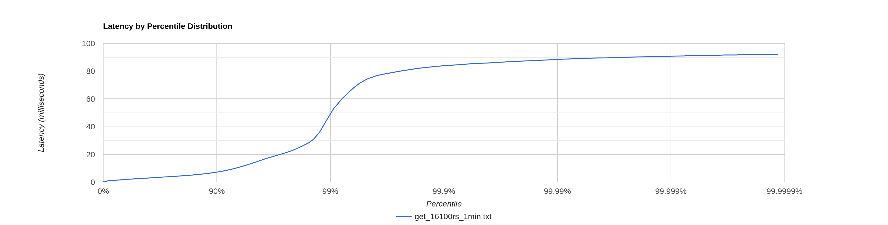

## put

1. 16600 запросов в секунду в течение 1 минуты:
   Найдена точка разладки. Latency всех запросов не превышает 100 мс.
   На последнем персентиль наблюдается резкое возрастание latency.
   

2. 16700 запросов в секунду в течение 1 минуты:

`90.000% 47.20ms
99.000% 148.48ms
99.900% 199.93ms
99.990% 230.27ms
99.999% 240.77ms
100.000% 245.12ms
`
На последних 10 персентиль наблюдается скачек latency, время выполнения всех запросов уже превышает 100мс.

### cpu profiling

На обработку перенаправления запроса уходит 20% ресурсов процессора, 11 % на SelectorManager и 39% на работу сетевых
потоков.

### alloc profiling

Аллокации из-за поиска необходимой ноды занимают менее 1% (конкатенация строк).
Появились 54 процента новых аллокаций из-за перенаправления запросов по http и работы httpClient, 26% - работа сетевых
потоков и 4% selectorManager. Итого 85% новых аллокаций.

### lock profiling

Большую часть находятся в ожидании сетевые потоки (SequentialScheduler) - 50% и selectorManager - 14%

## get

1. 16100 запросов в секунду в течение 1 минуты:
   Найдена точка разладки. Latency всех запросов не превышает 100 мс.
   На последнем персентиль наблюдается резкое возрастание latency.
   

2. 16200 запросов в секунду в течение 1 минуты:

`
75.000% 5.92ms
90.000% 152.32ms
99.000% 544.26ms
99.900% 602.11ms
99.990% 618.49ms
99.999% 623.10ms
100.000% 625.66ms
`
На последних 20 персентиль наблюдается резкий скачёк latency, время выполнения всех запросов уже значительно
превышает 100мс.

### cpu profiling

На обработку перенаправления запроса уходит 15% ресурсов процессора, 9 % на SelectorManager и 28% на работу сетевых
потоков.

### alloc profiling

Аллокации из-за поиска необходимой ноды занимают менее 0.5% (конкатенация строк).
Появились 23 процента новых аллокаций из-за перенаправления запросов по http и работы httpClient, 10% - работа сетевых
потоков и 2% selectorManager. Итого 35% новых аллокаций.

### lock profiling

Большую часть находятся в ожидании сетевые потоки (SequentialScheduler) - 52% и selectorManager - 15%

## Сравнение с прошлым этапом

### PUT
Точка разладки сместилась на 4000 запросов в секунду в меньшую сторону по сравнению с прошлым этапом.
Возьмем и замерим результаты реализации прошлого этапа в точке разладки этого:

`         было          стало
50.000   1.24ms        1.97ms
75.000   1.71ms        2.79ms
90.000   2.18ms        5.06ms
99.000   7.31ms        21.85ms
99.900   11.80ms       48.90ms
99.990   15.29ms       69.69ms
99.999   19.26ms       76.86ms
100.000  22.14ms       79.04ms
`

### GET
Точка разладки сместилась на 2000 запросов в секунду в меньшую сторону по сравнению с прошлым этапом.
Возьмем и замерим результаты реализации прошлого этапа в точке разладки этого:

`          было       стало
50.000   1.53ms      2.48ms
75.000   2.13ms      4.03ms
90.000   2.74ms      7.20ms
99.000   3.72ms      49.53ms
99.900   20.13ms     83.84ms  
99.990% 29.90ms     88.45ms
99.999% 35.42ms     90.69ms
100.000% 38.65ms     92.16ms
`
## Выводы
Текущая реализация стала держать меньше get и put-запросов и стала медленнее. Это можно объяснить появлением большого 
количества новых аллокаций и блокировок из-за сетевого взаимодействия нод, что приводит к необходимости тратить как 
минимум треть ресурсов процессора на это. Использование рандеву-хэширования не вносит явных замедлений в систему.
Использование хэш-функции murmur3 помогает относительно равномерно распределять данные по нодам в отличие от 
стандартного hashcode() (с ним одна из трех нод всегда пустая).

