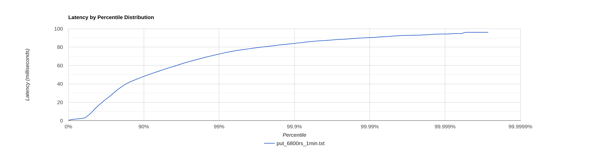
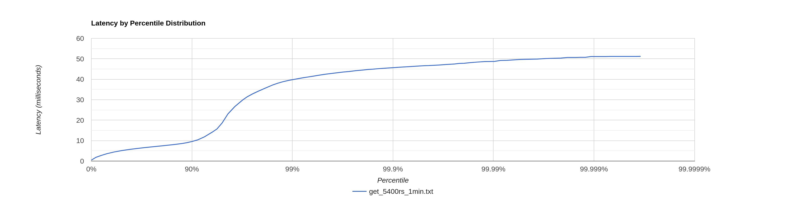

## Описание исследований
Все исследования проводились для кластера из 3 нод. На целевую ноду поступали запросы без указания ack и from.
Таким образом ack = 2 и from = Это симулирует ситуацию, когда пользователю максимально важно сохранить данные и получить
самые свежие из них

## put

1. 6800 запросов в секунду в течение 1 минуты:
   Найдена точка разладки. Latency всех запросов не превышает 100 мс.
   На последних 10 персентиль наблюдается резкое возрастание latency.
   

2. 6900 запросов в секунду в течение 1 минуты:

```
 50.000%    6.01ms
 75.000%   35.74ms
 90.000%   60.51ms
 99.000%   89.41ms
 99.900%  102.14ms
 99.990%  109.25ms
 99.999%  115.78ms
100.000%  117.44ms
```
На последнем персентиль наблюдается скачек latency, время выполнения всех запросов уже превышает 100мс.

### cpu profiling

На обработку перенаправления запроса уходит 20% ресурсов процессора, 11 % на SelectorManager и 39% на работу сетевых
потоков.


### alloc profiling


Аллокации из-за поиска необходимых нод по максимальному хэшу занимают менее 1% (конкатенация строк и создание treeMap).
Аллокации из-за перенаправления запросов по http и работы httpClient и сборке всех ответов - 58% , 27% - работа сетевых
потоков и 5% selectorManager. 

### lock profiling


Большую часть находятся в ожидании сетевые потоки (SequentialScheduler) - 52% и selectorManager - 14%

## get

1. 5400 запросов в секунду в течение 1 минуты:
   Найдена точка разладки. Latency всех запросов не превышает 100 мс.
   На последних 10 персентиль наблюдается резкое возрастание latency.
   

2. 5500 запросов в секунду в течение 1 минуты:

```
 50.000%   91.78ms
 75.000%  143.87ms
 90.000%  205.70ms
 99.000%  255.23ms
 99.900%  281.09ms
 99.990%  291.58ms
 99.999%  294.91ms
100.000%  295.68ms
```
На последних 25 персентиль наблюдается резкий скачёк latency, время выполнения всех запросов уже значительно
превышает 100мс.

### cpu profiling


На обработку перенаправления запроса уходит 17% ресурсов процессора при этом 25% тратится на сбор всех ответов на 
целевой ноде, 10 % на SelectorManager и 30% на работу сетевых потоков.

### alloc profiling


Аллокации из-за поиска необходимой ноды занимают менее 0.5% (конкатенация строк).
Появились 46 процентов новых аллокаций из-за ожидания выполнения всех запросов, 13% - работа сетевых
потоков и 2% selectorManager. Итого 35% новых аллокаций. Обработка одного запроса для целевой ноды теперь приводит
к числу семплов аллокаций в 3 раза большему, чем в прошлом этапе.

### lock profiling


Большую часть находятся в ожидании сетевые потоки (SequentialScheduler) - 52% и selectorManager - 15%

## Сравнение с прошлым этапом

### PUT
Точка разладки сместилась на 9800 запросов в секунду в меньшую сторону по сравнению с прошлым этапом
(была 16600 стала 6800).
Возьмем и замерим результаты реализации прошлого этапа в точке разладки этого:

```
         было          стало
50.000   1.60ms        8.32ms
75.000   2.27ms        30.13ms
90.000   3.03ms        48.10ms
99.000   10.38ms       72.45ms
99.900   18.54ms       84.03ms
99.990   22.93ms       90.37ms
99.999   26.40ms       94.27ms
100.000  26.40ms       96.13ms
```

### GET
Точка разладки сместилась на 10700 запросов в секунду в меньшую сторону по сравнению с прошлым этапом
(была 16100 стала 5400).
Возьмем и замерим результаты реализации прошлого этапа в точке разладки этого:

```          
         было       стало
50.000   4.01ms      5.11ms
75.000   4.91ms      6.94ms
90.000   5.71ms      9.53ms
99.000   7.33ms      39.78ms
99.900   9.51ms      45.66ms 
99.990%  12.38ms     48.70ms
99.999%  14.26ms     50.72ms
100.000% 15.08ms     51.20m
```

## Выводы
Текущая реализация стала держать меньше get и put-запросов и стала медленнее. Из проофилей виднно, что хоть и
процентное соотношение всех семплов осталось приблизительно таким же, как в прошлом этапе (кроме участка, где требуется
ожидание ответов от всех нод на целевой), но каждый из участков стал занимать значительно больше сэмплов. Для решения
данной проблемы требуется ввести асинхронные опрос нод и агрегацию ответов.

