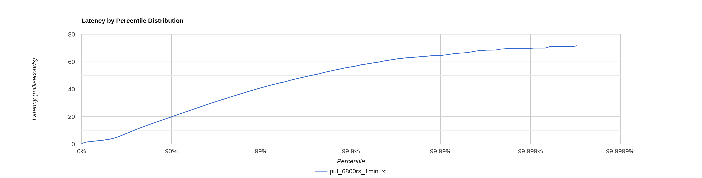
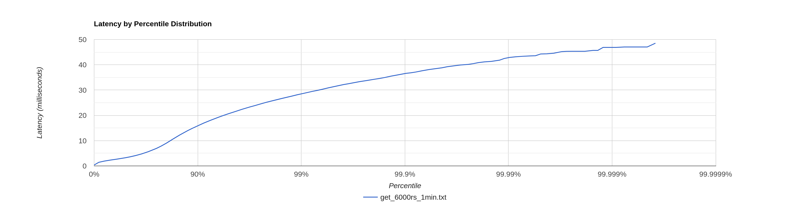

## Описание исследований

Все исследования проводились для кластера из 3 нод. На целевую ноду поступали запросы без указания ack и from.
Таким образом ack = 2 и from = 3. Это симулирует ситуацию, когда пользователю максимально важно сохранить данные и
получить самые свежие из них

## put

1. 6800 запросов в секунду в течение 1 минуты:
   Найдена точка разладки. Latency всех запросов не превышает 100 мс. Точка разладки не изменилась по сравнению с
   прошлым этапом
   На последних 10 персентиль наблюдается плавное возрастание latency.
   

2. 6900 запросов в секунду в течение 1 минуты:

```
 50.000%   32.80ms
 75.000%  135.42ms
 90.000%  211.97ms
 99.000%  305.92ms
 99.900%  355.58ms
 99.990%  390.14ms
 99.999%  397.57ms
100.000%  400.13ms
```

На последних 30 персентиль наблюдается резкий скачёк latency, время выполнения всех запросов уже превышает 100мс.

### cpu profiling

Теперь на работу сетевых потоков требуется 55% ресурсов процессора вместо 39% для прошлого этапа. Это связано
с добавлением 14% из-за CompletableFuture.asyncSupply.run
На обработку перенаправления запроса уходит 4% ресурсов процессора, 8 % на SelectorManager. Заметно уменьшилось
количество семплов в ключевых методах по обработке запросов за счет их увеличения в сетевых потоках.


### alloc profiling


Появилось 37% новых аллокаций в сетевых потоках из-за CompletableFuture.asyncSupply.run
Вместо 62% аллокаций в ключевых методах по обработке запросов их стало 23%

### lock profiling


Большую часть находятся в ожидании сетевые потоки - 96% вместо 52% с прошлого этапа
из-за добавления к SequentialScheduler(60%) ожидания при CompletableFuture.asyncSupply.run (36%)

## get

1. 6000 запросов в секунду в течение 1 минуты:
   Найдена точка разладки. Latency всех запросов не превышает 100 мс.
   На последних 10 персентиль наблюдается резкое возрастание latency.
   

2. 6100 запросов в секунду в течение 1 минуты:

```
 50.000%    7.38ms
 75.000%    9.48ms
 90.000%   14.29ms
 99.000%   51.04ms
 99.900%  102.72ms
 99.990%  133.25ms
 99.999%  138.11ms
100.000%  140.03ms
```
На последнем персентиль наблюдается резкий скачёк latency, время выполнения всех запросов уже превышает 100мс.

### cpu profiling


Теперь на работу сетевых потоков требуется 45% ресурсов процессора вместо 30% для прошлого этапа. Это связано
с добавлением 12% из-за CompletableFuture.asyncSupply.run
На обработку перенаправления запроса уходит 3% ресурсов процессора, 7 % на SelectorManager. Заметно уменьшилось
количество семплов в ключевых методах по обработке запросов за счет их увеличения в сетевых потоках.
### alloc profiling


Появилось 19% новых аллокаций в сетевых потоках из-за CompletableFuture.asyncSupply.run
Вместо 83% аллокаций в ключевых методах по обработке запросов их стало 63%
### lock profiling


Большую часть находятся в ожидании сетевые потоки - 97% вместо 53% с прошлого этапа
из-за добавления к SequentialScheduler(62%) ожидания при CompletableFuture.asyncSupply.run (35%)


## Сравнение с прошлым этапом

### PUT

Точка разладки не изменилась и осталась 6800 запросов в секунду
Сравним результаты с прошлым этапом в этой же точке разладки:

```
         было          стало
50.000   8.32ms        3.40ms
75.000   30.13ms       10.46ms
90.000   48.10ms       19.82ms
99.000   72.45ms       41.02ms
99.900   84.03ms       56.29ms
99.990   90.37ms       64.67ms
99.999   94.27ms       69.69ms
100.000  96.13ms       71.61ms
```

### GET

Точка разладки сместилась на 600 запросов в секунду в большую сторону по сравнению с прошлым этапом
(была 5400, а стала 6000).
Возьмем и замерим результаты реализации этого этапа в точке разладки прошлого:

```          
           было      стало
50.000   5.11ms      2.62ms
75.000   6.94ms      3.35ms
90.000   9.53ms      4.58ms
99.000   39.78ms     9.00ms
99.900   45.66ms     16.26ms  
99.990%  48.70ms     23.22ms
99.999%  50.72ms     29.69ms
100.000% 51.20ms     32.13ms
```

## Выводы

Текущая реализация стала держать больше get и столько же put-запросов и стала быстрее. Из профилей видно, что
процентное соотношение всех семплов значительно изменилось, участки целевых методов по обработке запросов стали занимать
меньше семплов, а эту разницу на себя взяли сетевые потоки при выполнении CompletableFuture. Теперь сервер может
быстрее отправить запрос пользователю, не дожидаясь ответа всех нод - основная причина ускорения get-запросов.