#Анализ программы с использованием wrk2 и async-profiler

Первоначально я ввел достаточно большое число запросов в секунду на upsert и get, для нахождения точки разладки.
По несколько раз запуская wrk и смотря на результаты я выяснил, что точка разладки для upsert равна 25к запросов в секунду,
для get число значительно меньше и равно 3500 запросов в секунду. Это связано со значением flushThresholdBytes = 32 Кб,
из-за этого приходилось искать в большем количестве файлов, что снижает поисковые возможности.

##Рассмотрим результаты подробней:
###UPSERT 20k r/s (меньше разладки)
Количество запросов в секунду = 20k r/s

####Результаты работы wrk:
```
  Thread Stats   Avg      Stdev     Max   +/- Stdev
    Latency   619.81us  407.21us  12.32ms   71.06%
    Req/Sec    21.10k     1.36k   30.55k    70.62%
  Latency Distribution (HdrHistogram - Recorded Latency)
 50.000%  613.00us
 75.000%    0.90ms
 90.000%    1.07ms
 99.000%    1.18ms
 99.900%    3.09ms
 99.990%   11.57ms
 99.999%   12.25ms
100.000%   12.33ms
```
На основе этих данные можно сказать, что если нагрузка на наш сервис от одного коннекта будет составлять 20k r/s, 
то мы с большой вероятностью на все запросы будем отвечать не дольше чем за 12.33ms. Стоит отметить что есть погрешность, 
и она может повлиять как в плюс, так и в минус нашим результатам, нужно собирать больше метрик,
поднимать сервер в виртуальной среде, чтоб никакие другие процессы не мешали работе сервера.

####Результаты работы async-profiler (CPU):

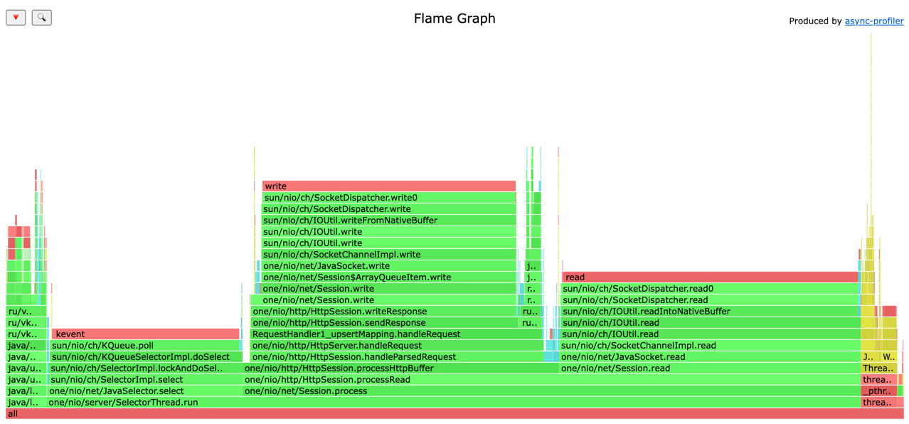

На графике видно, что бизнес логика нашего приложения занимает всего 2.45% (вставка в memTable) + 
4,54% (процесс сохранения на диск memTable). 
Все остальное время это работа внутренних процессов java и библиотеки one-nio

####Результаты работы async-profiler (ALLOC):

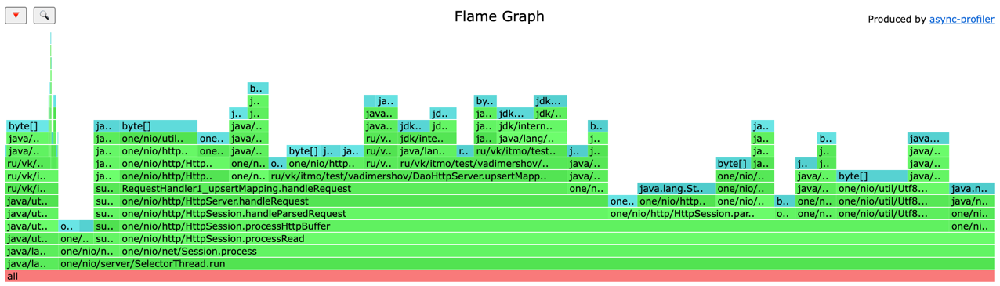

На графике видно, что больше всего ресурсов аллокаций уходит на библиотеку one nio, сам бизнес процесс dao занимает 
17.10% (Преобразование данных в данные для dao) + 3.46% (метод put) + 5.40% (Сохранения на диск). 
Все остальные аллокации связаны с библиотекой с ее преобразование как входных данных так и выходных

###UPSERT 25k r/s (разладка)
```
  Thread Stats   Avg      Stdev     Max   +/- Stdev
    Latency     1.88ms    5.45ms  42.18ms   94.87%
    Req/Sec    25.03k   286.58    26.38k    89.81%
  Latency Distribution (HdrHistogram - Recorded Latency)
 50.000%  713.00us
 75.000%    1.03ms
 90.000%    1.30ms
 99.000%   34.40ms
 99.900%   40.51ms
 99.990%   42.11ms
 99.999%   42.17ms
100.000%   42.21ms
```
Можно заметить что время увеличилось, но все еще не является критичным (на мой взгляд) для пользователя, все запросы (25к в секунду) 
было успешно выполнены

####Результаты работы async-profiler (CPU):

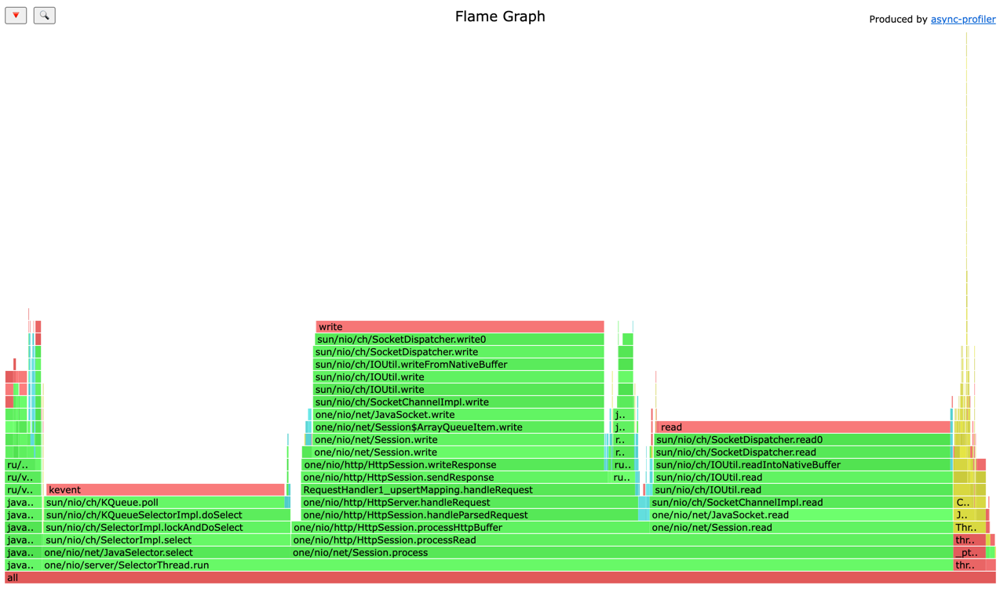

Результаты остались прежними, все также больше cpu было затрачено на библиотеку и процессы java


####Результаты работы async-profiler (ALLOC):

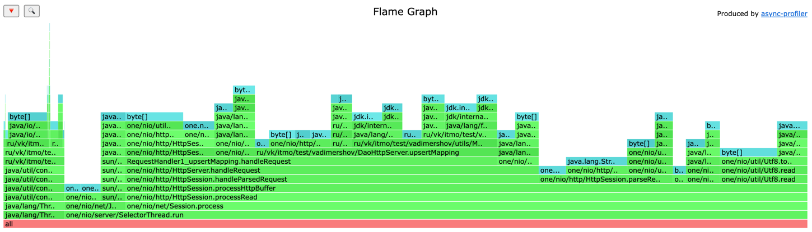

Процесс дао из графика: 18.04% (Преобразование данных в данные для dao) + 2.63% (метод put) + 7.57% (Сохранения на диск).
Не на много увеличился процент аллокаций для процесса сохранения на диск, чуть больше запросов, больше и сохранений на диск

###UPSERT 30k r/s (больше разладка)

```
  Thread Stats   Avg      Stdev     Max   +/- Stdev
    Latency     4.36s     1.69s    7.25s    57.32%
    Req/Sec    26.50k   192.59    26.69k    89.47%
  Latency Distribution (HdrHistogram - Recorded Latency)
 50.000%    4.37s
 75.000%    5.82s
 90.000%    6.68s
 99.000%    7.20s
 99.900%    7.25s
 99.990%    7.25s
 99.999%    7.25s
100.000%    7.25s
```

В данном случае показано сколько будет занимать запрос если мы превысим точку разладки. 
Запрос будет выполняться значительно дольше среднее значение будет около 4.36s

Также стоит отметить, что выполнилось только 26k r/s из 30k заданных

####Результаты работы async-profiler (CPU):

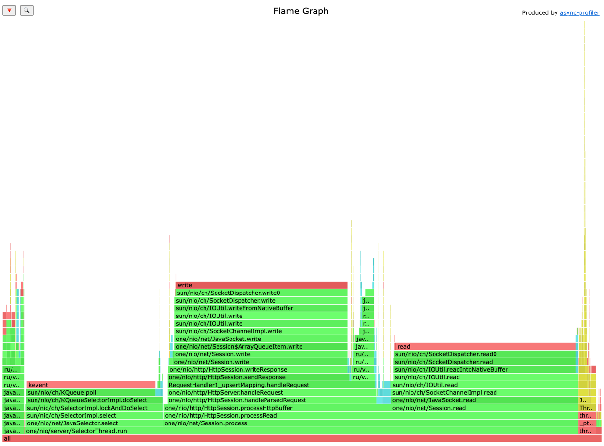

Даже при значениях больших точки разладки нагрузка на cpu не изменяется

####Результаты работы async-profiler (ALLOC):

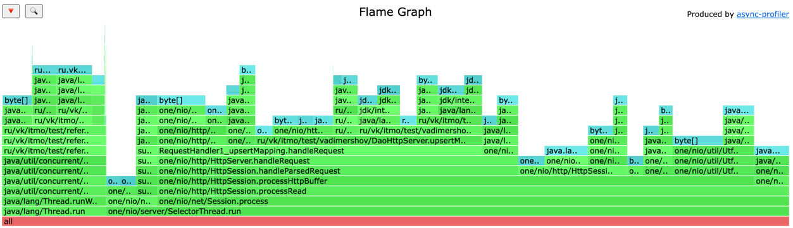

Процесс дао из графика: 15.82% (Преобразование данных в данные для dao) + 3.09% (метод put) + 13.24% (Сохранения на диск).
Также не на много увеличился процент аллокаций для процесса сохранения на диск, чуть больше запросов, больше и сохранений на диск


###GET 3k r/s (меньше разладки)

```
  Thread Stats   Avg      Stdev     Max   +/- Stdev
    Latency     2.49ms    3.10ms  31.47ms   92.33%
    Req/Sec     3.12k   329.67     5.00k    74.56%
  Latency Distribution (HdrHistogram - Recorded Latency)
 50.000%    1.54ms
 75.000%    2.70ms
 90.000%    4.75ms
 99.000%   17.55ms
 99.900%   27.44ms
 99.990%   31.12ms
 99.999%   31.49ms
100.000%   31.49ms
```
Все запросы выполнились успешно, были получены результаты, время выполнения get запросы больше чем вставки, 
так как при upsert мы вставляем сразу в memTable, 
а при get мы ищем не только в memTable, но и в файлах сохраненных на диск 

####Результаты работы async-profiler (CPU):

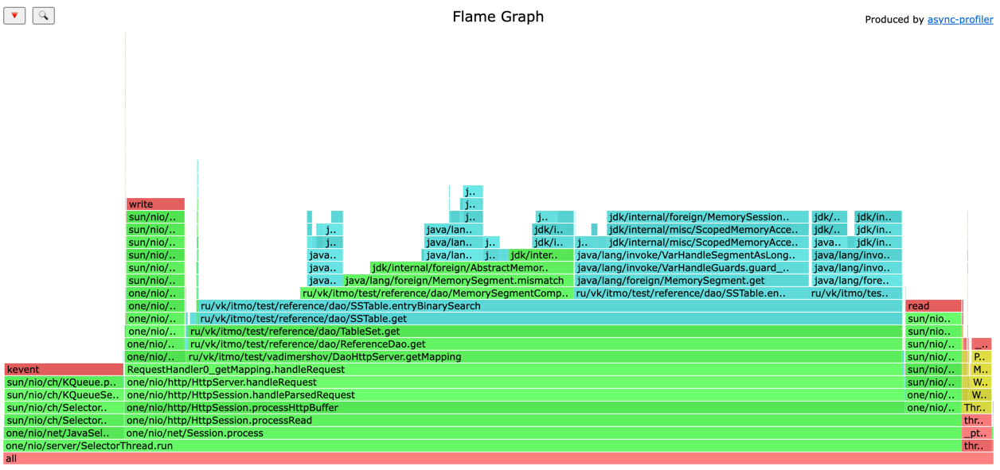

На графике видно, что бизнес логика get метода Dao занимает 72.10% 
из которых больше всего времени ушло на поиск в файлах на диске с использованием бинарного поиска, 
и только 0.15% времени уходило на получение данных из memTable
Все оставшееся время ушло на работу внутренних процессов java и библиотеки one-nio

####Результаты работы async-profiler (ALLOC):

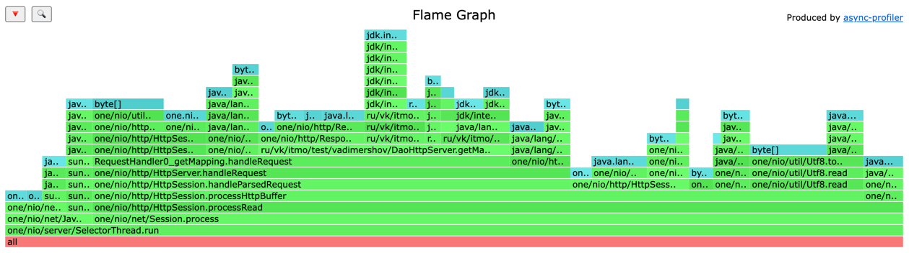

На графике видно, что больше всего ресурсов аллокаций уходит на библиотеку one nio, сам бизнес процесс dao занимает
6.76% (Метод get Dao), преобразование в byte[] 1.76%, key в MemorySegment 7.65%.
Все остальные аллокации связаны с библиотекой с ее преобразование как входных данных так и выходных


###GET 3.5k r/s (разладка)
```
  Thread Stats   Avg      Stdev     Max   +/- Stdev
    Latency    21.61ms   21.67ms 115.58ms   83.63%
    Req/Sec     3.52k   305.47     4.52k    66.85%
  Latency Distribution (HdrHistogram - Recorded Latency)
 50.000%   14.70ms
 75.000%   33.28ms
 90.000%   52.96ms
 99.000%   91.97ms
 99.900%  111.23ms
 99.990%  115.26ms
 99.999%  115.52ms
100.000%  115.65ms
```
Увеличилось время выполнения запроса, так как подошли к точке разладки

####Результаты работы async-profiler (CPU):

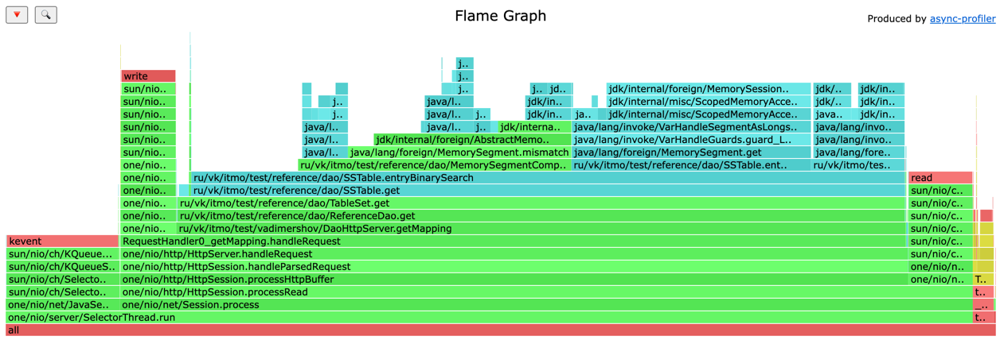

В данном случае все комментарии по-данному графику те же. Бизнес логика get метода Dao занимает 73.47%
из которых больше всего времени ушло на поиск в файлах на диске с использованием бинарного поиска,
и только 0.21% времени уходило на получение данных из memTable
Все оставшееся время ушло на работу внутренних процессов java и библиотеки one-nio

####Результаты работы async-profiler (ALLOC):

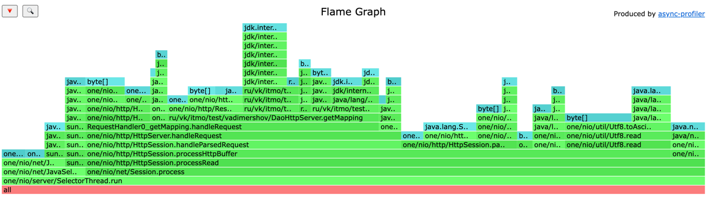

На графике видно, что больше всего ресурсов аллокаций уходит на библиотеку one nio, сам бизнес процесс dao занимает
8.01% (Метод get Dao), преобразование в byte[] 1.70%, key в MemorySegment 9.71%.
Все остальные аллокации связаны с библиотекой с ее преобразование как входных данных так и выходных


###GET 4k r/s (больше разладка)

```
  Thread Stats   Avg      Stdev     Max   +/- Stdev
    Latency     1.75s   675.12ms   2.92s    59.20%
    Req/Sec     3.81k   173.70     4.27k    69.64%
  Latency Distribution (HdrHistogram - Recorded Latency)
 50.000%    1.72s
 75.000%    2.38s
 90.000%    2.71s
 99.000%    2.91s
 99.900%    2.92s
 99.990%    2.92s
 99.999%    2.92s
100.000%    2.92s
```

Время выполнения запроса в среднем равняется 1.75s для клиента такое время, на мой взгляд, не является положительным.

Также стоит отметить, что выполнилось только 3.8k r/s из 4k заданных

####Результаты работы async-profiler (CPU):

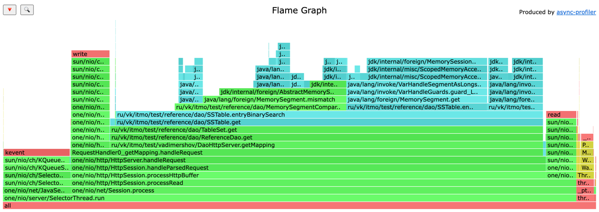

В данном случае все комментарии по-данному графику те же. Бизнес логика get метода Dao занимает 72.98%
из которых больше всего времени ушло на поиск в файлах на диске с использованием бинарного поиска,
и только 0.10% времени уходило на получение данных из memTable
Все оставшееся время ушло на работу внутренних процессов java и библиотеки one-nio

####Результаты работы async-profiler (ALLOC):

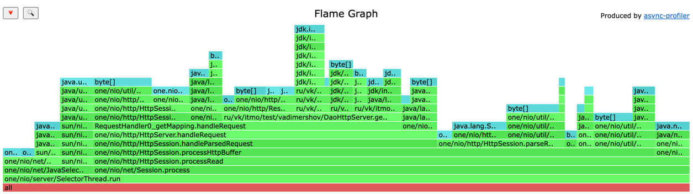

На графике видно, что больше всего ресурсов аллокаций уходит на библиотеку one nio, сам бизнес процесс dao занимает
5.03% (Метод get Dao), преобразование в byte[] 3.50%, key в MemorySegment 7.00%.
Все остальные аллокации связаны с библиотекой с ее преобразование как входных данных так и выходных