#Анализ программы с использованием wrk2 и async-profiler

Первоначально я ввел достаточно большое число запросов в секунду на upsert и get, 
для нахождения точки разладки.
По несколько раз запуская wrk и смотря на результаты я выяснил, что точка разладки для upsert равна 55к запросов в секунду, что в 2 раза больше при реализации без пула потоков,
для get число меньше и равно 25k запросов в секунду, что в 10 раз больше в сравнении с реализацией без пула. Значение flushThresholdBytes я увеличил до 1Mb.
Пул состоит из 10 потоков (такой процессор) и количество не изменяется

##Рассмотрим результаты подробней:
###UPSERT 50k r/s (меньше разладки)
####Результаты работы wrk:
```
 50.000%    1.36ms
 75.000%    1.80ms
 90.000%    2.23ms
 99.000%    3.94ms
 99.900%   11.12ms
 99.990%   18.24ms
 99.999%   20.59ms
100.000%   22.02ms
```
На основе этих данные можно сказать, что если нагрузка на наш сервис от одного коннекта будет составлять 50k r/s,
то мы с большой вероятностью на все запросы будем отвечать не дольше чем за 22.02ms. Стоит отметить что есть погрешность,
и она может повлиять как в плюс, так и в минус нашим результатам, нужно собирать больше метрик,
поднимать сервер в виртуальной среде, чтоб никакие другие процессы не мешали работе сервера.

####Результаты работы async-profiler (CPU):

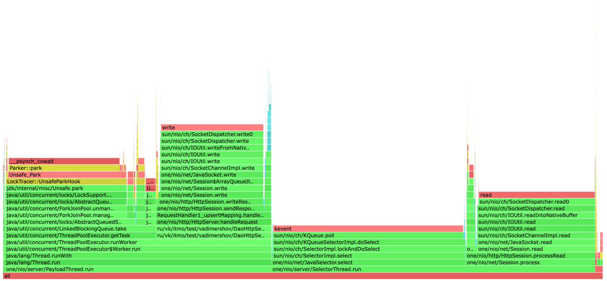

На основе графика можно увидеть что работа dao занимает 19%, 25% получение задачи из очереди
Все остальное время это работа внутренних процессов java и библиотеки one-nio

####Результаты работы async-profiler (ALLOC):

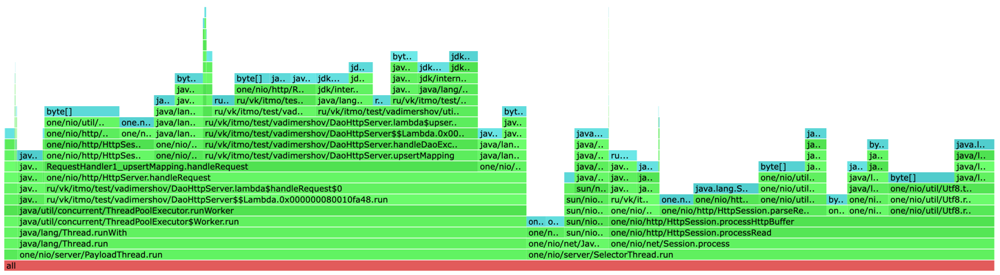

На графике видно, что больше всего ресурсов аллокаций уходит на библиотеку one nio, сам бизнес процесс dao занимает
16.37% (Преобразование данных в данные для dao) + 0.95% (метод put) + 1.34% (Сохранения на диск).
Все остальные аллокации связаны с библиотекой с ее преобразование как входных данных так и выходных

####Результаты работы async-profiler (LOCK):

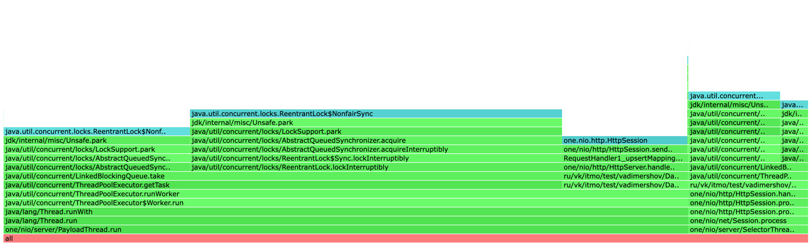

Из графика видно, что логике dao требуется: 14.90% (для работы очереди в пуле) + 15.68% (для отправки респонса).
Остальное нужно для библиотеки one nio


###UPSERT 55 - 60k r/s (разладка)
####Результаты работы wrk:
```
 50.000%    1.58ms
 75.000%    2.06ms
 90.000%    2.48ms
 99.000%    3.41ms
 99.900%    9.38ms
 99.990%   13.38ms
 99.999%   14.46ms
100.000%   14.97ms
```

```
 50.000%    1.89ms
 75.000%    3.41ms
 90.000%   61.18ms
 99.000%  508.42ms
 99.900%  593.92ms
 99.990%  615.42ms
 99.999%  621.05ms
100.000%  623.10ms
```

Видим что между 55-60 находится точка разладки, хотя может быть и 60к это и есть точка разладки, 
ибо мы не перевалили за 1с длительности запроса (мой приемлемый предел)

####Результаты работы async-profiler (CPU):

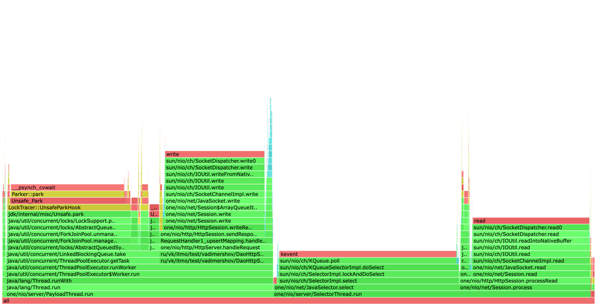
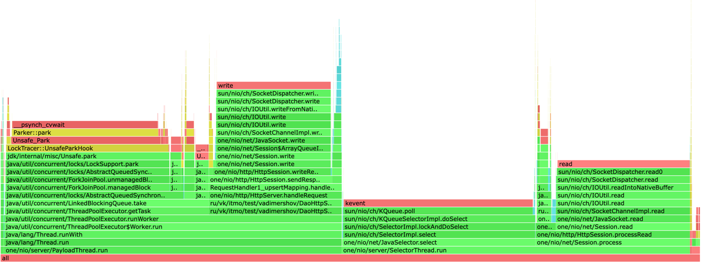

Графики идентичны с прошлыми результатами, аномалий нет

####Результаты работы async-profiler (ALLOC):

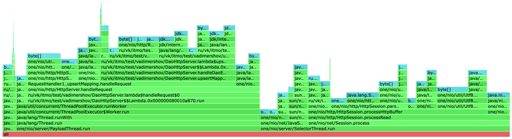
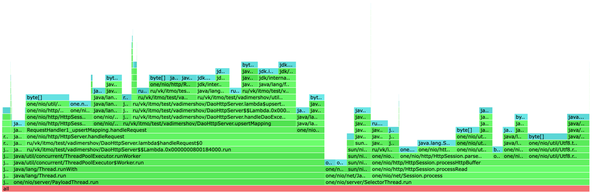

Проценты достаточно равны в рамках погрешностей, немного больше аллокаций ушло на flush

####Результаты работы async-profiler (LOCK):

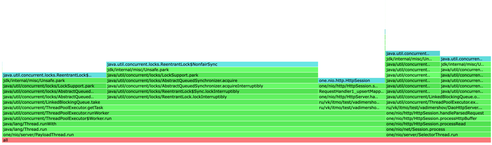
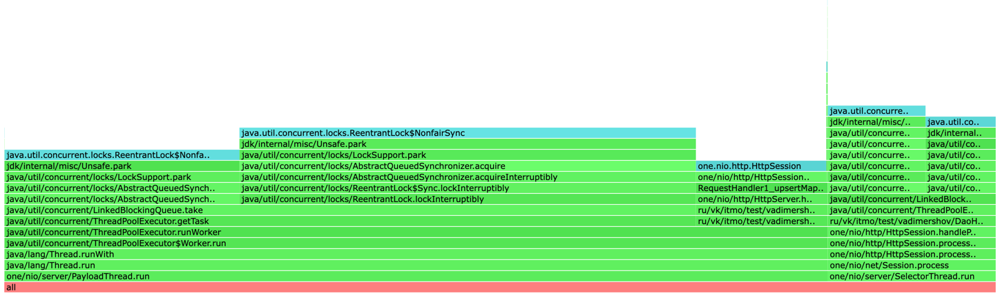

Немного увеличились проценты для работы dao и отправки ответа, в рамках погрешности

###UPSERT 55 - 60k r/s (больше разладки)
####Результаты работы wrk:
```
50.000%    1.99s
75.000%    2.55s
90.000%    2.93s
99.000%    3.36s
99.900%    3.47s
99.990%    3.50s
99.999%    3.51s
100.000%    3.51s
```
Тут мы перешли точку разладки, в среднем выполнять запрос мы сможем за примерно 2.01 с.
Смогли выполнить в данном случае только 61к запросов

####Результаты работы async-profiler (CPU):

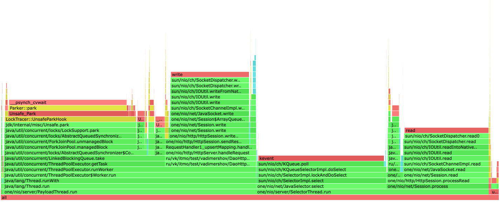

Графики идентичны с прошлыми результатами, аномалий нет

####Результаты работы async-profiler (ALLOC):

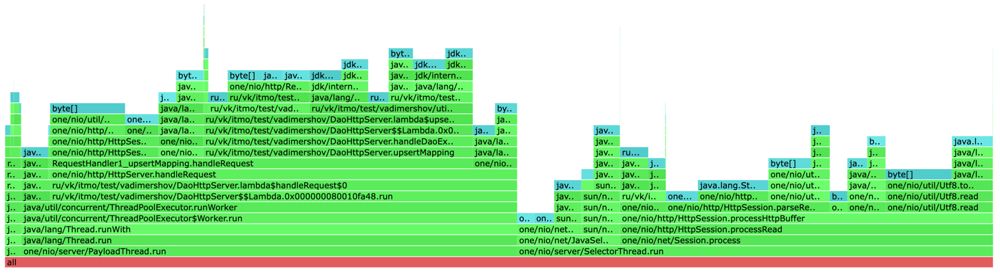

Графики идентичны с прошлыми результатами, аномалий нет

####Результаты работы async-profiler (LOCK):

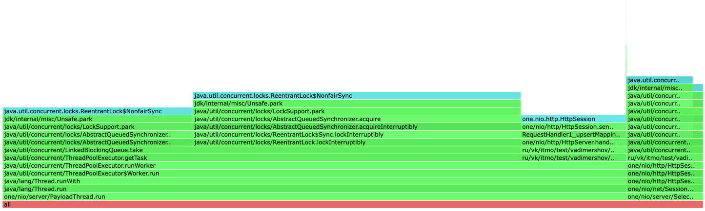

Графики идентичны с прошлыми результатами, аномалий нет

###GET 30k r/s (меньше разладки)
####Результаты работы wrk:
```
 50.000%    1.14ms
 75.000%    1.55ms
 90.000%    1.86ms
 99.000%    2.44ms
 99.900%    5.48ms
 99.990%    8.24ms
 99.999%   10.58ms
100.000%   14.03ms
```
Из данных видно что если к нам будут отправлять по 30к запросов в секунды мы успешно
в 100% случаях сможем отдавать данные за 14 мс.
Количество запросов которые мы смогли сделать при реализации с пулом потоков возросло в 10 раз, что и ожидалось

####Результаты работы async-profiler (CPU):

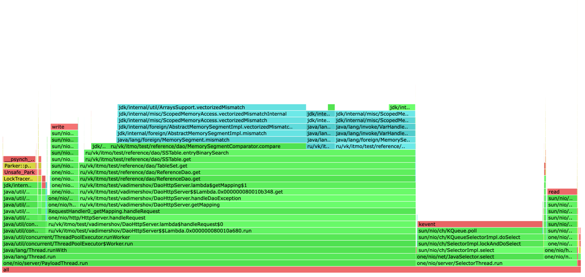

Из графика видим, что бизнес логики get запроса нужно 58.10%, для получения задачи из очереди нужно 7.48%

####Результаты работы async-profiler (ALLOC):

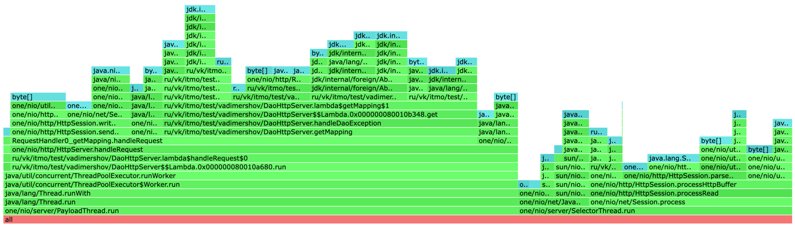

Из графика видно, что бизнес логике нужно 39.89%, для получения задачи из очереди 0.90%

####Результаты работы async-profiler (LOCK):

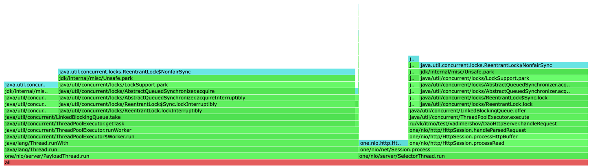

60.65% потребовалось для работы пула потоков остальное для библиотеки

###GET 35k r/s (разладка)
####Результаты работы wrk:

```
 50.000%    1.36ms
 75.000%    1.82ms
 90.000%    2.25ms
 99.000%    4.83ms
 99.900%   51.07ms
 99.990%   57.44ms
 99.999%   60.45ms
100.000%   64.99ms
```

Видим что время выполнения запросов увеличилось

####Результаты работы async-profiler (CPU):

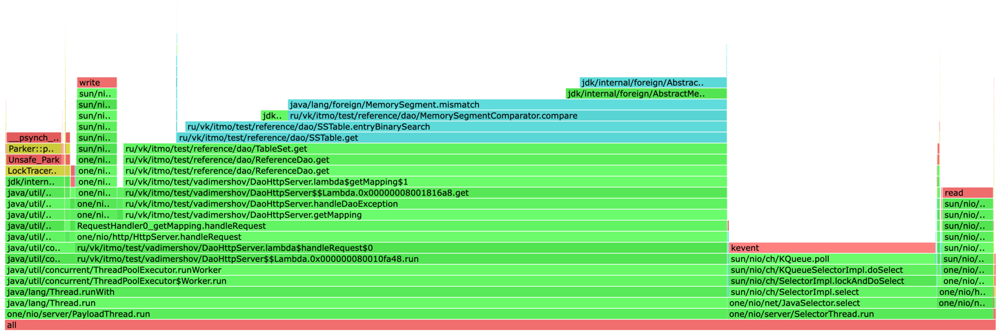

Графики идентичны с прошлыми результатами, аномалий нет

####Результаты работы async-profiler (ALLOC):

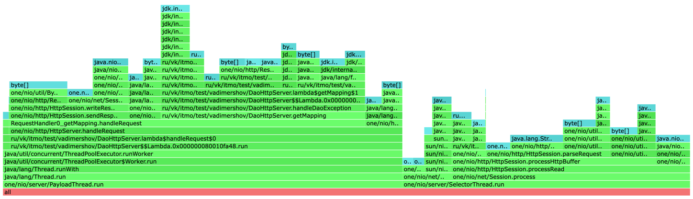

Из графика видим, что бизнес логики get запроса потребовалось меньше чем в прошлом результате: 29.75%, 
для получения задачи из очереди нужно 0.94%

####Результаты работы async-profiler (LOCK):

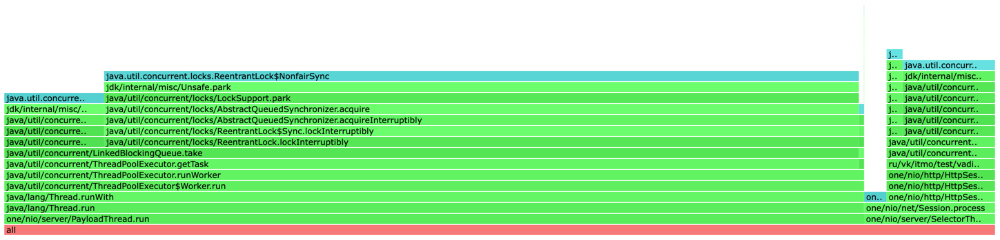

Увеличилось процент локов в реализации, уже 86.77%

###GET 40k r/s (больше разладки)
####Результаты работы wrk:

```
 50.000%    1.68s
 75.000%    2.23s
 90.000%    2.59s
 99.000%    2.99s
 99.900%    3.18s
 99.990%    3.23s
 99.999%    3.25s
100.000%    3.25s
```

Видим что время выполнения запросов увеличилось достаточно высоко, считаем что мы превысили точку разладки.
Также стоит отметить что выполнилось только 38к запросов

####Результаты работы async-profiler (CPU):

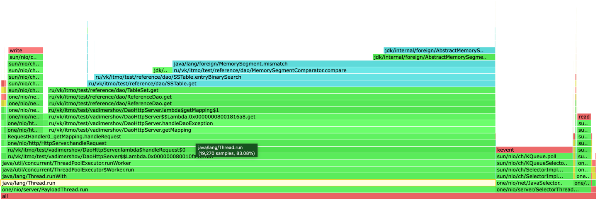

75.15% было использовано бизнес логикой метода get, получение задачи из очереди: 0.79%

####Результаты работы async-profiler (ALLOC):

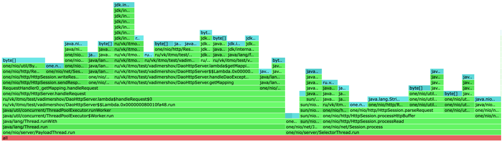

Графики идентичны с прошлыми результатами, аномалий нет

####Результаты работы async-profiler (LOCK):

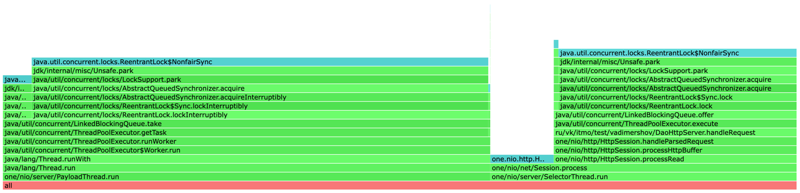

61.39% - процент локов для бизнес-логики приложения

