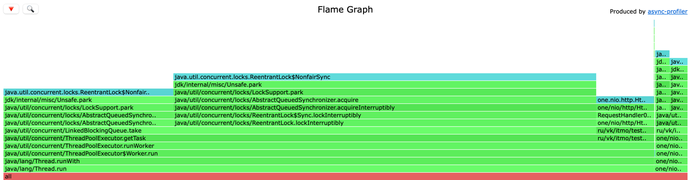

# Анализ программы с использованием wrk2 и async-profiler

Хотелось бы отметить то, что я сделал изменение в своей первоначальной реализации,
допусти ошибку связанную с тем, что для каждой виртуальной ноды создавал новый объект HttpClient,
сейчас переделано.

Также изменил количество виртуальных нод с 5 на 128, потому что при 5 распределение было неравномерным.
Рассмотрим таблицы для 5 и 128:

#### При 5 виртуальных нодах получаем

| size | port |
|------|------|
| 3.2M | 9080 |
| 1.6M | 9081 |
| 400K | 9082 |

#### При 128 виртуальных нодах получаем

| size | port |
|------|------|
| 720K | 9080 |
| 800K | 9081 |
| 800K | 9082 |

Ну как мы можем заметить при 3 нодах и 5 виртуальных нод не позволяет равномерно распределить данные.
При 128 виртуальных нод мы получаем хорошее распределение.
Также стоит отметить, что при 5 виртуальных нод мы можем обработать больше запросов, чем при 128. 
Думаю это связано с тем, что мы чаще ходим в исходную ноду, так как я посылаю запрос на 9080 
и большая часть записей попадает на сервер с этим портом.

[//]: # (Я заметил что есть различие в прогретой и не прогретой бд)

Реализация моего шардированного сервиса:

1. Для распределения использовал consistent hashing через murmur3 из библиотеки one-nio, он нужен для определения места ключа в системе.
2. Для взаимодействия между нодами использовал клиент из one-nio.
3. Реализовал отдельный класс ShardingDao для лучшей абстракции, что позволило значительно меньше изменить класс сервер,
в себе он оборачивает работу с локальным дао и со смежными системами.

## Перейдем к тестам и сравнениям

Проводя различные тестирования, я столкнулся с проблемой выделения коннектов 
и мне пришлось изменить количество коннектов wrk до 64, так как не выделялись коннекты к смежным нодам.

### Точка разладки для upsert является 35к запросов в секунду
Получаем 35к rps это больше чем при синзронной реализацией (лаб 1), 
но меньше чем при асинхронной без шардирования (лаб 2), так как у нас появились затраты на сетевое взаимодействие 
(подробнее это рассмотрим в выводе профалировщика)

```
 50.000%    5.84ms
 75.000%   56.48ms
 90.000%   93.63ms
 99.000%  196.61ms
 99.900%  346.62ms
 99.990%  378.11ms
 99.999%  389.63ms
100.000%  392.70ms
```

Получаем достаточно неплохие результаты, да, это хуже, чем в реализации во 2 лаб, 
но в данном случаем мы получаем шардированную хорошо распределенную бд

#### CPU


На основе диаграммы cpu видно, что больше всего времени уходит на отправку put запросов в смежные ноды (25.90%). 
Локальное сохранение на диаграмме почти не видны и занимают всего 0.85%.
Из-за этого при асинхронной реализации не было таких проблем и та реализация могла выдержать больше запросов.

#### ALLOC


Тут можно тоже увидеть, что большое количество аллокаций уходит на метод put (73.60%), конкретно на чтение ответа от сервиса.
И всего 2.35% аллокаций нужны для upsert dao.

#### LOCK


Какого-то явного отличие от прошлый лабораторных работ я не замечаю

### Точка разладки для get является 37к запросов в секунду

Получаем 37к rps это больше чем при синзронной реализацией (лаб 1) и при асинхронной без шардирования (лаб 2), 
хоть и появились затраты на взаимодействие через сеть

```
50.000%    3.42ms
75.000%   14.60ms
90.000%  136.70ms
99.000%  158.34ms
99.900%  237.95ms
99.990%  260.99ms
99.999%  262.91ms
100.000%  264.96ms
```

Видим, что при 37к запросов в секунду происходит точка разладки, рассмотрим профалировщик


#### CPU


На диаграмме видно, что обращений в локальную бд (4.18%) занимает меньше процентов, 
чем отправка get запроса в ноды (25.08%)
Оперделение ноды, в которую нужно отправить запрос или локально записать, происходит всего за 0.48%, 
что никак не ухудшит работу.
Можно было бы как-то из заголовка запроса вычитывать, что этот запрос пришел из другой ноды, а не из клиента, и сразу начинать поиск

#### ALLOC


На диаграмме, как и при get мы видим что больше всего процентов уходит на чтение ответа от смежной ноды (76.36%), 
для поиска ноды (1.93%), так как используем tailMap и всего 0.70% процентов уходит для поиска в локальной dao


#### LOCK


Какого-то явного отличие от прошлый лабораторных работ я не замечаю


Можно сделать вывод, что сама работа dao не так сильно влияет как сетевое взаимодействие между нодами
Можно улучшить и в хедере передавать что этот запрос пришел от смежной ноды и не запускать поиск виртуальной ноды, 
но прирост в производительности будет не велик так как и сейчас нет узкого горлышка в этом алгоритме.
Как еще один возможный пункт для запросов которые возвращают только HttpCode можно не парсить response body, 
тогда мы должны значительно уменьшить количество аллокаций


