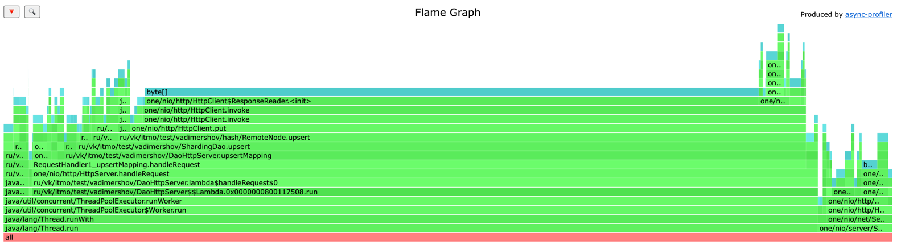

# Анализ программы с использованием wrk2 и async-profiler

Для проведения анализов использовал 3 ноды (from) и кворумом равный 2 нодам.
То есть сохранение и получение данных происходило минимум из двух нод.
Для выбора нод использовал тот же алгоритм, что и в 3 лабораточной, пришлось его доделать, 
чтоб получать не одну конкретную ноду. То есть я нахожу конкретную ноду для данного ключа и начинаю идти по кольцу, 
находя не первые попавшиеся виртуальные ноды, а уникальные (с уникальным url).

Распределение между нода осталось таким же равномерным 

| size     | port |
|----------|------|
| 160.5 Mb | 9080 |
| 160.5 Mb | 9081 |
| 160.5 Mb | 9082 |


### Точка разладки для upsert является 6.5к запросов в секунду

Это значительно меньше чем в прошлой реализации, в прошлой значение было 35к. 
Связано это со многим факторами:
- самое главное, что мы сохраняем реплики на смежные ноды
- запрос может прийти вообще не на ноду, которую выберет алгоритм, 
и придется отправлять запрос на сохранение в другие две ноды (вероятность такого попадания примерно 33%
(при нашей реализации, конечное процент будет другой в зависимости от количества нод и указывания кворума)). 
В идеальном случае мы отправим только один запрос в смежную ноду (66%).
- Выбор нод тоже занимает чуть больше по сравнению с прошлым вариантом, 
так как нам нужно найти кворум уникальных нод по кольцу
- Сохраняем в дао время

```
 50.000%    0.87ms
 75.000%    1.21ms
 90.000%    3.84ms
 99.000%   87.17ms
 99.900%  108.80ms
 99.990%  111.17ms
 99.999%  111.49ms
100.000%  111.55ms
```

Получаем достаточно не плохой результат работы, количество запросов уменьшилось в примерно 5 раз, 
но при этом мы получили хорошо реплицируемый сервис, и не боимся за потерю сохранения данных при отказе ноды

#### CPU


На основе диаграммы cpu видно, что больше всего времени уходит на отправку put запросов 
в смежные ноды (RemoteNode) 25.19%. 
Сохранение в локальную ноду занимает всего 1.51%.
Поиск нод занимает всего 0.25%.
Можно сделать вывод, больше всего времени уходит на работу по сити и с отправкой ответов на запросы.

#### ALLOC


Тут все также, как и в прошлой лабе, получем больше всего аллокаций на чтение ответа из ноды, 
которая уже может быть не одна (77.40%), хоть мы и добавили в бд сохранение времени с типом Long. 
Для сохранения в локальную бд 2.97%.
Поиск нод не увличился, хоть нам нужно найти не одну ноду.

#### LOCK


Увеличилось количество локов для отправки ответа, это логично так как нам нужно отправить 
ответ уже не с одной ноды, а с нескольких (одной или двух)


### Точка разладки для get является 2.1к запросов в секунду

Получаем 2.1к rps это значительно меньше чем в прошлой реализации, 
но это связано с реплицированием данных и запрос на несколько нод, и получение самых актуальных данных из всех ответов

```
 50.000%    2.82ms
 75.000%    6.63ms
 90.000%   30.69ms
 99.000%   55.26ms
 99.900%   62.98ms
 99.990%   64.93ms
 99.999%   65.12ms
100.000%   65.12ms
```

#### CPU


Из диаграммы видим что увеличились проценты для получение данных.
Стоит отметить, что больше всего уходит на получение из локальной бд 63.59%, видно, что не произошло оптимизаций
кода для SSTable.get, как в прошлой лабораторной.
Также стоит отметить, что мы получаем также время upsert записи, также так как мы сохраняем время,
то и количество файлов увеличилось.
Ну и основной фактор влияющий на проценты в том что мы читаем с локальных бд всегда с 2 нод.
Получение данных со смежных нод всего 11.25%

#### ALLOC


Тут все стандартно, больше всего аллокаций идет на чтение ответа от смежных нод (79.72%), 
и теперь их может быть две, а не одна. 
2.86% процентов уходит для поиска в локальной dao, это значение больше чем в прошлой лабораторной, 
так как мы читаем две записи
Поиск нод всего 1.63%
Для определения самой новой записи (PriorityQueue) 0.31%

#### LOCK


Все (100%) локов уходит на отправку ответа

### Вывод
Вывод который можно сделать, при реализации репликаций мы проигрываем в скорости как upsert так и get запросов, 
но при этом мы обезопасили себя от выключения и недоступности определенного количества нод, знаем что получим только 
актуальные данные даже если в какой-то ноде есть неактуальные данные.
Можно реализовать систему быстрого чтения, путем сохранения записи на все ноды, а чтения только из нескольких нод, 
или из одной если мы будем уверены в том что ни одна нода не была выключена 

Улучшения которые я вижу, сделать параллельный вызов смежных сервисов и дожидаться только ack ответов

