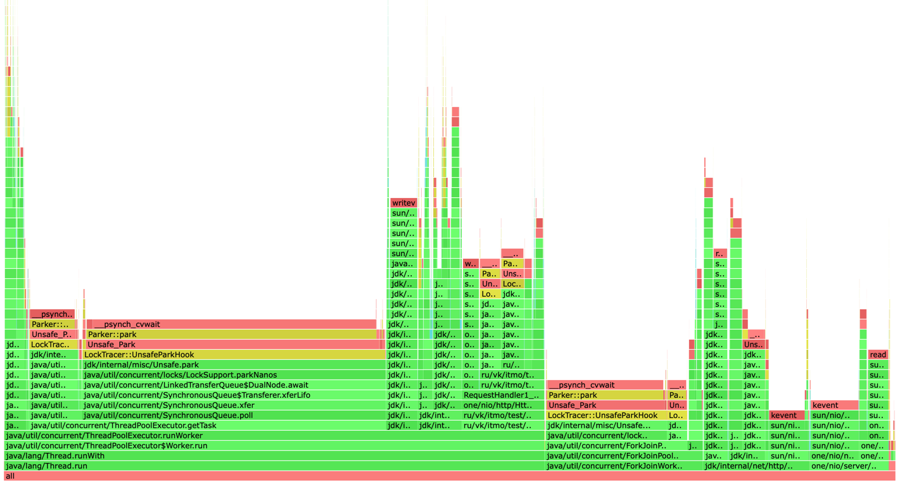
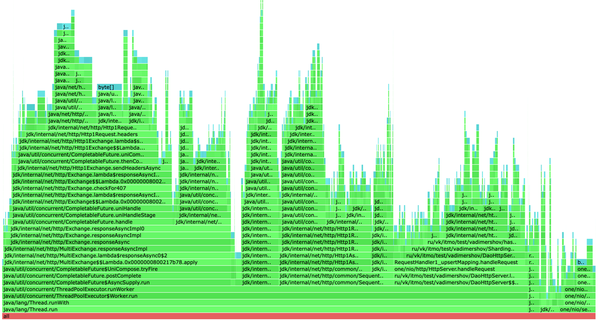
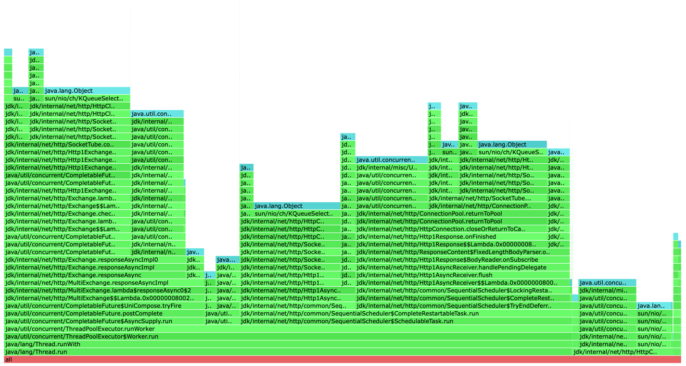
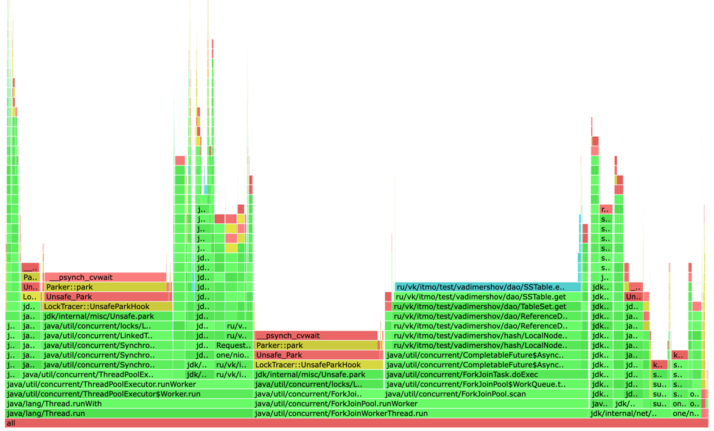
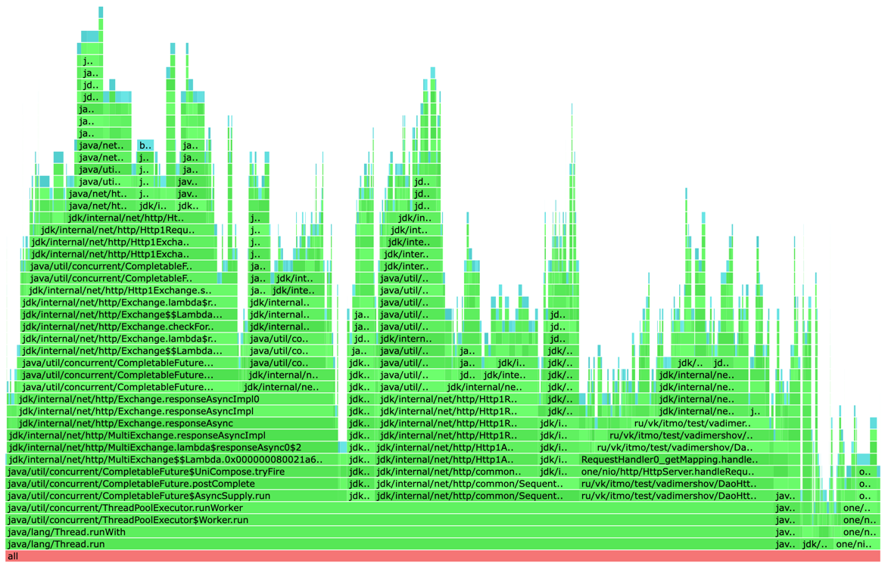
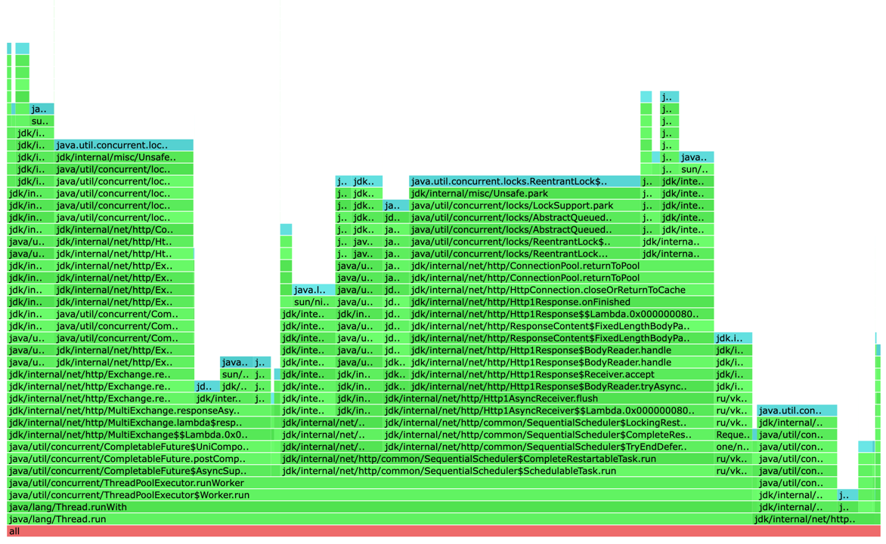

# Анализ программы с использованием wrk2 и async-profiler

Был использован httpClient java с асинхронным вызовом запросов, после идет объединение всех Future.
В объединении я добавлял метод whenComplete в котором считал количество положительных и ошибочных ответов, 
при достижении порога ошибочных и положительных результатов отправлял самый свежий из данных ответ (timestamp) 
Распределение между надами как в прошлой реализации не изменилось данные кладутся равномерно


### Точка разладки для upsert является 11.5к запросов в секунду

Значение с прошлого раза увеличилось в чуть меньше чем в 2 раза, и при этом остаемся со всеми плюсами из лабораторной 4

```
 50.000%    1.58ms
 75.000%   19.14ms
 90.000%   66.37ms
 99.000%  214.27ms
 99.900%  273.41ms
 99.990%  279.81ms
 99.999%  280.57ms
100.000%  281.09ms
```

Получаем хороший результат при асинхронной реализации, добавляя скорости.
Плюсом ускорения является то, что мы можем сделать сразу все запросы ко всем нужным нам нодам, 
потом просто ждать ответа. При получении ответа считаем положительные/отрицательные и при пороговом значении сразу 
отдавать ответ, что все ок или нет.

#### CPU


На основе диаграммы cpu видно, что на работу нашего DAO сервера уходит значительно меньше процентов 9% вместо 46%.
Из которых сохранение в локальную DAO занимает 0.8% на создание запроса в смежные ноды 1.4%. 
На метод waitFuture в котором есть join на получение положительного или отрицательного результата, 
чтоб отправить ответ уходит 2.61%, а на join для внутренних запросов 2.38%.
Отправка ответа занимает 1.9%. Все остальное время занимает асинхронные взаимодействия и работа библиотеки one nio

#### ALLOC

Уменьшилось количество аллокаций для работы DAO c 80% до 20%, но при этом появились аллокации 
для работы асинхронных запросов и их обработок. Отправка асинхронного запроса занимает 10%.
Можно сказать что аллокации самой DAO значительно не существенней чем асинхронное взаимодействие.

#### LOCK


Самое интересно мы должны получить в локах. 48% уделяется на SchedulableTask.run так как он, вроде как, 
отвечает за построение цепочек выполнения асинхронных процессов (whenComplete). 
Для AsyncSupply.run 30%, который используется для ожидания через синхронный блок. 
5.3 % уходил для пула воркеров.
И только 0.33% нужно для отправки ответа.


### Точка разладки для get является 10к запросов в секунду

```
 50.000%  128.45ms
 75.000%  234.75ms
 90.000%  359.68ms
 99.000%  476.67ms
 99.900%  535.04ms
 99.990%  547.33ms
 99.999%  548.86ms
100.000%  548.86ms
```

Из-за асинхронного взаимодействия получаем прирост точки разладки в 5 раз вместо 2.1 к получаем 10к,
при этом получаем все те же плюсы, что и в лабораторной работе 4.

#### CPU


Из диаграммы видно, что есть разделение выполнения get из локального DAO, 
так как процесс происходит также в ComputableFuture, составляет все 27% вместо 64%.
Отправка ответа 1.5%, join для внутренних запросов 1.7%, ожидание выполнения всех запросов 1%, 
создания задачи для локальной dao 0.18%, отправка запроса в смежную ноду 1%.
Все остальные ресурсы уходят на работы one nio, пула потоков и внутренние процессы java

#### ALLOC


Тут такая же картина, как и с upsert, больше всего аллокаций уходит на асинхронные процессы. 
По процентам для работы dao сервера 16%, вместо 84%
(с учетом асинхронной отправки запросов, созданием URI, созданием запроса и проставления заголовков)
get в локальную dao 0.6%, в смежную ноду 16%, поиск ноды 0.8%, ожидание ответа от смежных нод 1%, 
join для отправки ответа 0.23%.

#### LOCK


Локи на локальной дао занимают всего 4.38%, AsyncSupply.run 30%, SchedulableTask.run 50%, 1 % уходил для пула воркеров.
По определяем тут все также, как и при upsert, потому что влияние работы дао совсем незначительное


### Вывод

Переделав реализация на асинхронную мы получили значительный прирост в latency. 
Из-за этого мы не дожидаемся всех from, а только если положительно то ack, либо from - ack + 1 
если отрицательно 

Возможные улучшения: если получили достаточное количество 
отрицательных или положительных ответов, то можно не дожидаться ответа от серверов и завершать запрос, 
чтоб не уходило время на коннект и выполнение.

