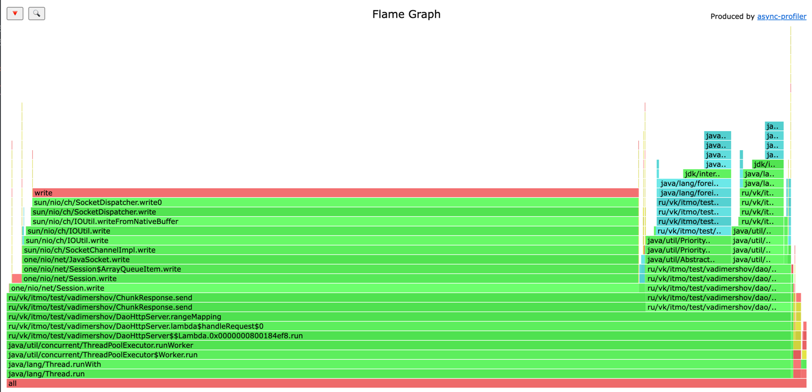
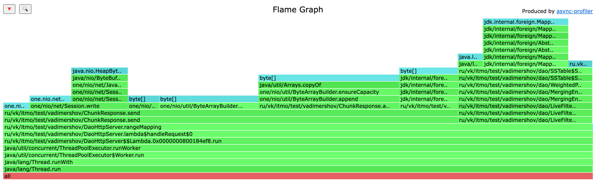
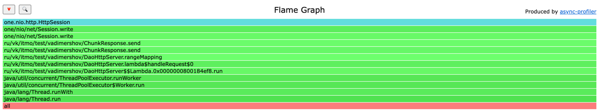

# Анализ программы с использованием wrk2 и async-profiler

Формирую ArrayByteBuilder аналогично как это делает nio помещаю данные key и value и отправляю это в сессию, 
реализованно через Transfer-Encoding: chunked. Количество данных в бд значительно больше чем может поместиться в памяти,
но это не мешает так как я перебираю данные через итератор.

Range Mapping занимает 98% в который входит: 79% под запись в сессию, 0.78% для метода append класса ByteArrayBuilder,
18% на метод next в итераторе по всем значениям
Оставшаяся работа уходит на внутренние процессы java и библиотеки one nio. 
Каких либо странных отклонений я не увидел, как мне кажется в данном случае все процессы в основном и связанны 
с записью и получение данных

Больше всего аллокация уходит как раз на отправку в сессию наших чанков 77%: 
запись в сессию 17%, 24% для метода append класса ByteArrayBuilder, 10% для преобразования MS в byteArray, 
остальное уходит на аллокации one nio.
Также аллокации в размере 28 % уходят на next получение следующей записи

Тут, как и ожидалось, все время локов уходит на запись сессию.

### Вывод
Можно сделать вывод, что на текущий момент наше приложение может обрабатывать range запросы не зависимо 
от количества записей, мы не сохраняем и не отправляем все записи сразу, 
а делаем это поэтапно через Transfer-Encoding: chunked
