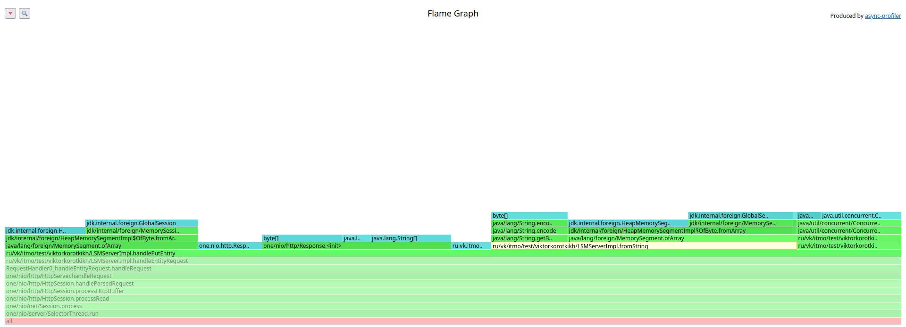

# Stage 1

- [PUT](#PUT)
    * [Latency](#latency)
    * [CPU profiling](#cpu-profiling)
    * [Memory allocations](#memory-allocations)
- [PUT hot](#PUT-hot)
  * [Latency](#latency-1)
  * [CPU profiling](#cpu-profiling-1)
  * [Memory allocations](#memory-allocations-1)
- [GET (после PUT)](#Get-после-PUT)
    * [Latency](#latency-2)
    * [CPU profiling](#cpu-profiling-2)
    * [Memory allocations](#memory-allocations-2)
- [GET (после compaction)](#get-после-compaction)
  * [Latency](#latency-3)
  * [CPU profiling](#cpu-profiling-3)
  * [Memory allocations](#memory-allocations-3)


## PUT

### Latency

Экспериментальным путём было выявлено, что стабильной нагрузкой ниже точки разладки является 5500 запросов в секунду.

Результаты замера ([PUT-5500-60s.txt](PUT-5500-60s.txt)):
```
  Latency Distribution (HdrHistogram - Recorded Latency)
 50.000%  695.00us
 75.000%    0.99ms
 90.000%    1.18ms
 99.000%    4.35ms
 99.900%   19.49ms
 99.990%   22.14ms
 99.999%   22.29ms
100.000%   22.30ms
```


На графике хорошо заметно, что, во-первых, есть заметный рост задержки около 98%, и, во-вторых, гигантский рост после 99%.
Это связано с прогревом JVM (на cpu профиле будет видно, что большое количество процессорного времени заняла jit компиляция).

### Cpu profiling


На графике профилирования cpu видно, что немалую часть времени заняла jit компиляция - примерно 25% всего процессорного времени.

При этом большую часть времени обработки запроса занимает запись ответа - почти 30% процессорного времени:


Также часть времени заняла запись sstable на диск - 12%:


### Memory allocations


Больше всего памяти выделяется при приёме запроса - аллокация буффера для чтения запроса.

Также видно, что именно чтение тела запроса занимает больше памяти, чем все остальные параметры 
(заголовки, параметры и т.д.).



При обработке запроса память занимает преобразование строки параметра id в MemorySegment (выделение byte[]), 
а также преобразование тела запроса в MemorySegment.


При сохранении sstable выделяется заметное количество памяти при чтении индекс файла (readAllLines), 
а также при инициализации BufferedOutputStream для записи в файл.

Повторное чтение индекс файла можно заменить на постоянно хранящийся в памяти список sstable, 
который заполняется при инициализации dao и просто модифицируется.

## Put (hot)

Проведём повторное тестирование и посмотрим, как будет вести себя система с уже прогретой jvm.

### Latency

[PUT-5500-60s-hot.txt](PUT-5500-60s-hot.txt):
```
  Latency Distribution (HdrHistogram - Recorded Latency)
 50.000%  698.00us
 75.000%    0.99ms
 90.000%    1.16ms
 99.000%    1.28ms
 99.900%    5.22ms
 99.990%    7.49ms
 99.999%    7.76ms
100.000%    7.78ms
```


В целом график похож на график теста с холодной jvm, но задержки для 99.9+ перцентиля в 3 раза меньше.

### Cpu profiling

То, что jvm была прогрета подтверждает и график профилирования CPU - jit компиляция заняла лишь ~5% вместо 25%:


### Memory allocations

С точки зрения аллокаций ничего не поменялось:


## Get (после PUT)

### Latency

GET запросы отправлялись на прогретой jvm после PUT запросов.

Экспериментальным путём было выявлено, что стабильной нагрузкой ниже точки разладки является 4000 запросов в секунду.

Результаты замера ([GET-4000-60s](GET-4000-60s.txt)):

```
Latency Distribution (HdrHistogram - Recorded Latency)
50.000%    1.01ms
75.000%    1.45ms
90.000%    1.98ms
99.000%   31.09ms
99.900%   49.41ms
99.990%   50.24ms
99.999%   50.40ms
100.000%   50.49ms
```


На графике хорошо заметно, что серьёзные "проблемы" начинаются после 90%. Но после 99.9% выходят на плато.

### Cpu profiling


На графике профилирования cpu видно, что большую часть времени занимают операции сравнения MemorySegment - 24% времени.
Операции записи ответа в сокет занимают всего 2.7%.

### Memory allocations


Немалое количество памяти выделяется при отправке ответа на запрос - 45% от общего количества.

Парсинг самого запроса потребляет лишь 3%.

Куда большее количество памяти требуется при поиске Entity - 48%. 
Это происходит из-за чтения Entity с диска и копирования его значения в byte[] (так как Response в качестве тела ответа принимает byte[]).

## Get (после compaction)

### Latency

Результаты замера ([GET-4000-60s-after-compaction.txt](GET-4000-60s-after-compaction.txt)):

```
  Latency Distribution (HdrHistogram - Recorded Latency)
 50.000%    0.99ms
 75.000%    1.42ms
 90.000%    1.75ms
 99.000%    1.95ms
 99.900%    1.98ms
 99.990%    2.06ms
 99.999%    2.33ms
100.000%    2.70ms
```


На графике хорошо заметно, что в целом latency стала более ровной, но есть "проблемы" около трёх девяток 

### Cpu profiling


Всё ещё большу́ю часть времени занимают операции сравнения MemorySegment - 22% времени.
Однако запись в сокет стала потреблять 34%. Это связано с тем, что до compact у нас был список sstable, по которому 
мы итерировались и для каждого sstable выполняли бинарный поиск, а после compact выполняем бинарный поиск в одном файле, 
что оказалось быстрее.

### Memory allocations


C точки зрения аллокаций в целом ситуация осталась такой же.
