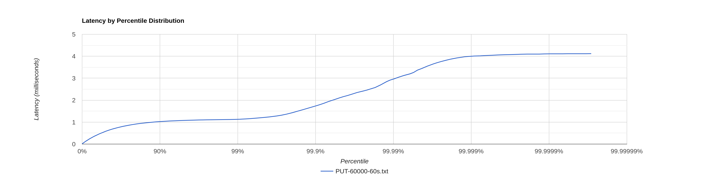
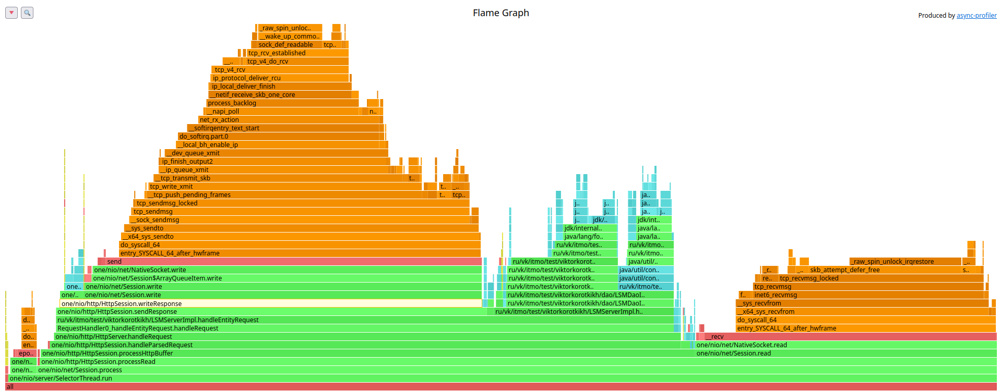

# Stage 1

Новый отчёт с использованием новых скриптов для создания запросов. Оказалось, что прошлая версия не могла обеспечить большой
RPS из-за долгой генерации тела запроса. То есть wrk физически не мог пропихнуть нужное количество запросов.

- [PUT](#PUT)
    * [Latency](#latency)
    * [CPU profiling](#cpu-profiling)
    * [Memory allocations](#memory-allocations)
- [PUT hot](#PUT-hot)
    * [Latency](#latency-1)
    * [CPU profiling](#cpu-profiling-1)
    * [Memory allocations](#memory-allocations-1)
- [GET (после PUT)](#Get-после-PUT)
    * [Latency](#latency-2)
    * [CPU profiling](#cpu-profiling-2)
    * [Memory allocations](#memory-allocations-2)
- [GET (после compaction)](#get-после-compaction)
    * [Latency](#latency-3)
    * [CPU profiling](#cpu-profiling-3)
    * [Memory allocations](#memory-allocations-3)

## PUT

### Latency

Стабильная нагрузка 60000 запросов в секунду.

Результаты замера ([PUT-60000-60s.txt](PUT-60000-60s.txt)):

```
  Thread calibration: mean lat.: 1.193ms, rate sampling interval: 10ms
  Thread Stats   Avg      Stdev     Max   +/- Stdev
    Latency   579.52us  330.73us   4.12ms   58.95%
    Req/Sec    63.25k     3.80k   89.33k    68.37%
  Latency Distribution (HdrHistogram - Recorded Latency)
 50.000%  580.00us
 75.000%    0.86ms
 90.000%    1.02ms
 99.000%    1.13ms
 99.900%    1.73ms
 99.990%    2.96ms
 99.999%    4.00ms
100.000%    4.12ms
```



На графике хорошо заметно, что, до 99-го и после 99.999-го перцентилей есть плато. Вероятнее всего часть ресурсов было отнято jit
компиляцией, после которой запросы стали обрабатываться быстрее.

### Cpu profiling


На графике профилирования cpu видно, что немалую часть времени заняла jit компиляция - примерно 10% всего процессорного
времени.

При этом часть времени обработки запроса занимает запись ответа - почти 40% процессорного времени.
Примерно столько же занимает сама обработка запроса.
Флаш занял лишь 3% времени.

### Memory allocations


Больше всего памяти выделяется при записи entry в базу 34%:


1. Преобразование тела запроса в MemorySegment
2. Создание объекта Response
3. Преобразование id в MemorySegment
4. Создание ноды в ConcurrentHashMap

Явное место для оптимизации - перестать каждый раз заново создавать объект Response и возвращать заранее созданный.
Но создание константы не даст прироста, а даже скорее всего приведёт к лишним аллокациям, так как при отправке запроса\
(метод `HttpSession::sendResponse`) добавляется заголовок `"Connection: Keep-Alive"` или `"Connection: close"`.
Заголовки добавляются инкрементально, то есть с каждым новым вызовом метода `HttpSession::sendResponse` массив
заголовков увеличивается в размере (если массив заполнен, то происходит его копирование в массив побольше (+4)).
При 60k rps будет ~15k копирований массива в секунду. При этом каждое новое копирование будет линейно больше
предыдущего.
Легко понять, что такие "улучшения" приведут к огромным утечкам памяти.

В таком случае можно задать несколько констант с заголовком `"Connection: Keep-Alive"` или `"Connection: close"`
(разные константы для потокобезопасности, так как нам всё равно придётся проверять заголовок запроса и решать какой из
заголовков писать в response), создать свою реализацию HttpSession и переопределить метод `sendResponse`,
а также переопределить метод `HttpServer::createSession`.


При сохранении sstable выделяется заметное количество памяти при чтении индекс файла (readAllLines),
а также при инициализации BufferedOutputStream для записи в файл.

Повторное чтение индекс файла можно заменить на постоянно хранящийся в памяти список sstable,
который заполняется при инициализации dao и просто модифицируется.

## Put (hot)

Проведём повторное тестирование и посмотрим, как будет вести себя система с уже прогретой jvm.

### Latency

[PUT-60000-60s-hot.txt](PUT-60000-60s-hot.txt):

```
Running 1m test @ http://localhost:8080
  1 threads and 1 connections
  Thread calibration: mean lat.: 0.579ms, rate sampling interval: 10ms
  Thread Stats   Avg      Stdev     Max   +/- Stdev
    Latency   584.88us  332.91us   3.10ms   59.05%
    Req/Sec    62.96k     3.99k   76.44k    72.61%
  Latency Distribution (HdrHistogram - Recorded Latency)
 50.000%  586.00us
 75.000%    0.87ms
 90.000%    1.03ms
 99.000%    1.18ms
 99.900%    1.70ms
 99.990%    2.60ms
 99.999%    2.98ms
100.000%    3.11ms
```


В целом график похож на график теста с холодной jvm, но задержки 99.999 перцентиля стали меньше на 1ms.

### Cpu profiling

То, что jvm была прогрета подтверждает и график профилирования CPU - jit компиляция заняла лишь ~3% вместо 10%:


### Memory allocations

С точки зрения аллокаций в целом ничего не поменялось:


## Get (после PUT)

### Latency

GET запросы отправлялись на прогретой jvm после PUT запросов.

Экспериментальным путём было выявлено, что стабильной нагрузкой ниже точки разладки является 30000 запросов в секунду.

Результаты замера ([GET-30000-60s](GET-30000-60s.txt)):

```
  Thread Stats   Avg      Stdev     Max   +/- Stdev
    Latency   646.75us  384.88us   5.79ms   65.27%
    Req/Sec    31.61k     2.34k   40.11k    65.32%
  Latency Distribution (HdrHistogram - Recorded Latency)
 50.000%  638.00us
 75.000%    0.93ms
 90.000%    1.09ms
 99.000%    1.72ms
 99.900%    1.98ms
 99.990%    4.51ms
 99.999%    5.66ms
100.000%    5.79ms
```


На графике хорошо заметно, что есть 2 скачка - около 94% и 99.95%. Причём второй очень заметный.

### Cpu profiling


На графике профилирования cpu видно, что большую часть времени занимают операции сравнения MemorySegment - 38% времени.
30% - `MemorySegment.mismatch`.

Операции записи ответа занимают всего 17%.

Такое большое количество операций сравнения обусловлено тем, что мы итерирумся через список sstable и выполняем 
бинарный поиск над каждой sstable. Так как ключи у нас линейно растут с каждым запросом (`key${counter}`), то получается,
что в самых свежих sstable хранятся наиболее большие ключи (относительно `${counter}`), а так как мы итерироваться начинаем
как раз с самых свежих, то получается, что первые запросы выполняются дольше, чем последние. Тут также имеет влияние page cache -
 очевидно, что большое количество файлов + прыжки по ним могут легко его убить.

### Memory allocations


Почти 30% аллокаций приходится на парсинг запроса - `parseRequest` и `Utf8.read`.


1. На чтение entity уходит 12% памяти.
2. Те же 12% идут на преобразование id в MemorySegment.
3. Создание инстанса Response занимает 13%.
4. Копирование MemorySegment в byte[] для записи в Response.

Уменьшить количество аллокаций можно засчёт своей реализации Response - принимать в качестве тела MemorySegment 
и переопределить метод `toBytes`. 
Это позволит избежать лишнего копирования MemorySegment в byte[].

## Get (после compaction)

### Latency

Результаты замера ([GET-30000-60s-aftercompact.txt](GET-30000-60s-aftercompact.txt)):

```
  Thread Stats   Avg      Stdev     Max   +/- Stdev
    Latency     1.01ms  552.03us   3.15ms   59.59%
    Req/Sec    31.58k     1.76k   39.33k    77.04%
  Latency Distribution (HdrHistogram - Recorded Latency)
 50.000%    1.01ms
 75.000%    1.45ms
 90.000%    1.79ms
 99.000%    2.01ms
 99.900%    2.11ms
 99.990%    2.54ms
 99.999%    3.03ms
100.000%    3.15ms
```


На графике хорошо заметно, что в целом latency стала более ровной - появилось плато до 99.97%, но есть после него 
также есть скачок. Возможно, это связано page cache.

### Cpu profiling



Теперь весь поиск Entity занимает 17%, а запись ответа 43%. Очевидно, что бинарный поиск по одному файлу оказался 
эффективнее.

30% времени занимает чтение из сокета.

### Memory allocations


C точки зрения аллокаций в целом ситуация осталась такой же.
