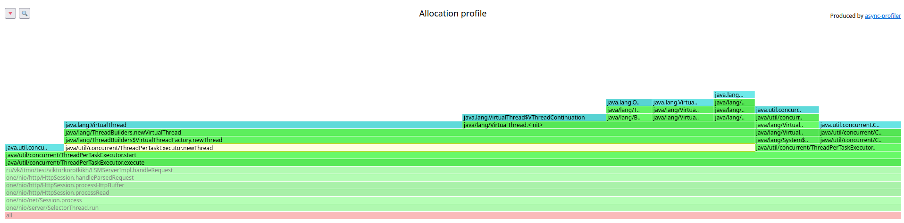
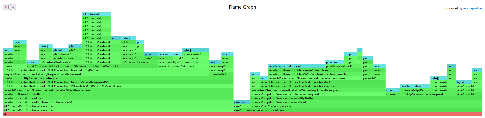
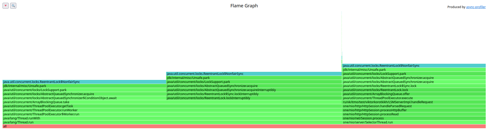
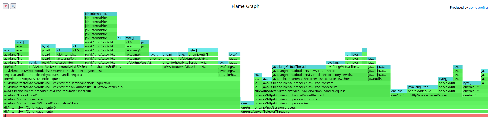
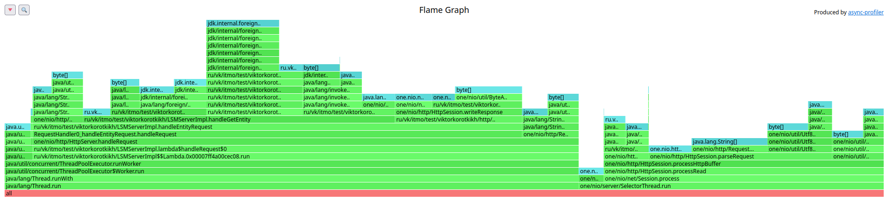
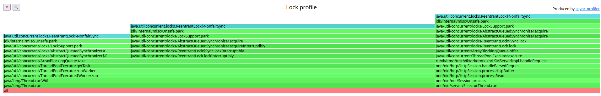

# Stage 2 - Сравнение virtual threads, thread pool + LinkedBlockingQueue, thread pool + ArrayBlockingQueue

- [Stage 2 - Сравнение virtual threads, thread pool + LinkedBlockingQueue, thread pool + ArrayBlockingQueue]()
    * [1 thread, 1 connection](#1-thread-1-connection)
        + [PUT](#put)
            - [Virtual Threads CPU](#virtual-threads-cpu)
            - [ThreadPool LinkedBlockingQueue CPU](#threadpool-linkedblockingqueue-cpu)
            - [ThreadPool ArrayBlockingQueue CPU](#threadpool-arrayblockingqueue-cpu)
            - [Virtual Threads Alloc](#virtual-threads-alloc)
            - [ThreadPool LinkedBlockingQueue Alloc](#threadpool-linkedblockingqueue-alloc)
            - [ThreadPool ArrayBlockingQueue Alloc](#threadpool-arrayblockingqueue-alloc)
            - [Virtual Threads Lock](#virtual-threads-lock)
            - [ThreadPool LinkedBlockingQueue Lock](#threadpool-linkedblockingqueue-lock)
            - [ThreadPool ArrayBlockingQueue Lock](#threadpool-arrayblockingqueue-lock)
        + [GET](#get)
            - [Virtual Threads CPU](#virtual-threads-cpu-1)
            - [ThreadPool LinkedBlockingQueue CPU](#threadpool-linkedblockingqueue-cpu-1)
            - [ThreadPool ArrayBlockingQueue CPU](#threadpool-arrayblockingqueue-cpu-1)
            - [Virtual Threads Alloc](#virtual-threads-alloc-1)
            - [ThreadPool LinkedBlockingQueue Alloc](#threadpool-linkedblockingqueue-alloc-1)
            - [ThreadPool ArrayBlockingQueue CPU](#threadpool-arrayblockingqueue-cpu-2)
            - [Virtual Threads Lock](#virtual-threads-lock-1)
            - [ThreadPool LinkedBlockingQueue Lock](#threadpool-linkedblockingqueue-lock-1)
            - [ThreadPool ArrayBlockingQueue Lock](#threadpool-arrayblockingqueue-lock-1)
    * [1 thread, 64 connections](#1-thread-64-connections)
        + [PUT](#put-1)
            - [Virtual Threads CPU](#virtual-threads-cpu-2)
            - [ThreadPool LinkedBlockingQueue CPU](#threadpool-linkedblockingqueue-cpu-2)
            - [ThreadPool ArrayBlockingQueue CPU](#threadpool-arrayblockingqueue-cpu-3)
            - [Virtual Threads Alloc](#virtual-threads-alloc-2)
            - [ThreadPool LinkedBlockingQueue Alloc](#threadpool-linkedblockingqueue-alloc-2)
            - [ThreadPool ArrayBlockingQueue Alloc](#threadpool-arrayblockingqueue-alloc-1)
            - [Virtual Threads Lock](#virtual-threads-lock-2)
            - [ThreadPool LinkedBlockingQueue Lock](#threadpool-linkedblockingqueue-lock-2)
            - [ThreadPool ArrayBlockingQueue Lock](#threadpool-arrayblockingqueue-lock-2)
        + [GET](#get-1)
            - [Virtual Threads CPU](#virtual-threads-cpu-3)
            - [ThreadPool LinkedBlockingQueue CPU](#threadpool-linkedblockingqueue-cpu-3)
            - [ThreadPool ArrayBlockingQueue CPU](#threadpool-arrayblockingqueue-cpu-4)
            - [Virtual Threads Alloc](#virtual-threads-alloc-3)
            - [ThreadPool LinkedBlockingQueue Alloc](#threadpool-linkedblockingqueue-alloc-3)
            - [ThreadPool ArrayBlockingQueue CPU](#threadpool-arrayblockingqueue-cpu-5)
            - [Virtual Threads Lock](#virtual-threads-lock-3)
            - [ThreadPool LinkedBlockingQueue Lock](#threadpool-linkedblockingqueue-lock-3)
            - [ThreadPool ArrayBlockingQueue Lock](#threadpool-arrayblockingqueue-lock-3)
    * [Итог](#Итог)

## 1 thread, 1 connection

### PUT

| [virtualThreads](PUT-1connection-virtualthreads-60k.txt)                                                                                                                                                                                                                                                                                                                                                               | [TP + LinkedBQ](PUT-1connection-pool-linkedqueue-60k.txt)                                                                                                                                                                                                                                                                                                                                                              | [TP + ArrayBQ](PUT-1connection-pool-arrayqueue-60k.txt)                                                                                                                                                                                                                                                                                                                                                                |
|------------------------------------------------------------------------------------------------------------------------------------------------------------------------------------------------------------------------------------------------------------------------------------------------------------------------------------------------------------------------------------------------------------------------|------------------------------------------------------------------------------------------------------------------------------------------------------------------------------------------------------------------------------------------------------------------------------------------------------------------------------------------------------------------------------------------------------------------------|------------------------------------------------------------------------------------------------------------------------------------------------------------------------------------------------------------------------------------------------------------------------------------------------------------------------------------------------------------------------------------------------------------------------|
| <pre>  Thread Stats   Avg      Stdev     Max   +/- Stdev     Latency     7.07ms   22.01ms 129.22ms   92.73%     Req/Sec    62.97k     4.79k   77.11k    74.80%   Latency Distribution (HdrHistogram - Recorded Latency)  50.000%  709.00us  75.000%    1.05ms  90.000%   16.33ms  99.000%  120.51ms  99.900%  128.06ms  99.990%  129.09ms  99.999%  129.28ms 100.000%  129.28ms</pre> | <pre>  Thread Stats   Avg      Stdev     Max   +/- Stdev     Latency     8.30ms   13.79ms  69.25ms   83.60%     Req/Sec    63.14k     5.03k   75.22k    66.79%   Latency Distribution (HdrHistogram - Recorded Latency)  50.000%    1.13ms  75.000%    9.93ms  90.000%   28.21ms  99.000%   62.91ms  99.900%   68.80ms  99.990%   69.25ms  99.999%   69.25ms 100.000%   69.31ms</pre> | <pre>  Thread Stats   Avg      Stdev     Max   +/- Stdev     Latency     2.71ms    6.28ms  44.96ms   92.49%     Req/Sec    63.18k     4.91k   74.78k    64.63%   Latency Distribution (HdrHistogram - Recorded Latency)  50.000%  827.00us  75.000%    1.24ms  90.000%    5.53ms  99.000%   34.43ms  99.900%   44.03ms  99.990%   44.90ms  99.999%   44.96ms 100.000%   44.99ms</pre> |
|                                                                                                                                                                                                                                                                                                                   |                                                                                                                                                                                                                                                                                                               |                                                                                                                                                                                                                                                                                                                 |

По гистограмме хорошо видно, что virtualThreads примерно около 88% имеют резкий рост задержки.
Между 75% и 90% разница в 16 раз.

ThreadPool показывает лучшие результаты - гистограмма более плавная. Однако по задержкам ArrayBlockingQueue выигрывает у
LinkedBlockingQueue.

#### Virtual Threads CPU

У виртуальных потоков большую часть времени занимает ожидание задачи. Вероятно это связано с устройством ForkJoinPool,
на
базе которого работает `Executors.newVirtualThreadPerTaskExecutor()`.

#### ThreadPool LinkedBlockingQueue CPU

#### ThreadPool ArrayBlockingQueue CPU

По профилю CPU видно, почему arrayqueue работает быстрее, чем linkedqueue - меньше времени затрачивается на получение
задачи из очереди: 11.85% против 8.76%.

В остальном профили одинаковые, что логично, так как мы поменяли тут лишь очередь.

#### Virtual Threads Alloc

#### ThreadPool LinkedBlockingQueue Alloc

#### ThreadPool ArrayBlockingQueue Alloc

У ThreadPool executor нет накладных расходов, кроме создания объекта ConditionNode:

Virtual Threads требуют 20% аллокаций на создание виртуального потока:

#### Virtual Threads Lock

#### ThreadPool LinkedBlockingQueue Lock

#### ThreadPool ArrayBlockingQueue Lock

ArrayBlockingQueue тратит больше времени на блокировку при добавлении в очередь. Virtual Threads кроме общих блокировок
на LSMCustomSession (synchronized методы) больше нигде не блокируется.

### GET

| [virtualThreads](GET-1connection-virtualthreads.txt)                                                                                                                                                                                                                                                                                                                                                            | [TP + LinkedBQ](GET-1connection-pool-linkedqueue-60k.txt)                                                                                                                                                                                                                                                                                                                                                              | [TP + ArrayBQ](GET-1connection-pool-arrayqueue-60k.txt)                                                                                                                                                                                                                                                                                                                                                                |
|-----------------------------------------------------------------------------------------------------------------------------------------------------------------------------------------------------------------------------------------------------------------------------------------------------------------------------------------------------------------------------------------------------------------|------------------------------------------------------------------------------------------------------------------------------------------------------------------------------------------------------------------------------------------------------------------------------------------------------------------------------------------------------------------------------------------------------------------------|------------------------------------------------------------------------------------------------------------------------------------------------------------------------------------------------------------------------------------------------------------------------------------------------------------------------------------------------------------------------------------------------------------------------|
| <pre>   Thread Stats   Avg      Stdev     Max   +/- Stdev     Latency     5.02s   875.60ms   5.90s    79.84%     Req/Sec    28.60k     2.96k   34.40k    63.64%   Latency Distribution (HdrHistogram - Recorded Latency)  50.000%    5.30s  75.000%    5.71s  90.000%    5.87s  99.000%    5.90s  99.900%    5.91s  99.990%    5.91s  99.999%    5.91s 100.000%    5.91s</pre> | <pre>  Thread Stats   Avg      Stdev     Max   +/- Stdev     Latency    13.43s     4.62s   20.89s    59.37%     Req/Sec    20.12k     1.07k   21.38k    66.67%   Latency Distribution (HdrHistogram - Recorded Latency)  50.000%   14.02s   75.000%   17.42s   90.000%   19.45s   99.000%   20.81s   99.900%   20.89s   99.990%   20.91s   99.999%   20.91s  100.000%   20.91s </pre> | <pre>  Thread Stats   Avg      Stdev     Max   +/- Stdev     Latency    11.22s     3.59s   16.74s    60.13%     Req/Sec    22.24k     1.59k   23.82k    85.71%   Latency Distribution (HdrHistogram - Recorded Latency)  50.000%   11.64s   75.000%   14.36s   90.000%   15.68s   99.000%   16.65s   99.900%   16.74s   99.990%   16.75s   99.999%   16.75s  100.000%   16.75s </pre> |
|                                                                                                                                                                                                                                                                                                                |                                                                                                                                                                                                                                                                                                                   |                                                                                                                                                                                                                                                                                                                     |

По гистограмме хорошо видно, что все сервисы перегружены. Но Virtual Threads показывает лучшие результаты.
По задержкам ArrayBlockingQueue выигрывает у LinkedBlockingQueue.

#### Virtual Threads CPU

Снова у виртуальных потоков немалую часть времени занимает ожидание задачи.

#### ThreadPool LinkedBlockingQueue CPU

#### ThreadPool ArrayBlockingQueue CPU

По профилю CPU не видно, почему arrayqueue работает быстрее, чем linkedqueue. Но на профиле локов станет всё понятно.

#### Virtual Threads Alloc

#### ThreadPool LinkedBlockingQueue Alloc

#### ThreadPool ArrayBlockingQueue CPU

У ThreadPool executor также из изменений создание объекта ConditionNode

Virtual Threads требуют 30% аллокаций на создание виртуального потока.

#### Virtual Threads Lock

#### ThreadPool LinkedBlockingQueue Lock

#### ThreadPool ArrayBlockingQueue Lock

ArrayBlockingQueue блокируется только на LSMCustomSession, в то время как LinkedBlockingQueue имеет блокировки ещё и в
очереди. Это объясняет бОльшие задержки - скорее всего переполняется очередь. Virtual Threads блокируются только на
сессии.

Скорее всего Virtual Threads работают быстрее как минимум из-за отсутствия блокировок на очереди и отсутствия блокировок
в dao,
так как при get запросах их нет.

## 1 thread, 64 connections

### PUT

| [virtualThreads](PUT-64connection-virtualthreads-60k.txt)                                                                                                                                                                                                                                                                                                                                                              | [TP + LinkedBQ](PUT-1connection-pool-linkedqueue-60k.txt)                                                                                                                                                                                                                                                                                                                                                              | [TP + ArrayBQ](PUT-1connection-pool-arrayqueue-60k.txt)                                                                                                                                                                                                                                                                                                                                                                |
|------------------------------------------------------------------------------------------------------------------------------------------------------------------------------------------------------------------------------------------------------------------------------------------------------------------------------------------------------------------------------------------------------------------------|------------------------------------------------------------------------------------------------------------------------------------------------------------------------------------------------------------------------------------------------------------------------------------------------------------------------------------------------------------------------------------------------------------------------|------------------------------------------------------------------------------------------------------------------------------------------------------------------------------------------------------------------------------------------------------------------------------------------------------------------------------------------------------------------------------------------------------------------------|
| <pre>  Thread Stats   Avg      Stdev     Max   +/- Stdev     Latency     1.12ms  722.77us  12.70ms   80.67%     Req/Sec    63.44k     6.15k  134.78k    81.52%   Latency Distribution (HdrHistogram - Recorded Latency)  50.000%    1.10ms  75.000%    1.45ms  90.000%    1.81ms  99.000%    2.37ms  99.900%    9.94ms  99.990%   11.53ms  99.999%   12.14ms 100.000%   12.71ms</pre> | <pre>  Thread Stats   Avg      Stdev     Max   +/- Stdev     Latency     1.05ms  508.43us   3.52ms   65.01%     Req/Sec    63.17k     4.48k   77.89k    72.38%   Latency Distribution (HdrHistogram - Recorded Latency)  50.000%    1.07ms  75.000%    1.41ms  90.000%    1.75ms  99.000%    2.18ms  99.900%    2.43ms  99.990%    2.62ms  99.999%    3.00ms 100.000%    3.52ms</pre> | <pre>  Thread Stats   Avg      Stdev     Max   +/- Stdev     Latency     1.06ms  511.41us   3.84ms   65.04%     Req/Sec    63.21k     4.59k   78.11k    73.15%   Latency Distribution (HdrHistogram - Recorded Latency)  50.000%    1.08ms  75.000%    1.41ms  90.000%    1.76ms  99.000%    2.20ms  99.900%    2.45ms  99.990%    2.69ms  99.999%    3.40ms 100.000%    3.84ms</pre> |
|                                                                                                                                                                                                                                                                                                                  |                                                                                                                                                                                                                                                                                                             |                                                                                                                                                                                                                                                                                                               |

По гистограмме хорошо видно, что virtualThreads примерно около 99% имеют резкий рост задержки.

ThreadPool показывает лучшие результаты - гистограмма более плавная. Однако по задержкам ArrayBlockingQueue выигрывает у
LinkedBlockingQueue.

При этом начинают появляться не двухсотые ответы - всё дело в фоновых флашах, которые кидают эксепнш, если memtable
заполнилась, а старая ещё не закончила флашиться.

#### Virtual Threads CPU

У виртуальных потоков снова большую часть времени занимает ожидание задачи

#### ThreadPool LinkedBlockingQueue CPU

#### ThreadPool ArrayBlockingQueue CPU

Профиль CPU arrayqueue и linkedqueue имеют примерно одинаковый.

Сама обработка запроса (RequestHandler::handleRequest) занимает одинаковое время во всех реализациях - примерно 30%.
Но Virtual Threads ещё имеет накладные расходы при переключении виртуальных потоков между собой в рамках одного потока
(на графике в разделе обработки запросов желтым цветом обозначены).

#### Virtual Threads Alloc

#### ThreadPool LinkedBlockingQueue Alloc

#### ThreadPool ArrayBlockingQueue Alloc

В целом профили аллокаций остались такими же.

#### Virtual Threads Lock

Virtual Threads по-прежнему блокируются только на сессии.

#### ThreadPool LinkedBlockingQueue Lock

ThreadPool с LinkedBlockingQueue блокируется на сессии и в очереди - при попытке положить и взять из очереди.

#### ThreadPool ArrayBlockingQueue Lock

ArrayBlockingQueue почему-то не блокируется на сессии, что странно. При повторных попытках снять профиль ситуация была
аналогичной.

### GET

| [virtualThreads](GET-64-virtualthreads.txt)                                                                                                                                                                                                                                                                                                                                                                              | [TP + LinkedBQ](GET-64connection-pool-linkedqueue.txt)                                                                                                                                                                                                                                                                                                                                                                   | [TP + ArrayBQ](GET-64connections-pool-arrayqueue.txt)                                                                                                                                                                                                                                                                                                                                                                    |
|--------------------------------------------------------------------------------------------------------------------------------------------------------------------------------------------------------------------------------------------------------------------------------------------------------------------------------------------------------------------------------------------------------------------------|--------------------------------------------------------------------------------------------------------------------------------------------------------------------------------------------------------------------------------------------------------------------------------------------------------------------------------------------------------------------------------------------------------------------------|--------------------------------------------------------------------------------------------------------------------------------------------------------------------------------------------------------------------------------------------------------------------------------------------------------------------------------------------------------------------------------------------------------------------------|
| <pre>   Thread Stats   Avg      Stdev     Max   +/- Stdev     Latency     0.98ms  440.22us   2.99ms   60.39%     Req/Sec    31.60k     1.77k   38.33k    72.57%   Latency Distribution (HdrHistogram - Recorded Latency)  50.000%    0.97ms  75.000%    1.34ms  90.000%    1.59ms  99.000%    1.85ms  99.900%    2.17ms  99.990%    2.34ms  99.999%    2.43ms 100.000%    2.99ms </pre> | <pre>   Thread Stats   Avg      Stdev     Max   +/- Stdev     Latency     0.97ms  427.18us   2.38ms   60.56%     Req/Sec    32.24k     1.89k   38.78k    70.64%   Latency Distribution (HdrHistogram - Recorded Latency)  50.000%    0.96ms  75.000%    1.31ms  90.000%    1.57ms  99.000%    1.79ms  99.900%    2.15ms  99.990%    2.23ms  99.999%    2.31ms 100.000%    2.38ms </pre> | <pre>   Thread Stats   Avg      Stdev     Max   +/- Stdev     Latency     0.97ms  433.54us   2.40ms   60.03%     Req/Sec    32.06k     1.87k   38.22k    72.34%   Latency Distribution (HdrHistogram - Recorded Latency)  50.000%    0.96ms  75.000%    1.32ms  90.000%    1.56ms  99.000%    1.79ms  99.900%    2.16ms  99.990%    2.28ms  99.999%    2.36ms 100.000%    2.40ms </pre> |
|                                                                                                                                                                                                                                                                                                                                 |                                                                                                                                                                                                                                                                                                                   |                                                                                                                                                                                                                                                                                                                     |

В целом все графики схожи по своему виду. У ArrayBlockingQueue и LinkedBlockingQueue есть ступенька около 99.7%. У 
Virtual Threads тоже есть, но ближе к концу. Также там какой-то непонятный крючок.

#### Virtual Threads CPU

#### ThreadPool LinkedBlockingQueue CPU

#### ThreadPool ArrayBlockingQueue CPU

Профили CPU такие же, как и при 1 connection 1 thread.

#### Virtual Threads Alloc

#### ThreadPool LinkedBlockingQueue Alloc

#### ThreadPool ArrayBlockingQueue CPU

У ThreadPool executor появилось больше аллокаций у selectorThread:

В остальном отличий нет.

#### Virtual Threads Lock

#### ThreadPool LinkedBlockingQueue Lock

#### ThreadPool ArrayBlockingQueue Lock

В локах тоже отличий особо нет.

## Итог

Virtual Threads показали себя лучше всего при get запросах в 1 соединение и 1 тред. В остальных случаях были хуже, кроме 
тех же get запросов при 64 соединениях - там примерно одинаковые результаты. Но Virtual Thread требуют больше аллокаций. 
ArrayBlockingQueue работает лучше, чем LinkedBlockingQueue при работе через одно соединение. При 64 соединениях тоже 
наблюдается преимущество. 

Так что остановимся на реализации ThreadPool + ArrayBlockingQueue, так как по совокупности показателей этот вариант 
более выигрышный. Возможно, имеет смысл сделать 2 executor'а - Virtual Threads для get запросов и ThreadPool + 
ArrayBlockingQueue для put запросов. Но это уже совсем другая история.
