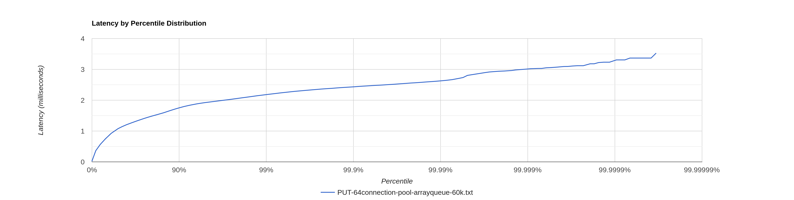
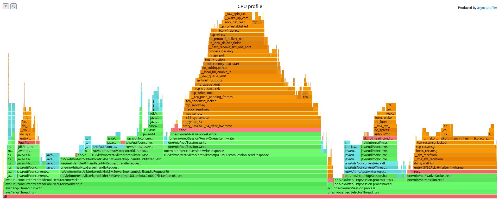
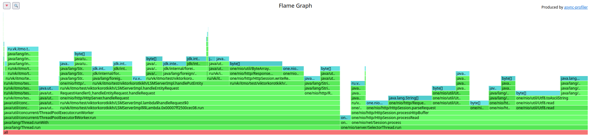
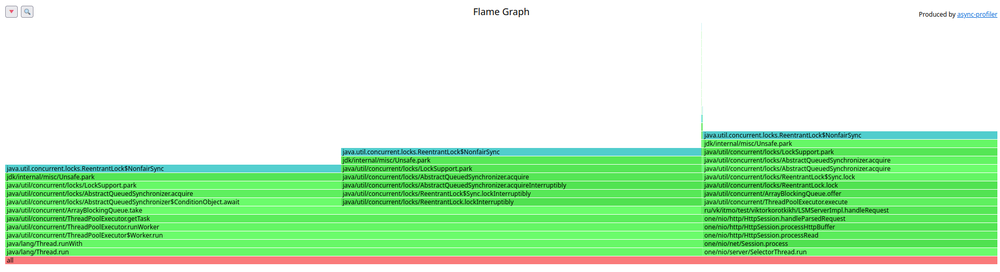
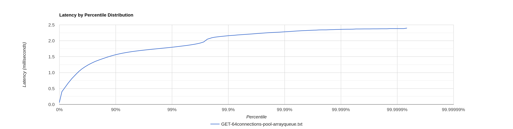
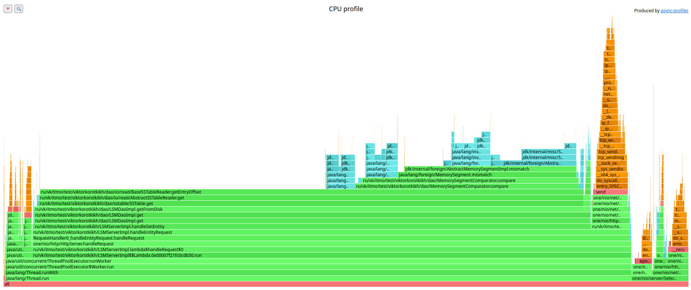
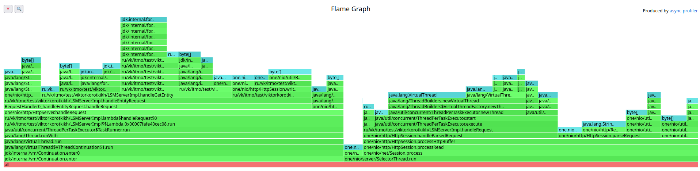
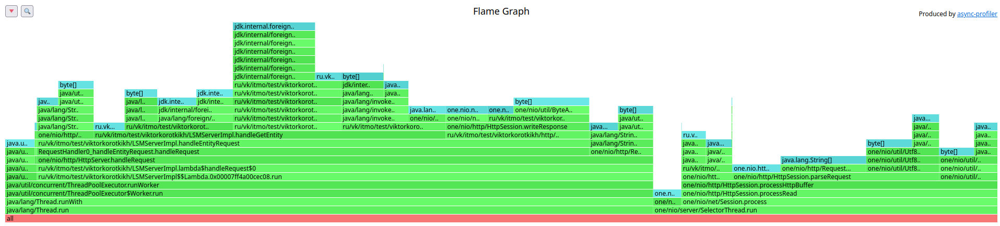
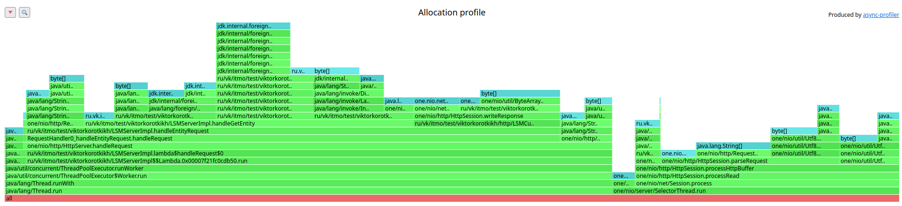
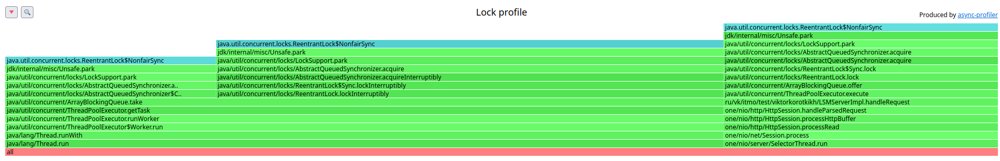

# Stage 2

В качестве основного решения была выбрана реализация ThreadPool + ArrayBlockingQueue.

## 1 thread, 64 connections

### PUT

[PUT-64connection-pool-arrayqueue-60k.txt](PUT-64connection-pool-arrayqueue-60k.txt)

```
  Thread Stats   Avg      Stdev     Max   +/- Stdev
    Latency     1.05ms  508.43us   3.52ms   65.01%
    Req/Sec    63.17k     4.48k   77.89k    72.38%
  Latency Distribution (HdrHistogram - Recorded Latency)
 50.000%    1.07ms
 75.000%    1.41ms
 90.000%    1.75ms
 99.000%    2.18ms
 99.900%    2.43ms
 99.990%    2.62ms
 99.999%    3.00ms
100.000%    3.52ms
```

         

Гистограмма плавная. Красивая.

Есть не двухсотые ответы - всё дело в фоновых флашах.

#### CPU profile



#### Alloc profile



#### Lock profile



ArrayBlockingQueue почему-то не блокируется на сессии, что странно. При повторных попытках снять профиль ситуация была
аналогичной.

### GET

[GET-64connections-pool-arrayqueue.txt](GET-64connections-pool-arrayqueue.txt)

```
  Thread Stats   Avg      Stdev     Max   +/- Stdev
    Latency     0.97ms  433.54us   2.40ms   60.03%
    Req/Sec    32.06k     1.87k   38.22k    72.34%
  Latency Distribution (HdrHistogram - Recorded Latency)
 50.000%    0.96ms
 75.000%    1.32ms
 90.000%    1.56ms
 99.000%    1.79ms
 99.900%    2.16ms
 99.990%    2.28ms
 99.999%    2.36ms
100.000%    2.40ms
```




Есть ступенька около 99.7%.

#### CPU profile



Профили CPU такие же, как и при 1 connection 1 thread.

#### Virtual Threads Alloc



#### ThreadPool LinkedBlockingQueue Alloc



#### Alloc profile



#### Lock profile


