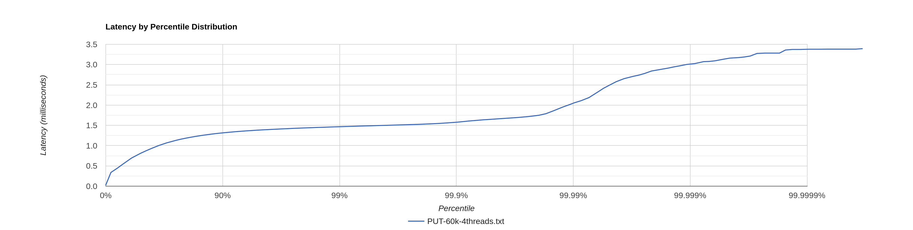
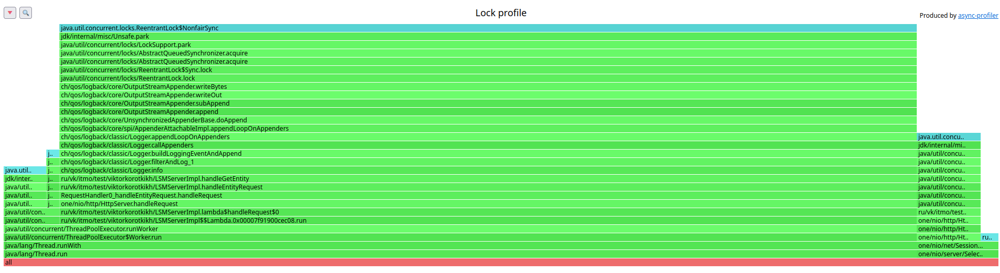

# Stage 2

В качестве основного решения была выбрана реализация ThreadPool + ArrayBlockingQueue.

## 1 thread, 64 connections

### PUT

[PUT-64connection-pool-arrayqueue-60k.txt](PUT-64connection-pool-arrayqueue-60k.txt)

```
  Thread Stats   Avg      Stdev     Max   +/- Stdev
    Latency     1.05ms  508.43us   3.52ms   65.01%
    Req/Sec    63.17k     4.48k   77.89k    72.38%
  Latency Distribution (HdrHistogram - Recorded Latency)
 50.000%    1.07ms
 75.000%    1.41ms
 90.000%    1.75ms
 99.000%    2.18ms
 99.900%    2.43ms
 99.990%    2.62ms
 99.999%    3.00ms
100.000%    3.52ms
```

         

Гистограмма плавная. Красивая.

Есть не двухсотые ответы - всё дело в фоновых флашах.

#### CPU profile


#### Alloc profile


#### Lock profile


ArrayBlockingQueue почему-то не блокируется на сессии, что странно. При повторных попытках снять профиль ситуация была
аналогичной.

### GET

[GET-64connections-pool-arrayqueue.txt](GET-64connections-pool-arrayqueue.txt)

```
  Thread Stats   Avg      Stdev     Max   +/- Stdev
    Latency     0.97ms  433.54us   2.40ms   60.03%
    Req/Sec    32.06k     1.87k   38.22k    72.34%
  Latency Distribution (HdrHistogram - Recorded Latency)
 50.000%    0.96ms
 75.000%    1.32ms
 90.000%    1.56ms
 99.000%    1.79ms
 99.900%    2.16ms
 99.990%    2.28ms
 99.999%    2.36ms
100.000%    2.40ms
```


Есть ступенька около 99.7%.

#### CPU profile


Профили CPU такие же, как и при 1 connection 1 thread.

#### Alloc profile


#### Lock profile


## 4 threads, 64 connections

Использовать будем модифицированные скрипты:

[stage-2-GET.lua](../../scripts/stage-2-GET.lua)

[stage-2-PUT.lua](../../scripts/stage-2-PUT.lua)

### PUT

[PUT-60k-4threads.txt](PUT-60k-4threads.txt)

```
  Thread Stats   Avg      Stdev     Max   +/- Stdev
    Latency   816.87us  360.50us   3.39ms   57.14%
    Req/Sec    15.47k   706.00    18.89k    74.65%
  Latency Distribution (HdrHistogram - Recorded Latency)
 50.000%  811.00us
 75.000%    1.13ms
 90.000%    1.31ms
 99.000%    1.46ms
 99.900%    1.58ms
 99.990%    2.04ms
 99.999%    3.01ms
100.000%    3.39ms
```



Есть полка около 1.5мс с 90% до 99.9%. Затем рост задержки.

Есть не двухсотые ответы - всё дело в фоновых флашах.

Относительно одного треда тут задержки чуть подросли. Возможно дело в том, что wrk2 запускается на той же машине.

#### CPU profile


#### Alloc profile


#### Lock profile


В целом ничего нового.


### GET

[GET-30k-4threads-16workers-2.txt](GET-30k-4threads-16workers-2.txt)


```
  Thread Stats   Avg      Stdev     Max   +/- Stdev
    Latency   817.85us  380.91us  11.99ms   59.88%
    Req/Sec     8.02k   398.13    10.22k    65.03%
  Latency Distribution (HdrHistogram - Recorded Latency)
 50.000%  825.00us
 75.000%    1.13ms
 90.000%    1.32ms
 99.000%    1.55ms
 99.900%    1.76ms
 99.990%    2.60ms
 99.999%    5.82ms
100.000%   12.00ms
```


Тут нам повезло - мы попали по всем ключам. Хотя всё равно есть резкий рост в конце. Возможно там мы ходили в самые 
старые sstable. 

[GET-30k-4threads-unlacky.txt](GET-30k-4threads-unlacky.txt)

````
  Thread Stats   Avg      Stdev     Max   +/- Stdev
    Latency     2.15ms    7.84ms 219.26ms   97.89%
    Req/Sec     7.91k     0.93k   19.00k    91.00%
  Latency Distribution (HdrHistogram - Recorded Latency)
 50.000%    1.21ms
 75.000%    1.68ms
 90.000%    2.15ms
 99.000%   27.34ms
 99.900%  122.18ms
 99.990%  183.29ms
 99.999%  211.84ms
100.000%  219.39ms
````

А вот тут уже невезуха - пришлось все sstable обойти. К тому же очень много запросов мимо: 1735743 из 1798859.

#### CPU profile


В целом всё как обычно - много времени на mistmatch, так как по всем таблицам делаем бинарный поиск.

#### Alloc profile


#### Lock profile



## Увеличим количество wokrers до 256

[GET-30k-4threads-256workers-2.txt](GET-30k-4threads-256workers-2.txt)

```
  Latency Distribution (HdrHistogram - Recorded Latency)
 50.000%    1.12ms
 75.000%    1.51ms
 90.000%    1.82ms
 99.000%    2.32ms
 99.900%    2.68ms
 99.990%    9.42ms
 99.999%   12.22ms
100.000%   13.82ms
```


Тут мы тоже попали и увеличение сыграло нам на руку - задержки уменьшились. Но если нам приходится обходить все sstable 
и мы ключ не находим, то увеличение количества потоков не помогает. Возможно нужно ставить ещё больше, например 1024. 
Тогда может быть и будет профит.
