# Stage 3

- [Stage 3](#stage-3)
    * [Конфигурация](#Конфигурация)
    * [PUT](#put)
        + [CPU profile](#cpu-profile)
        + [Alloc profile](#alloc-profile)
        + [Lock profile](#lock-profile)
    * [GET](#get)
        + [CPU profile](#cpu-profile-1)
        + [Alloc profile](#alloc-profile-1)
        + [Lock profile](#lock-profile-1)

## Конфигурация

wrk2 - 64 connections, 4 threads

Конфигурация кластера - 3 ноды, запущенные в отдельных процессах. Профилируем ноду, на которую шлём все запросы.

## PUT

[PUT-60k.txt](PUT-60k.txt)

```
  Thread Stats   Avg      Stdev     Max   +/- Stdev
    Latency     1.38ms    1.42ms  38.14ms   97.36%
    Req/Sec    15.81k     1.22k   26.44k    74.46%
  Latency Distribution (HdrHistogram - Recorded Latency)
 50.000%    1.22ms
 75.000%    1.70ms
 90.000%    2.18ms
 99.000%    3.87ms
 99.900%   21.89ms
 99.990%   30.17ms
 99.999%   35.36ms
100.000%   38.17ms
```


### CPU profile

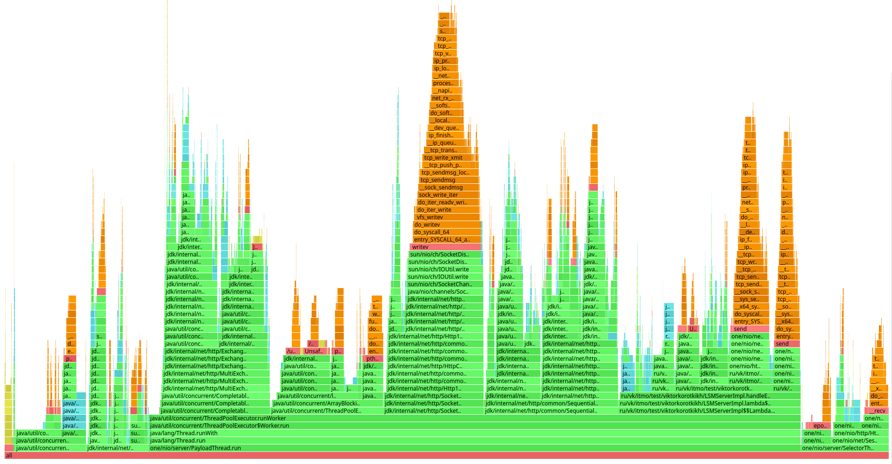

На профиле теперь видно, что очень много семплов занимает богатый внутренний мир httpClient.

Часть из них - отправка запроса:

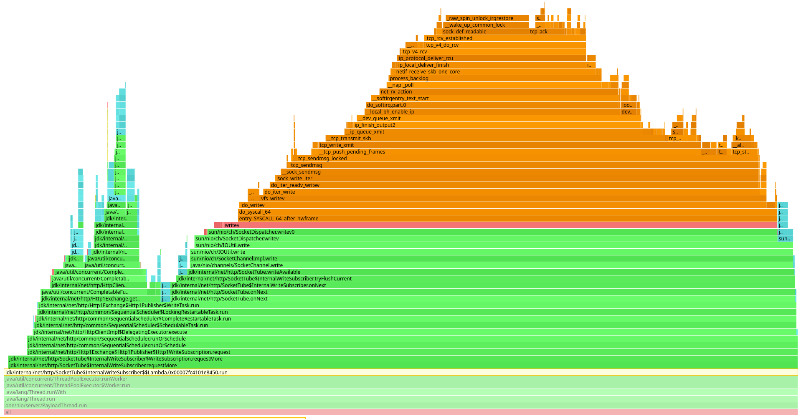

И приём:

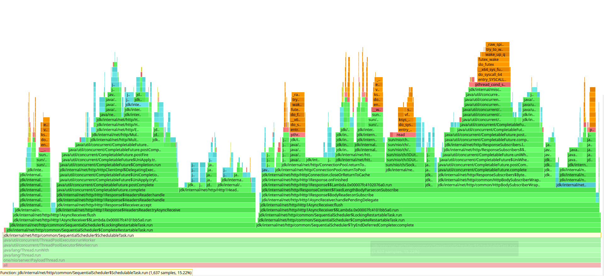

Из интересного - в самом методе sendClusterRequest не видно самой отправки запроса, так как я использую метод sendAsync, 
получаю CompletableFuture и вызываю у него метод timedGet. Отправка/получение ответа происходит в другом executor'е 
(который был передан при создании http клиента), но сам результат получаем в вызывающем. 

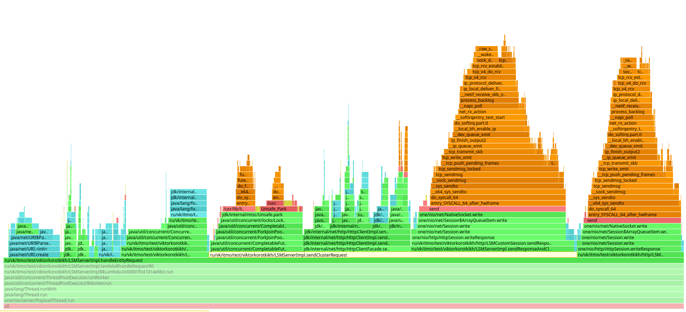

Таким образом, теперь мы получаем, что основная работа при записи данных, уходит на взаимодействие по сети, так как 
локальная запись происходит очень быстро (2.67% всех семплов).

### Alloc profile

Аллокации тоже изменились (раньше было так [PUT-60k-4threads-alloc.png](../stage2/PUT-60k-4threads-alloc.png)):

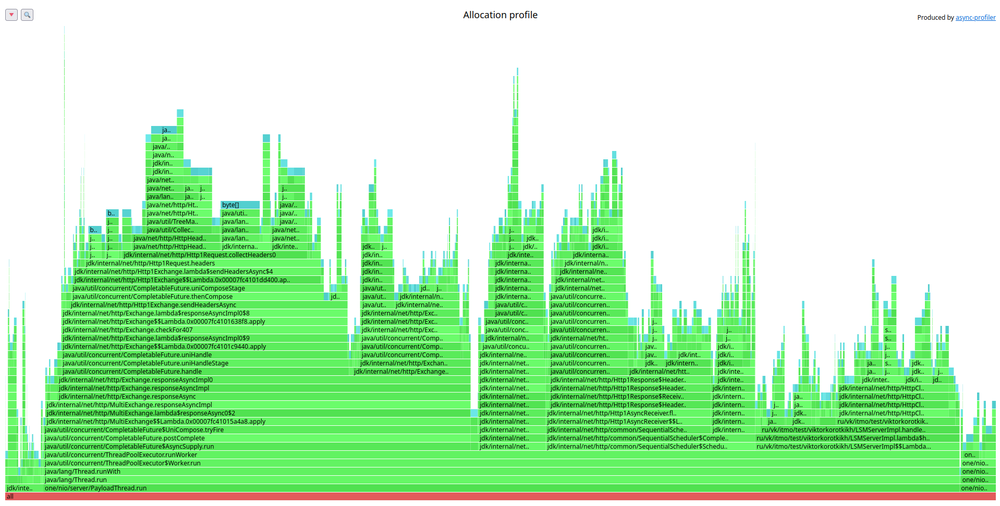

Достаточное количество выделяется на создание заголовков запроса (23.85%):

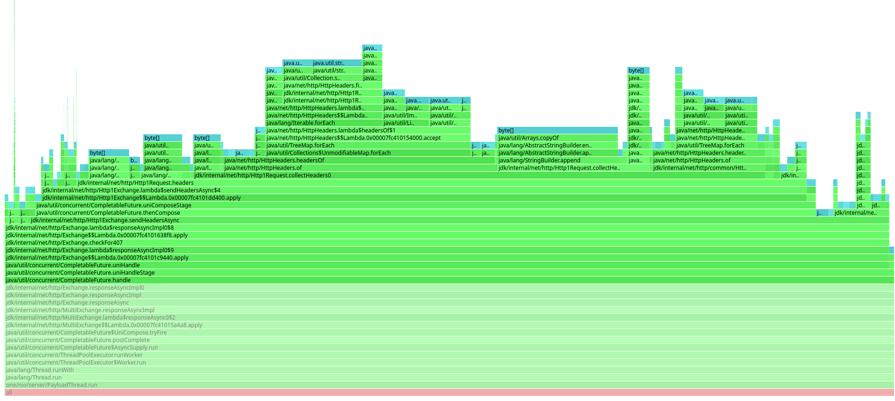

Создание HTTP/2 подключения:


Отправка тела запроса состоит в основном из аллокаций MinimalFuture, так как асинхронная отправка имеет очень много 
стадий CompletableFuture и в очень многих местах создаются новые объекты:

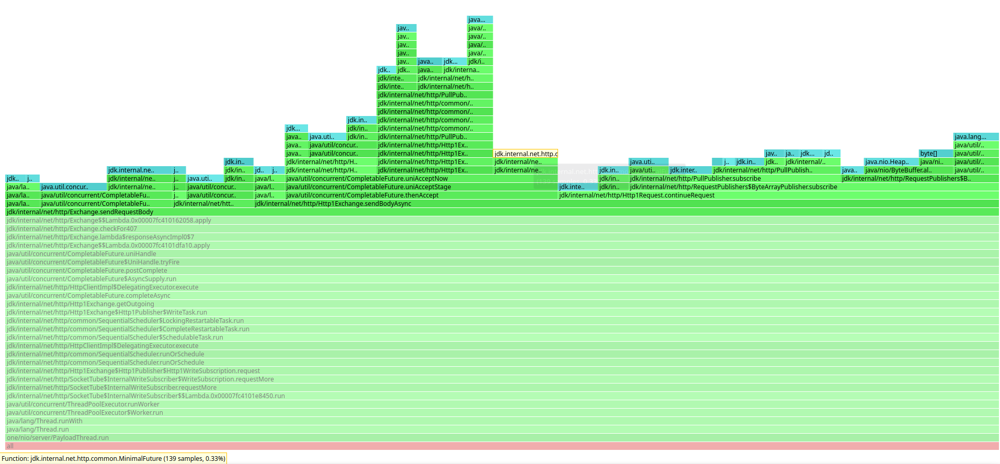

При приёме ответа выделяется память на чтение заголовков - тут "по-честному" выделяем массивы байт, а не future. Также 
выделяем массивы для чтения тела ответа. Но без выделения MinimalFuture тут тоже не обходится:

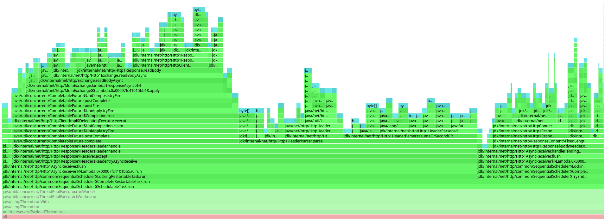

При создании запроса нам приходится каждый раз создавать URI, так как запросы у нас параметризованные (передаем id).
Также видим аллокации на заголовки при создании HttpRequestImpl:

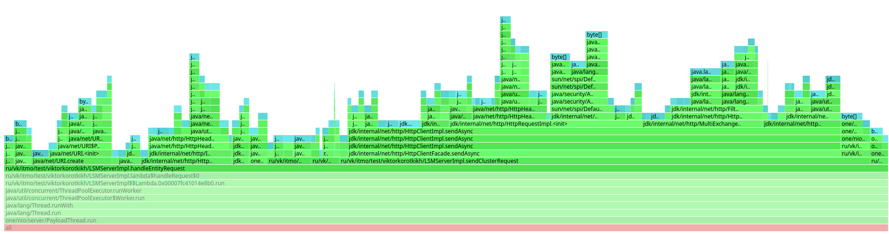

Ещё одна аллокация заголовков происходит из-за того, что httpClient превращает наши заголовки в список ByteBuffers.

### Lock profile

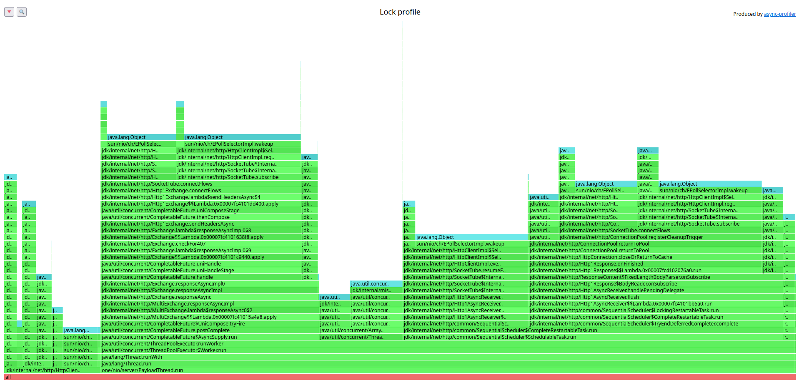

Видим, что в основном блокировки происходят на EPollSelectorImpl.wakeup - TODO объяснить

Всё также видим локи на очереди. Только теперь это локи не только на основном нашем executor'е, но и на executor'е http 
клиента:

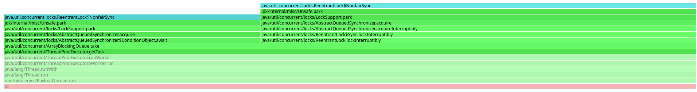

## GET

### CPU profile


### Alloc profile


### Lock profile


