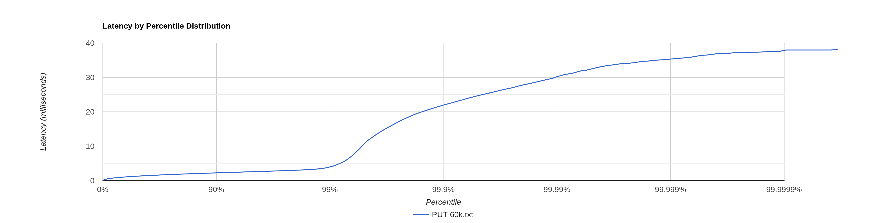

# Stage 3

- [Stage 3](#stage-3)
    * [Конфигурация](#Конфигурация)
    * [PUT](#put)
        + [CPU profile](#cpu-profile)
        + [Alloc profile](#alloc-profile)
        + [Lock profile](#lock-profile)
    * [GET](#get)
        + [CPU profile](#cpu-profile-1)
        + [Alloc profile](#alloc-profile-1)
        + [Lock profile](#lock-profile-1)
  * [GET](#get-key-miss)
      + [CPU profile](#cpu-profile-2)
      + [Alloc profile](#alloc-profile-2)
      + [Lock profile](#lock-profile-2)

## Конфигурация

wrk2 - 64 connections, 4 threads

Конфигурация кластера - 3 ноды, запущенные в отдельных процессах. Профилируем ноду, на которую шлём все запросы.

## PUT

[PUT-60k.txt](PUT-60k.txt)

```
  Thread Stats   Avg      Stdev     Max   +/- Stdev
    Latency     1.38ms    1.42ms  38.14ms   97.36%
    Req/Sec    15.81k     1.22k   26.44k    74.46%
  Latency Distribution (HdrHistogram - Recorded Latency)
 50.000%    1.22ms
 75.000%    1.70ms
 90.000%    2.18ms
 99.000%    3.87ms
 99.900%   21.89ms
 99.990%   30.17ms
 99.999%   35.36ms
100.000%   38.17ms
```



Относительно [предыдущих результатов](../stage2/PUT-60k-4threads.txt) показатели latency стали выше. Это связано с тем, 
что теперь у нас добавились запросы по сети к другим нодам кластера, что приводит к дополнительным расходам. Локальная 
запись значения работает очевидно быстрее, чем запись с пересылкой по сети.

### CPU profile

[PUT-60k-cpu.html](PUT-60k-cpu.html)

На профиле теперь видно, что очень много сэмплов занимает богатый внутренний мир HttpClient - отправка запроса, ожидание
ответа, чтение ответа.

Из интересного - в самом методе sendClusterRequest не видно самой отправки запроса, так как я использую метод sendAsync, 
получаю CompletableFuture и вызываю у него метод timedGet. Отправка/получение ответа происходит в другом executor'е 
(который был передан при создании http клиента), но сам результат получаем в вызывающем.

Таким образом, теперь мы получаем, что основная работа при записи данных, уходит на взаимодействие по сети, так как 
локальная запись в принимающую ноду происходит очень быстро (2.67% всех сэмплов).

### Alloc profile

Аллокации тоже изменились (раньше было так [PUT-60k-4threads-alloc.png](../stage2/PUT-60k-4threads-alloc.png)):

[PUT-60k-alloc.html](PUT-60k-alloc.html)

Достаточное количество выделяется на создание заголовков запроса (23.85%).

Отправка тела запроса состоит в основном из аллокаций MinimalFuture, так как асинхронная отправка имеет очень много
стадий CompletableFuture и в очень многих местах создаются новые объекты.

При приёме ответа выделяется память на чтение заголовков - тут "по-честному" выделяем массивы байт, а не future. Также
выделяем массивы для чтения тела ответа. Но без выделения MinimalFuture тут тоже не обходится.

При создании запроса нам приходится каждый раз создавать URI, так как запросы у нас параметризованные (передаем id).
Также видим аллокации на заголовки при создании HttpRequestImpl.
Ещё одна аллокация заголовков происходит из-за того, что HttpClient превращает наши заголовки в список ByteBuffers.


### Lock profile

[PUT-60k-lock.html](PUT-60k-lock.html)

Видим, что в основном блокировки происходят на `EPollSelectorImpl::wakeup` - он вызывается для пробуждения селектора, 
который в данный момент может находиться в ожидании готовности сокета. Это связано с асинхронной обработкой HTTP 
запросов и ответов.

Потоки регистрируют разные события AsyncEvent (запись в сокет, подписка на чтение из сокета, продолжить чтение из 
сокета и др.), которые пробуждают поток, который делает `socket::select`. Метод `EPollSelectorImpl::wakeup` 
синхронизирован, поэтому и видим локи. Частые асинхронные операции ввода-вывода приводят к такому количеству сэмплов.

Всё также видим локи на очереди. Только теперь это локи не только на основном нашем executor'е, но и на executor'е http 
клиента.

## GET

База объемом ~1.5G, каждая нода хранит около 507mb.

[GET-30k.txt](GET-30k.txt)

```
  Thread Stats   Avg      Stdev     Max   +/- Stdev
    Latency     1.00ms  468.22us   3.99ms   63.28%
    Req/Sec     7.91k   436.09     9.78k    71.60%
  Latency Distribution (HdrHistogram - Recorded Latency)
 50.000%    0.97ms
 75.000%    1.35ms
 90.000%    1.63ms
 99.000%    2.08ms
 99.900%    2.38ms
 99.990%    2.63ms
 99.999%    2.95ms
100.000%    3.99ms
```


Относительно [прошлого результата](../stage2/GET-30k-4threads-16workers-2.txt) показатели latency стали меньше. Это 
может быть связано с тем, что теперь у нас каждая нода хранит в себе меньшее количество sstable, а значит даже полный 
проход по всем sstable на диске занимает в 3 (так как кластер из 3 нод) раза меньше времени на каждой отдельно взятой 
ноде.

### CPU profile

[GET-60k-cpu.html](GET-30k-cpu.html)

Теперь у нас локальное чтение занимает ~34% сэмплов, а общение по сети с другими нодами около 44% (если объединить все 
сэмплы, связанные с работой HttpClient, кроме работы с очередью, так как основной пул потоков использует ту же очередь).

В целом количество сэплов локального чтение совпадает с распределением запросов в кластере - каждая нода должна 
обрабатывать 33.33% запросов к кластеру. Напрямую сравнивать количество сэмплов и количество запросов нельзя, так как 
ноды не только занимаются поиском значений по ключам, но и также имеют операции ввода-вывода и прочие расходы, но данные
значения определённо коррелируют.

### Alloc profile

[GET-60k-alloc.html](GET-30k-alloc.html)

И снова богатый внутренний мир HttpClient приводит чуть ли не к 80% аллокаций от общего числа.
Достаточно большое количество аллокаций (26%) приходится на выделение памяти под заголовки запроса для последующей их 
отправки (`Http1Exchange::sendHeaderAsync`).

При всём этом аллокации `MemorySegment` при чтении занимают всего ~1% (база была перезагружена, так что никаких ключей 
в memTable лежать не могло).

Конечно такое положение дел заставляет ужаснуться, так как уж очень сильный эффект имеет HttpClient. Возможно, эти 
аллокации можно каким-то образом сократить, но это весьма нетривиальная задача, так как HttpClient имеет достаточно 
сложную архитектуру.

### Lock profile

[GET-60k-lock.html](GET-30k-lock.html)

На локах хорошо видно, что на блокировках на очереди HttpClient больше сэмплов, чем на блокировках на очереди, которую 
использует основной пул потоков. Связано это может быть с тем, что при асинхронной обработке запросов HttpClient создаёт
различные CompletableFuture, которые отправляются в ExecutorService.
Также заметно, что блокировки в методе take превалируют над блокировками в методе offer - вероятно тут потоки ожидают 
ответа от ноды кластера.

Так же как и при PUT запросах, в основном блокировки происходят на методе `EPollSelectorImpl::wakeup`.

## Get key miss

Посмотрим на задержки, когда часть запросов обращаются по ключам, которых нет в кластере:

[GET-30k-key-miss.txt](GET-30k-key-miss.txt)

```
  Thread Stats   Avg      Stdev     Max   +/- Stdev
    Latency    21.50ms   49.34ms 260.48ms   87.17%
    Req/Sec     7.50k   226.62     8.31k    87.32%
  Latency Distribution (HdrHistogram - Recorded Latency)
 50.000%    1.75ms
 75.000%    2.86ms
 90.000%  110.46ms
 99.000%  203.39ms
 99.900%  234.49ms
 99.990%  252.16ms
 99.999%  259.58ms
100.000%  260.61ms
```

Latency увеличилась относительно [предыдщуего результата](../stage2/GET-30k-4threads-unlacky.txt).

Детальноно возможно это
связано с тем, что в текущем эксперименте больший объем базы данных.

### CPU profile

[GET-30k-cpu-key-miss.html](GET-30k-cpu-key-miss.html)

Профиль изменился - теперь больше сэмплов приходится на локальное чтение - теперь в ряде случаев (~30%) нам приходится 
обходить все sstable.

### Alloc profile

[GET-30k-alloc-key-miss.html](GET-30k-alloc-key-miss.html)

С точки зрения аллокаций изменений нет.

### Lock profile

[GET-30k-lock-key-miss.html](GET-30k-lock-key-miss.html)

На локах в целом всё тоже осталось по-прежнему. Единственное отличие - стало больше сэмплов в методе 
`Http1AsyncReciever::handlePendingDelegate`. Связано это может быть с тем, что запросы к нодам кластера теперь занимают 
больше времени (каждая нода выполняет трудоёмкий бинарный поиск по всем своим sstable) и нам приходится дольше ожидать 
ответ.
