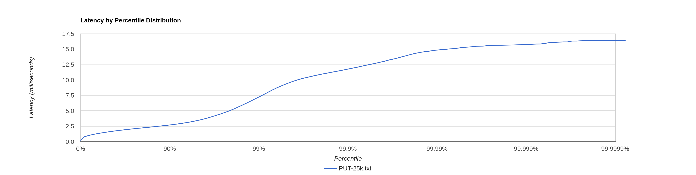
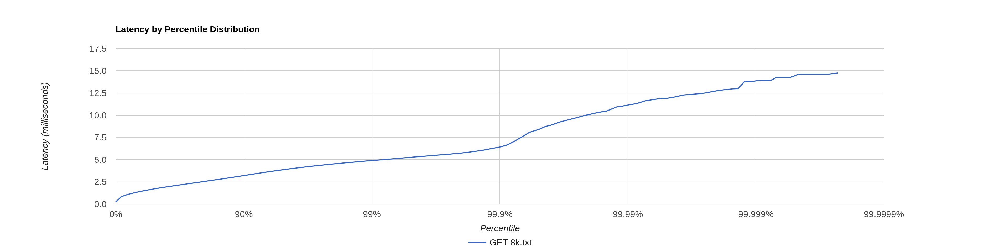

# Stage 4

- [Stage 4](#stage-4)
    * [Конфигурация](#Конфигурация)
    * [PUT](#put)
        + [CPU profile](#cpu-profile)
        + [Alloc profile](#alloc-profile)
        + [Lock profile](#lock-profile)
    * [GET](#get)
        + [CPU profile](#cpu-profile-1)
        + [Alloc profile](#alloc-profile-1)
        + [Lock profile](#lock-profile-1)
    * [`OneNioHttpResponseWrapper` optimization](#OneNioHttpResponseWrapper-optimization)
        + [CPU profile](#cpu-profile-2)
        + [Alloc profile](#alloc-profile-2)
        + [Lock profile](#lock-profile-2)

## Конфигурация

wrk2 - 64 connections, 4 threads

Конфигурация кластера - 3 ноды, запущенные в отдельных процессах. Профилируем ноду, на которую шлём все запросы.

Запросы без параметров ack и from -> по умолчанию реплицирование 2 из 3

## PUT

[PUT-60k.txt](PUT-60k.txt)

```
  Thread Stats   Avg      Stdev     Max   +/- Stdev
    Latency    17.29s     7.29s   30.15s    57.82%
    Req/Sec     7.43k   102.97     7.58k    60.00%
  Latency Distribution (HdrHistogram - Recorded Latency)
 50.000%   17.19s 
 75.000%   23.58s 
 90.000%   27.51s 
 99.000%   29.87s 
 99.900%   30.10s 
 99.990%   30.13s 
 99.999%   30.15s 
100.000%   30.16s 
----------------------------------------------------------
  1790139 requests in 1.00m, 114.38MB read
Requests/sec:  29835.72
Transfer/sec:      1.91MB
```

Сразу видно, что точка разладки уехала вниз - нужно уменьшать нагрузку, 60k RPS мы уже не выдерживаем. Максимум теперь
30k RPS, это видно из отчёта wrk - больше пропихнуть он не смог.

Путём экспериментов была выбрана точка разладки в 25к RPS.

[PUT-25k.txt](PUT-25k.txt)

```
  Thread Stats   Avg      Stdev     Max   +/- Stdev
    Latency     1.76ms    1.18ms  16.37ms   89.30%
    Req/Sec     6.59k   562.16    10.00k    74.85%
  Latency Distribution (HdrHistogram - Recorded Latency)
 50.000%    1.54ms
 75.000%    2.08ms
 90.000%    2.68ms
 99.000%    7.21ms
 99.900%   11.73ms
 99.990%   14.84ms
 99.999%   15.73ms
100.000%   16.38ms
```



Очевидно, что точка разладки сместилась из-за того, что мы делаем обязательную пересылку по сети из-за фактора
реплицирования. При этом в некоторых случаях у нас нет локальной записи на ноду, на которую мы отправили запрос, и есть
2 последовательных запроса по сети к двум другим нодам.

### CPU profile

[PUT-25k-cpu.html](PUT-25k-cpu.html)

На профиле стало видно работу GC - 6.26% от общего числа сэмплов.

В остальном профиль в целом такой же, как и в [предыдущем stage](../stage3/PUT-60k-cpu.html).

Богатый внутренний мир HttpClient никуда не делся. Количество сэмплов на локальную запись уменьшилось до 1.76%, что
логично так как мы теперь ещё больше ходим по сети.

### Alloc profile

Аллокации тоже сильно не изменились (раньше было так [PUT-60k-alloc.html](../stage3/PUT-60k-alloc.html)):

[PUT-25k-alloc.html](PUT-25k-alloc.html)

### Lock profile

[PUT-25k-lock.html](PUT-25k-lock.html)

Блокировки также ([прошлый результат](../stage3/PUT-60k-lock.html)) в основном происходят
на `EPollSelectorImpl::wakeup`.

## GET

База объемом ~1.5G, каждая нода хранит около 517mb.

[GET-30k.txt](GET-30k.txt)

```
  Thread Stats   Avg      Stdev     Max   +/- Stdev
    Latency    23.30s     9.61s   40.01s    57.65%
    Req/Sec     2.50k     6.85     2.51k    75.00%
  Latency Distribution (HdrHistogram - Recorded Latency)
 50.000%   23.30s 
 75.000%   31.64s 
 90.000%   36.63s 
 99.000%   39.65s 
 99.900%   39.94s 
 99.990%   40.01s 
 99.999%   40.04s 
100.000%   40.04s 
----------------------------------------------------------
  599960 requests in 1.00m, 29.40MB read
  Non-2xx or 3xx responses: 17980
Requests/sec:   9999.36
Transfer/sec:    501.70KB
```

Показатели latency GET запросов тоже стали выше относительно [прошлого результата](../stage3/GET-30k.txt).
Да и явно точка разладки стала ниже.

Это связано с тем, что поиск по всем sstable осуществляется не на одной ноде, а на 2-х.

Максимум теперь 10k RPS, это видно из отчёта wrk - больше пропихнуть он не смог.

Путём экспериментов была выбрана точка разладки в 8к RPS.

[GET-8k.txt](GET-8k.txt)

```
  Thread Stats   Avg      Stdev     Max   +/- Stdev
    Latency     1.87ms    0.98ms  14.73ms   73.32%
    Req/Sec     2.11k   185.94     3.11k    62.94%
  Latency Distribution (HdrHistogram - Recorded Latency)
 50.000%    1.69ms
 75.000%    2.33ms
 90.000%    3.18ms
 99.000%    4.88ms
 99.900%    6.39ms
 99.990%   11.08ms
 99.999%   13.79ms
100.000%   14.73ms
```



### CPU profile

[GET-8k-cpu.html](GET-8k-cpu.html)

Теперь у нас локальное чтение занимает ~52% сэмплов, а общение по сети с другими нодами около ~33% (если объединить все
сэмплы, связанные с работой HttpClient, кроме работы с очередью, так как основной пул потоков использует ту же очередь).

Видим, что работа с локальными данными стала занимать почти в 2 раза больше сэмплов - это объясняется репликацией.
Раньше
запросы, которые принадлежат другим нодам, уходили только на них, а теперь ещё есть 50% шанс (фактор репликации 2/3,
одну ноду мы уже определили) обработать пришедший запрос и начать искать значение по своим локальным sstable.

### Alloc profile

[GET-8k-alloc.html](GET-8k-alloc.html)

С точки зрения аллокаций тут всё снова примерно также, как и [было](../stage3/GET-30k-alloc.html).

Но есть и изменения - появились дополнительные аллокации в методе `mergeReplicasResponses`. Видно, что нужно изменить
подход к тому, как оборачивать ответы от нод из сети и локально. Сейчас `OneNioHttpResponseWrapper` занимает 10%
сэмплов.
Явно стоит пересмотреть данный подход.

### Lock profile

[GET-8k-lock.html](GET-8k-lock.html)

Локи изменились сильнее. Теперь стало ещё больше блокировок на очереди HttpClientЮ так как по сети мы стали ходить чаще.

## `OneNioHttpResponseWrapper` optimization

Я решил заменить реализацию и добавил свой интерфейс `NodeResponse`. Посмотрим как изменились профили.

[GET-8k-2.txt](GET-8k-2.txt)

```
  Thread Stats   Avg      Stdev     Max   +/- Stdev
    Latency     1.77ms    0.94ms  10.38ms   72.44%
    Req/Sec     2.11k   183.01     3.00k    63.02%
  Latency Distribution (HdrHistogram - Recorded Latency)
 50.000%    1.60ms
 75.000%    2.23ms
 90.000%    3.04ms
 99.000%    4.67ms
 99.900%    6.16ms
 99.990%    8.32ms
 99.999%    9.66ms
100.000%   10.38ms
```

Показатели latency в последних перцентилях уменьшились.

### CPU profile

[GET-8k-cpu-2.html](GET-8k-cpu-2.html)

По профилю видно, что сравнение sstable было оптимизированно компилятором путём использования векторизиров. Скорее всего
из-за этого и уменьшились задержки. В остальном профиль не поменялся.

### Alloc profile

[GET-8k-alloc-2.html](GET-8k-alloc-2.html)

Вот теперь замечательно - аллокации в методе `mergeReplicasResponses` теперь занимают меньше одного процента сэмплов.

### Lock profile

[GET-8k-lock-2.html](GET-8k-lock-2.html)

На локах всё тоже по-прежнему. По-другому быть и не могло, так как никаких изменений в работе блокирующего кода не было.
