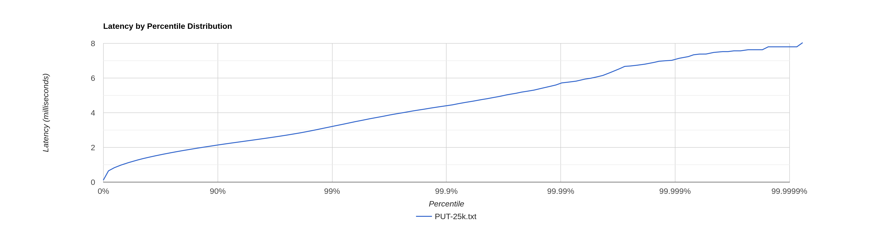
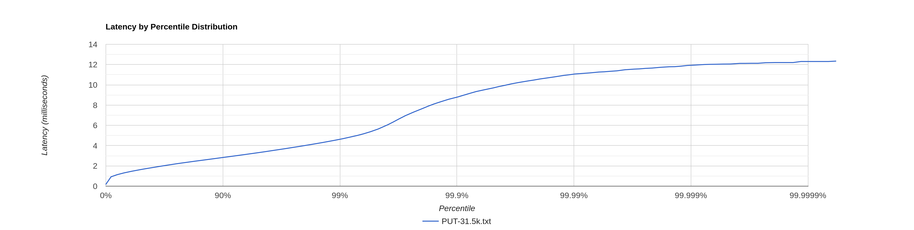
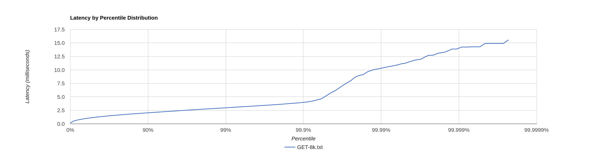

# Stage 5

- [Stage 5](#stage-5)
    * [Конфигурация](#Конфигурация)
    * [PUT](#put)
        + [CPU profile](#cpu-profile)
        + [Alloc profile](#alloc-profile)
        + [Lock profile](#lock-profile)
    * [GET](#get)
        + [CPU profile](#cpu-profile-1)
        + [Alloc profile](#alloc-profile-1)
        + [Lock profile](#lock-profile-1)

## Конфигурация

wrk2 - 64 connections, 4 threads

Конфигурация кластера - 3 ноды, запущенные в отдельных процессах. Профилируем ноду, на которую шлём все запросы.

Запросы без параметров ack и from -> по умолчанию реплицирование 2 из 3

## PUT

[PUT-60k.txt](PUT-60k.txt)

```
  Thread Stats   Avg      Stdev     Max   +/- Stdev
    Latency    12.97s     5.67s   23.43s    58.22%
    Req/Sec     9.02k   283.19     9.27k    87.50%
  Latency Distribution (HdrHistogram - Recorded Latency)
 50.000%   12.80s 
 75.000%   17.84s 
 90.000%   20.92s 
 99.000%   23.17s 
 99.900%   23.38s 
 99.990%   23.41s 
 99.999%   23.43s 
100.000%   23.45s
----------------------------------------------------------
  2194003 requests in 1.00m, 140.19MB read
  Non-2xx or 3xx responses: 1
Requests/sec:  36566.85
Transfer/sec:      2.34MB 
```

60k RPS мы всё ещё не держим, но показатели лучше, чем в [прошлой реализации](../stage4/PUT-60k.txt) - wrk удалось
пропихнуть на 6.5k RPS больше. Посмотрим, что происходит на нагрузке в 25k RPS:

[PUT-25k.txt](PUT-25k.txt)

```
  Thread Stats   Avg      Stdev     Max   +/- Stdev
    Latency     1.35ms  609.01us   8.03ms   70.39%
    Req/Sec     6.25k     8.63     6.28k    76.12%
  Latency Distribution (HdrHistogram - Recorded Latency)
 50.000%    1.27ms
 75.000%    1.70ms
 90.000%    2.13ms
 99.000%    3.20ms
 99.900%    4.40ms
 99.990%    5.68ms
 99.999%    7.04ms
100.000%    8.03ms
```



Latency на нагрузке в 25k RPS уменьшились в 2 раза, а график теперь похож на прямую зависимость.
Имеет смысл найти новую точку разладки. Очевидно, что это где-то между 25k и 36.5k (столько максимум смог впихнуть wrk
при требуемой от него нагрузки в 60k RPS).

Путём экспериментов была выбрана точка разладки в 31.5к RPS.

[PUT-31.5k.txt](PUT-31.5k.txt)

```
  Thread Stats   Avg      Stdev     Max   +/- Stdev
    Latency     1.79ms    0.88ms  12.33ms   77.46%
    Req/Sec     8.30k   813.43    12.00k    72.55%
  Latency Distribution (HdrHistogram - Recorded Latency)
 50.000%    1.63ms
 75.000%    2.19ms
 90.000%    2.82ms
 99.000%    4.61ms
 99.900%    8.77ms
 99.990%   11.05ms
 99.999%   11.90ms
100.000%   12.34ms
```



Благодаря асинхронным операциям удалось нарастить пропускную способность нашего кластера на 26%. Теперь мы по-настоящему
ждём 2 успешных ответа из 3 и после этого отвечаем на запрос, соответственно, 1/3 самых медленных запросов выполняется,
но мы не ждём их полного завершения. Это в целом коррелирует с приростом в 26%.

### CPU profile

[PUT-31k-cpu.html](PUT-31k-cpu.html)

На профиле также, как и в [прошлый раз](../stage4/report.md#cpu-profile) видно работу GC - 6% от общего числа сэмплов.

Уменьшилось количество сэмплов метода `handleEntityRequest` по сравнению
с [предыдущим stage](../stage4/PUT-25k-cpu.html):

1. В 2 раза меньше сэмплов в методе `processRemote`, так как теперь мы обрабатываем ответы в
   отдельном `ExecutorService`.
2. `LsmCustomSession::sendResponse` выполняется тоже асинхронно в отдельном `ExecutorService`.

В остальном профиль в целом такой же.

### Alloc profile

Аллокации не изменились (в рамках погрешности) (раньше было так [PUT-25k-alloc.html](../stage4/PUT-25k-alloc.html)):

[PUT-31k-alloc.html](PUT-31k-alloc.html)

### Lock profile

[PUT-31k-lock.html](PUT-31k-lock.html)

Блокировки относительно [прошлого результата](../stage4/PUT-25k-lock.html) изменились:

1. Появились явные блокировки на `HttpClient` при вызове метода `sendAsync`.
2. Блокировки на методе `HttpClient::cancelTimer` из-за того, что таймаут теперь реализуется не с помощью
   метода `CompletableFututre::get`, а при создании запроса через builder.
3. Блокировки на внутренних локах `HttpClient`
4. Почти исчезли блокировки на `EPollSelectorImpl::wakeup` - вероятно из-за лучшей утилизации пула потоков, который мы
   передали в `HttpClient`, ведь теперь мы не последовательно выполняем 1, а потом второй запрос (в рамках одного
   пришедшего запроса), а 2 запроса параллельно, что, вероятно, позволяет потокам не ждать события сокета, а заниматься
   обработкой других запросов.

## GET

База объемом ~1.5G, каждая нода хранит около 517mb.

[GET-30k.txt](GET-30k.txt)

```
  Thread Stats   Avg      Stdev     Max   +/- Stdev
    Latency    19.15s     7.91s   33.08s    57.83%
    Req/Sec     3.40k    14.14     3.42k    62.50%
  Latency Distribution (HdrHistogram - Recorded Latency)
 50.000%   19.12s 
 75.000%   25.99s 
 90.000%   30.21s 
 99.000%   32.65s 
 99.900%   32.92s 
 99.990%   33.01s 
 99.999%   33.08s 
100.000%   33.10s 
----------------------------------------------------------
  811430 requests in 1.00m, 39.88MB read
  Non-2xx or 3xx responses: 31216
Requests/sec:  13523.69
Transfer/sec:    680.56KB
```

Ошибки Non-2xx or 3xx responses связаны с тем, что иногда мы ищем ключ, которого нет в нашем dao.

Показатели latency GET запросов тоже стали лучше относительно [прошлого результата](../stage4/GET-30k.txt). wrk уже смог
пропихнуть не 10k RPS, а 13.5k.

[GET-8k.txt](GET-8k.txt)

```
  Thread Stats   Avg      Stdev     Max   +/- Stdev
    Latency     1.24ms  620.90us  15.56ms   70.23%
    Req/Sec     2.11k   153.09     4.00k    73.39%
  Latency Distribution (HdrHistogram - Recorded Latency)
 50.000%    1.17ms
 75.000%    1.60ms
 90.000%    2.03ms
 99.000%    2.96ms
 99.900%    3.96ms
 99.990%   10.31ms
 99.999%   13.86ms
100.000%   15.57ms
```

Но точка разладки по всей видимости примерно такая же, как и была (либо поднялась, но на незначительные показатели).



### CPU profile

[GET-8k-cpu.html](GET-8k-cpu.html)

1. В 2 раза меньше сэмплов в методе `processRemote`, так как теперь мы обрабатываем ответы в
   отдельном `ExecutorService`.
2. `LsmCustomSession::sendResponse` выполняется тоже асинхронно в отдельном `ExecutorService` - пропали столбики из
   метода `handleEntityRequest`.
3. Чуть-чуть больше стало (~1% против 0.33% ранее) сэмплов GC - вероятно из-за того, что асинхронные операции добавили
   разных аллокаций внутреннего мира `HttpClient`.

В остальном профиль не поменялся относительно [прошлого](../stage4/GET-8k-cpu-2.html).

### Alloc profile

[GET-8k-alloc.html](GET-8k-alloc.html)

С точки зрения аллокаций тут всё снова примерно также, как и [было](../stage4/GET-8k-alloc-2.html).

Меньше аллокаций в методе `purgeExpiredConnectionsAndReturnNextDeadline` - 2% сэмплов было, а стало 0.09%. Скорее всего
мы теперь лучше переиспользуем соединения.

### Lock profile

[GET-8k-lock.html](GET-8k-lock.html)

Локи изменились сильнее:

1. Также, как и в PUT, появились явные блокировки на `HttpClient` при вызове метода `sendAsync` из-за асинхронности -
   ранее 2 запроса к кластеру выполнялись последовательно, а теперь параллельно и один из них всегда ждёт лок.
2. Появились блокировки на методе `HttpClient::registerTimer` из-за того, что таймаут теперь реализуется не с помощью
   метода `CompletableFututre::get`, а при создании запроса через builder.
3. Количество сэмплов на `purgeExpiredConnectionsAndReturnNextDeadline` тоже увеличилось. Вероятно, стало больше гонок
   из-за параллельного выполнения запросов к кластеру - отсюда и локи.
