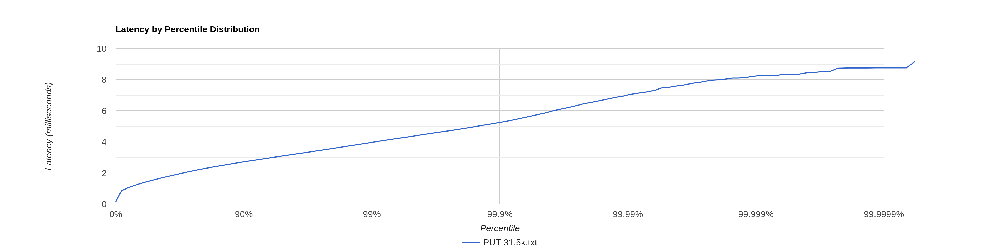
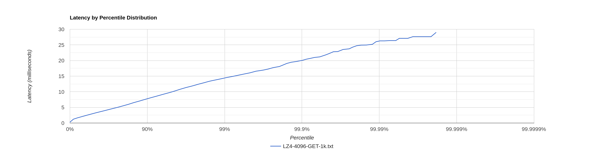

# Stage 5

## Конфигурация

wrk2 - 64 connections, 4 threads

Конфигурация кластера - 3 ноды, запущенные в отдельных процессах. Профилируем ноду, на которую шлём все запросы.

Запросы без параметров ack и from -> по умолчанию реплицирование 2 из 3

## LZ4 - блок 4kb

### PUT

[PUT-31.5k.txt](PUT-31.5k.txt)

```
  Thread Stats   Avg      Stdev     Max   +/- Stdev
    Latency     1.68ms  758.49us   9.14ms   70.52%
    Req/Sec     8.30k   762.83    13.00k    71.62%
  Latency Distribution (HdrHistogram - Recorded Latency)
 50.000%    1.55ms
 75.000%    2.12ms
 90.000%    2.70ms
 99.000%    3.95ms
 99.900%    5.24ms
 99.990%    7.02ms
 99.999%    8.20ms
100.000%    9.15ms
```

Показатели лучше, чем в [прошлой реализации](../stage5/PUT-31.5k.txt) - задержки 99.000%-100.000% стали меньше на 3-4ms,
а это ~25%. Но в логах всех нод появилось больше записей debug и warn логов:

```
14:14:56.238 [local-processor-8] DEBUG ru.vk.itmo.test.viktorkorotkikh.LSMServerImpl -- Entity(id=key1541093) is too big to be putted into memtable
14:14:56.238 [local-processor-6] DEBUG ru.vk.itmo.test.viktorkorotkikh.LSMServerImpl -- Entity(id=key480766) is too big to be putted into memtable
14:14:57.674 [local-processor-5] DEBUG ru.vk.itmo.test.viktorkorotkikh.LSMServerImpl -- Entity(id=key1519447) is too big to be putted into memtable
14:14:59.051 [local-processor-4] WARN ru.vk.itmo.test.viktorkorotkikh.LSMServerImpl -- Too many flushes
```

Они были и раньше, но в меньшем количестве.

Ошибки эти связаны с тем, что фоновый флаш работает дольше, ведь нам теперь нужно сжимать sstable. Отсюда в первую 
очередь появляется ошибка `Too many flushes`. `is too big to be putted into memtable` возникает из-за этого же.

Так как у нас по умолчанию реплицирование 2 из 3 нод, то эти сообщения мало влияют на ошибки wrk (их всего 6), но 
ускоряют ответ ноды, так как не нужно производить действия по записи в memTable и по запуску фонового флаша. Так что 
уменьшение задержек скорее всего связано с этим.

Гистограмма примерно такая же, как и [в прошлый раз](../stage5/PUT-31.5k-histogram.png):



#### CPU profile

[LZ4-4096-cpu.html](LZ4-4096-PUT-cpu.html)

На профиле также, как и в [прошлый раз](../stage5/PUT-31.5k-af-cpu.html) видно работу GC - 5% от общего числа сэмплов.

Чуть-чуть увеличилось количество сэмплов метода `ArrayBlockingQueue::take` (на 2%). Предположительно это может быть 
связано с теми же ошибками выше. Мы параллельно обрабатываем 3 запроса: локальный (метод `processLocalAsync`) и 2 кластерных http 
запроса (метод `processRemote`). Какой-то из этих запрос завершается гораздо раньше из-за медленного флаша и получается, 
что один из пулов потоков ожидает новые задачи. Да, у нас поступают далее новые запросы, но первая их часть с высокой 
долей вероятности тоже пройдут с ошибкой, так как фоновые процессы флаша могли ещё не успеть закончиться.

В остальном профиль примерно такой же.

#### Alloc profile

Аллокации не изменились (в рамках погрешности) (раньше было так [PUT-31.5k-af-alloc.html](../stage5/PUT-31.5k-af-alloc.html)):

[LZ4-4096-alloc.html](LZ4-4096-PUT-alloc.html)

#### Lock profile

[LZ4-4096-PUT-lock.html](LZ4-4096-PUT-lock.html)[PUT-31k-lock.html](PUT-31k-lock.html)

Блокировки относительно [прошлого результата](../stage5/PUT-31.5k-af-lock.html) остались приблизительно такими же.

### GET

База объемом ~900mb, каждая нода хранит около 299mb.

[LZ4-4096-GET-8k.txt](LZ4-4096-GET-8k.txt)

```
  Thread Stats   Avg      Stdev     Max   +/- Stdev
    Latency    28.16s    11.81s   49.12s    57.68%
    Req/Sec   367.42      2.69   372.00     91.67%
  Latency Distribution (HdrHistogram - Recorded Latency)
 50.000%   28.20s 
 75.000%   38.37s 
 90.000%   44.56s 
 99.000%   48.30s 
 99.900%   48.86s 
 99.990%   48.99s 
 99.999%   49.12s 
100.000%   49.15s 
----------------------------------------------------------
  88365 requests in 1.00m, 4.30MB read
  Non-2xx or 3xx responses: 888
Requests/sec:   1472.61
Transfer/sec:     73.36KB
```

Ошибки Non-2xx or 3xx responses связаны с тем, что иногда мы ищем ключ, которого нет в нашем dao.

Показатели latency GET запросов стали ожидаемо хуже относительно [прошлого результата](../stage5/GET-8k-after-fix.txt).
wrk смог пропихнуть только 1.5k RPS. Нужно снижать нагрузку.

На 1k RPS уже ситуация лучше:
[LZ4-4096-GET-1k.txt](LZ4-4096-GET-1k.txt)

```
  Thread Stats   Avg      Stdev     Max   +/- Stdev
    Latency     3.86ms    2.93ms  28.98ms   81.50%
    Req/Sec   258.59     79.45   666.00     71.73%
  Latency Distribution (HdrHistogram - Recorded Latency)
 50.000%    3.02ms
 75.000%    4.90ms
 90.000%    7.74ms
 99.000%   14.40ms
 99.900%   20.01ms
 99.990%   26.00ms
 99.999%   28.99ms
100.000%   28.99ms
```



Вероятно точка разладки находится недалеко от 1k RPS.

#### CPU profile

[LZ4-4096-GET-cpu.html](LZ4-4096-GET-cpu.html)

На cpu профиле отчётливо видно, что расжатие данных занимает львиную долю всех семплов - 66%. Http взаимодействие с 
кластером отошло на задний план и почти не заметно.

Также стало больше видно GC - 3% вместо 0.75% в прошлый раз. 

#### Alloc profile

[LZ4-4096-GET-alloc.html](LZ4-4096-GET-alloc.html)

С точки зрения аллокаций тут тоже основное внимание направлено на расжимание данных 
([было](../stage5/GET-8k-af-alloc.html)).

Очень много аллокаций в методе `CompressedSSTableReader::getBuffer` (почти 70%). Вероятно стоит пересмотреть подход с 
использованием `ScopedValue` и оптимизировать аллокации тут.

#### Lock profile

[LZ4-4096-GET-lock.html](LZ4-4096-GET-lock.html)

Локи ожидаемо поменялись:

1. Изменился характер сэмплов в `SelectorManager` - исчезли блокировки у `AsyncEventTrigger`. У нас упала нагрузка, 
   стало меньше параллельных запросов, меньше гонок.
2. Но при этом увеличилось количество сэмлпов у `responseAsync` метода - больше локов у `EPollSelectorImpl::wakeup`, 
   так как обработка запроса нодой из кластера стала тяжелее и занимает больше времени.

