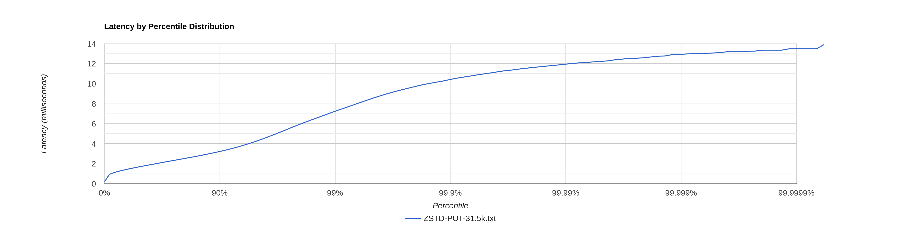
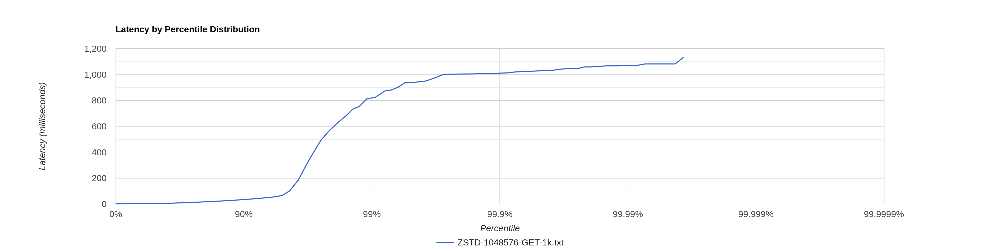

# Stage 7

- [Stage 7](#stage-7)
    * [Конфигурация](#конфигурация)
    * [LZ4 - блок 4kb](#lz4---блок-4kb)
        + [PUT](#put)
            - [CPU profile](#cpu-profile)
            - [Alloc profile](#alloc-profile)
            - [Lock profile](#lock-profile)
        + [GET](#get)
            - [CPU profile](#cpu-profile-1)
            - [Alloc profile](#alloc-profile-1)
            - [Lock profile](#lock-profile-1)
        + [Range](#range)
            - [Cpu profile](#cpu-profile-2)
            - [Alloc profile](#alloc-profile-2)
            - [Lock profile](#lock-profile-2)
    * [ZSTD - блок 4kb](#zstd---блок-4kb)
        + [PUT](#put-1)
            - [CPU profile](#cpu-profile-3)
            - [Alloc profile](#alloc-profile-3)
            - [Lock profile](#lock-profile-3)
        + [GET](#get-1)
            - [CPU profile](#cpu-profile-4)
            - [Alloc profile](#alloc-profile-4)
            - [Lock profile](#lock-profile-4)
        + [Range](#range-1)
            - [Cpu profile](#cpu-profile-5)
            - [Alloc profile](#alloc-profile-5)
            - [Lock profile](#lock-profile-5)
    * [ZSTD - блок 1mb](#zstd---блок-1mb)
        + [GET](#get-2)
            - [CPU profile](#cpu-profile-6)
            - [Alloc profile](#alloc-profile-6)
            - [Lock profile](#lock-profile-6)
    * [Итого](#итого)

## Конфигурация

wrk2 - 64 connections, 4 threads

Конфигурация кластера - 3 ноды, запущенные в отдельных процессах. Профилируем ноду, на которую шлём все запросы.

Запросы без параметров ack и from -> по умолчанию реплицирование 2 из 3

## LZ4 - блок 4kb

### PUT

[PUT-31.5k.txt](PUT-31.5k.txt)

```
  Thread Stats   Avg      Stdev     Max   +/- Stdev
    Latency     1.68ms  758.49us   9.14ms   70.52%
    Req/Sec     8.30k   762.83    13.00k    71.62%
  Latency Distribution (HdrHistogram - Recorded Latency)
 50.000%    1.55ms
 75.000%    2.12ms
 90.000%    2.70ms
 99.000%    3.95ms
 99.900%    5.24ms
 99.990%    7.02ms
 99.999%    8.20ms
100.000%    9.15ms
```

Показатели лучше, чем в [прошлой реализации](../stage5/PUT-31.5k.txt) - задержки 99.000%-100.000% стали меньше на 3-4ms,
а это ~25%. Но в логах всех нод появилось больше записей debug и warn логов:

```
14:14:56.238 [local-processor-8] DEBUG ru.vk.itmo.test.viktorkorotkikh.LSMServerImpl -- Entity(id=key1541093) is too big to be putted into memtable
14:14:56.238 [local-processor-6] DEBUG ru.vk.itmo.test.viktorkorotkikh.LSMServerImpl -- Entity(id=key480766) is too big to be putted into memtable
14:14:57.674 [local-processor-5] DEBUG ru.vk.itmo.test.viktorkorotkikh.LSMServerImpl -- Entity(id=key1519447) is too big to be putted into memtable
14:14:59.051 [local-processor-4] WARN ru.vk.itmo.test.viktorkorotkikh.LSMServerImpl -- Too many flushes
```

Они были и раньше, но в меньшем количестве.

Ошибки эти связаны с тем, что фоновый флаш работает дольше, ведь нам теперь нужно сжимать sstable. Отсюда в первую
очередь появляется ошибка `Too many flushes`. `is too big to be putted into memtable` возникает из-за этого же.

Так как у нас по умолчанию реплицирование 2 из 3 нод, то эти сообщения мало влияют на ошибки wrk (их всего 6), но
ускоряют ответ ноды, так как не нужно производить действия по записи в memTable и по запуску фонового флаша. Так что
уменьшение задержек скорее всего связано с этим.

Гистограмма примерно такая же, как и [в прошлый раз](../stage5/PUT-31.5k-histogram.png):


#### CPU profile

[LZ4-4096-cpu.html](LZ4-4096-PUT-cpu.html)

На профиле также, как и в [прошлый раз](../stage5/PUT-31.5k-af-cpu.html) видно работу GC - 5% от общего числа сэмплов.

Чуть-чуть увеличилось количество сэмплов метода `ArrayBlockingQueue::take` (на 2%). Предположительно это может быть
связано с теми же ошибками выше. Мы параллельно обрабатываем 3 запроса: локальный (метод `processLocalAsync`) и 2
кластерных http
запроса (метод `processRemote`). Какой-то из этих запрос завершается гораздо раньше из-за медленного флаша и получается,
что один из пулов потоков ожидает новые задачи. Да, у нас поступают далее новые запросы, но первая их часть с высокой
долей вероятности тоже пройдут с ошибкой, так как фоновые процессы флаша могли ещё не успеть закончиться.

В остальном профиль примерно такой же.

#### Alloc profile

Аллокации не изменились (в рамках погрешности) (раньше было
так [PUT-31.5k-af-alloc.html](../stage5/PUT-31.5k-af-alloc.html)):

[LZ4-4096-alloc.html](LZ4-4096-PUT-alloc.html)

#### Lock profile

[LZ4-4096-PUT-lock.html](LZ4-4096-PUT-lock.html)

Блокировки относительно [прошлого результата](../stage5/PUT-31.5k-af-lock.html) остались приблизительно такими же.

### GET

База объемом ~900mb, каждая нода хранит около 299mb.

[LZ4-4096-GET-8k.txt](LZ4-4096-GET-8k.txt)

```
  Thread Stats   Avg      Stdev     Max   +/- Stdev
    Latency    28.16s    11.81s   49.12s    57.68%
    Req/Sec   367.42      2.69   372.00     91.67%
  Latency Distribution (HdrHistogram - Recorded Latency)
 50.000%   28.20s 
 75.000%   38.37s 
 90.000%   44.56s 
 99.000%   48.30s 
 99.900%   48.86s 
 99.990%   48.99s 
 99.999%   49.12s 
100.000%   49.15s 
----------------------------------------------------------
  88365 requests in 1.00m, 4.30MB read
  Non-2xx or 3xx responses: 888
Requests/sec:   1472.61
Transfer/sec:     73.36KB
```

Ошибки Non-2xx or 3xx responses связаны с тем, что иногда мы ищем ключ, которого нет в нашем dao.

Показатели latency GET запросов стали ожидаемо хуже относительно [прошлого результата](../stage5/GET-8k-after-fix.txt).
wrk смог пропихнуть только 1.5k RPS. Нужно снижать нагрузку.

На 1k RPS уже ситуация лучше:
[LZ4-4096-GET-1k.txt](LZ4-4096-GET-1k.txt)

```
  Thread Stats   Avg      Stdev     Max   +/- Stdev
    Latency     3.86ms    2.93ms  28.98ms   81.50%
    Req/Sec   258.59     79.45   666.00     71.73%
  Latency Distribution (HdrHistogram - Recorded Latency)
 50.000%    3.02ms
 75.000%    4.90ms
 90.000%    7.74ms
 99.000%   14.40ms
 99.900%   20.01ms
 99.990%   26.00ms
 99.999%   28.99ms
100.000%   28.99ms
```


Вероятно точка разладки находится недалеко от 1k RPS.

#### CPU profile

[LZ4-4096-GET-cpu.html](LZ4-4096-GET-cpu.html)

На cpu профиле отчётливо видно, что расжатие данных занимает львиную долю всех семплов - 66%. Http взаимодействие с
кластером отошло на задний план и почти не заметно.

Также стало больше видно GC - 3% вместо 0.75% в прошлый раз.

#### Alloc profile

[LZ4-4096-GET-alloc.html](LZ4-4096-GET-alloc.html)

С точки зрения аллокаций тут тоже основное внимание направлено на расжимание данных
([было](../stage5/GET-8k-af-alloc.html)).

Очень много аллокаций в методе `CompressedSSTableReader::getBuffer` (почти 70%). Вероятно стоит пересмотреть подход с
использованием `ScopedValue` и оптимизировать аллокации тут.

#### Lock profile

[LZ4-4096-GET-lock.html](LZ4-4096-GET-lock.html)

Локи ожидаемо поменялись:

1. Изменился характер сэмплов в `SelectorManager` - исчезли блокировки у `AsyncEventTrigger`. У нас упала нагрузка,
   стало меньше параллельных запросов, меньше гонок.
2. Но при этом увеличилось количество сэмлпов у `responseAsync` метода - больше локов у `EPollSelectorImpl::wakeup`,
   так как обработка запроса нодой из кластера стала тяжелее и занимает больше времени.

### Range

#### Cpu profile

[LZ4-4096-RANGE-cpu.html](LZ4-4096-RANGE-cpu.html)

Видно работу GC - 1%. Также видно, что расжимать данные приходится при вызове метода `Iterator::next` 2 раза - при
сдвиге итераторов и при получении следующего элемента. Без этого вероятно никак, так как размер блока 4kb, а несжатый
размер sstable около 1mb, то есть при сдвиге итератора мы можем попасть в ситуацию, когда следующий entry в другом
блоке или на их границе. А структура индекса нам не позволяет пропускать элементы без их чтения. Как минимум потому, что
необходимо потом сравнивать итераторы по ключам entry, а для этого нам нужно его прочесть (без сжатия нас спасал mmap).

#### Alloc profile

[LZ4-4096-RANGE-alloc.html](LZ4-4096-RANGE-alloc.html)

Аллокации в целом тоже приемлемые - мы выделяем память на scopedValueCarrier, выделяем массивы байт при чтении entry
(размер ключа, сам ключ, размер value, само value, таймстемп - всё это мы должны выделить из расжатого блока и собрать в
TimestampedEntry).

#### Lock profile

[LZ4-4096-RANGE-lock.html](LZ4-4096-RANGE-lock.html)

Локов также нет (и не должно быть).

## ZSTD - блок 4kb

### PUT

[ZSTD-PUT-31.5k.txt](ZSTD-PUT-31.5k.txt)

```
  Thread Stats   Avg      Stdev     Max   +/- Stdev
    Latency     1.97ms    1.23ms  13.90ms   85.92%
    Req/Sec     8.30k     0.89k   12.11k    70.74%
  Latency Distribution (HdrHistogram - Recorded Latency)
 50.000%    1.68ms
 75.000%    2.32ms
 90.000%    3.21ms
 99.000%    7.23ms
 99.900%   10.41ms
 99.990%   11.95ms
 99.999%   12.91ms
100.000%   13.91ms
```

Показатели хуже, чем у LZ4 и примерно такие же как в [прошлой реализации](../stage5/PUT-31.5k.txt). Возможно, реализация
ZSTD просто
работает несколько медленнее.

Гистограмма примерно такая же, как и [в прошлый раз](../stage5/PUT-31.5k-histogram.png):



#### CPU profile

[ZSTD-4096-PUT-cpu.html](ZSTD-4096-PUT-cpu.html)

Профиль такой же (в рамках погрешности), как и у LZ4.

#### Alloc profile

Аллокации примерено такие же, как и в случае LZ4

[ZSTD-4096-PUT-alloc.html](ZSTD-4096-PUT-alloc.html)

#### Lock profile

[ZSTD-4096-PUT-lock.html](ZSTD-4096-PUT-lock.html)

Профиль блокировок похож на профиль LZ4, но здесь чуть больше (на 2.5%) сэмплов `Exchange::responseAsync`.

### GET

База объемом ~900mb, каждая нода хранит около 297mb.

На 1k RPS ситуация лучше стала значительно хуже:

[ZSTD-4096-GET-1k.txt](ZSTD-4096-GET-1k.txt)

```
  Thread Stats   Avg      Stdev     Max   +/- Stdev
    Latency    21.53s     8.83s   38.40s    56.20%
    Req/Sec    95.50      1.58   100.00     93.75%
  Latency Distribution (HdrHistogram - Recorded Latency)
 50.000%   21.69s 
 75.000%   29.62s 
 90.000%   32.87s 
 99.000%   36.67s 
 99.900%   37.85s 
 99.990%   38.34s 
 99.999%   38.44s 
100.000%   38.44s 
```

При этом уже 37 запросов завершилось с таймаутом.

Точка разладки ещё сильнее сместилась:

[ZSTD-4096-GET-200.txt](ZSTD-4096-GET-200.txt)

```
  Thread Stats   Avg      Stdev     Max   +/- Stdev
    Latency    91.18ms   38.56ms 241.41ms   71.20%
    Req/Sec    49.68     11.89    88.00     81.42%
  Latency Distribution (HdrHistogram - Recorded Latency)
 50.000%   90.30ms
 75.000%  115.39ms
 90.000%  140.93ms
 99.000%  189.44ms
 99.900%  222.34ms
 99.990%  236.03ms
 99.999%  241.54ms
100.000%  241.54ms
```

Дальнейшее снижение RPS не позволяло добиться тех же показателей latency, как у LZ4.

Очевидно, что для продакшн использования такое решение не подойдёт и в данном случае имеет смысл задуматься над фильтром
блума или хотя бы разреженным индексом для sstable (напр. первый ключ в sstable и последний), который бы позволил
сократить количество просматриваемых sstable. Также ещё одной оптимизацией являлось бы добавление кеша разжатых sstable,
чтобы к самым горячим данным мы сразу имели доступ в разжатом виде.

#### CPU profile

[ZSTD-4096-GET-cpu.html](ZSTD-4096-GET-cpu.html)

Как и в прошлый раз с LZ4 расжатие занимает львиную долю всех семплов, но в случае с ZSTD аж 88%. Http взаимодействие с
кластером отошло на задний план и почти не заметно.

GC примерно также - 3.68%.

#### Alloc profile

[ZSTD-4096-GET-alloc.html](ZSTD-4096-GET-alloc.html)

Аллокации в целом такие же, но ZSTD требует дополнительно 2% сэмплов аллокаций `ZstdDecompressedContext`.

#### Lock profile

[ZSTD-4096-GET-lock.html](ZSTD-4096-GET-lock.html)

Увеличилось количество сэмплов метода `ArrayBlockingQueue::take` - у нас меньше нагрузка, пулы потоков простаивают в
ожидании задач.

Блокировки на методах `HttpClient` тоже поменялись: Количество сэмплов на `purgeExpiredConnectionsAndReturnNextDeadline`
увеличилось. Вероятно, из-за долгого ожидания ответов от кластера.

### Range

#### Cpu profile

[ZSTD-4096-RANGE-cpu.html](ZSTD-4096-RANGE-cpu.html)

Видно работу GC - 1.5%. Также видно, что расжимать данные приходится при вызове метода `Iterator::next` 2 раза - при
сдвиге итераторов и при получении следующего элемента. Без этого вероятно никак, так как размер блока 4kb, а несжатый
размер sstable около 1mb, то есть при сдвиге итератора мы можем попасть в ситуацию, когда следующий entry в другом
блоке или на их границе. А структура индекса нам не позволяет пропускать элементы без их чтения. Как минимум потому, что
необходимо потом сравнивать итераторы по ключам entry, а для этого нам нужно его прочесть (без сжатия нас спасал mmap).

#### Alloc profile

[ZSTD-4096-RANGE-alloc.html](ZSTD-4096-RANGE-alloc.html)

Аллокации в целом тоже приемлемые - мы выделяем память на scopedValueCarrier, выделяем массивы байт при чтении entry
(размер ключа, сам ключ, размер value, само value, таймстемп - всё это мы должны выделить из расжатого блока и собрать в
TimestampedEntry).

#### Lock profile

[ZSTD-4096-RANGE-lock.html](ZSTD-4096-RANGE-lock.html)

Локов также нет (и не должно быть).

## ZSTD - блок 1mb

База объемом ~748mb, каждая нода хранит около 250mb. Размер блока - 1mb (равен пределу памяти memtable).

### GET

1k RPS:

```
  Thread Stats   Avg      Stdev     Max   +/- Stdev
    Latency    31.40ms  126.33ms   1.13s    96.06%
    Req/Sec   135.40     41.77   218.00     72.92%
  Latency Distribution (HdrHistogram - Recorded Latency)
 50.000%    1.75ms
 75.000%   11.26ms
 90.000%   32.70ms
 99.000%  813.57ms
 99.900%    1.01s 
 99.990%    1.06s 
 99.999%    1.13s 
100.000%    1.13s 
```

[ZSTD-1048576-GET-1k.txt](ZSTD-1048576-GET-1k.txt)



Показатели задержки стали куда лучше, но для этого пришлось увеличить Xmx до 1024m, иначе из-за множества аллокаций
получали ошибку по хипу. Тем не менее количество таймаутов стало больше. Возможно, это связано с тем, что у нас раньше
было меньше данных, при тех же размерах sstable на диске, так как большие блоки мы могли (возможно) сжимать эффективнее.
И получается, что те же примерно 750-900mb это разное количество key-value данных.

#### CPU profile

[ZSTD-1048576-GET-cpu.html](ZSTD-1048576-GET-cpu.html)

Естественно стало больше работы GC (почти в 2 раза - 7% против 3.68%), так как мы стали аллоцировать бОльшие буффера
памяти, которые после обработки запроса
не используются и попадают под руку GC. Также теперь при аллокации `ByteArraySegment` мы видим работу GC - вызов метода
`G1CollectedHeap::attempt_allocation_humanogous`. Он вызывается из-за того, что регион памяти недостаточно большой,
чтобы аллоцировать в нём новый `ByteArraySegment` размером в 1mb (размер региона от 1 MB до 32 MB в зависимости от
размера heap. Судя по отчёту jmap размер равен как раз 1mb: `G1HeapRegionSize = 1048576 (1.0MB)`).

#### Alloc profile

[ZSTD-1048576-GET-alloc.html](ZSTD-1048576-GET-alloc.html)

С точки зрения аллокаций их количество в методе `readEntry` уменьшилось с 24% до 0.87%. Вероятно из-за того, что блоки
стали больше и по сути мы сразу расжимаем sstable целиком (ведь memTable у нас тоже был размером 1mb ограничен).

#### Lock profile

[ZSTD-1048576-GET-lock.html](ZSTD-1048576-GET-lock.html)

Стало видно локи у логгера - из-за того, что пишем в лог ошибки по таймаутам от других нод.
Больше сэмлпов при работе по сети - валимся с таймаутами, а значит ждём ещё дольше, чем в прошлом эксперименте == весим
на локах.

## Итого

LZ4 оказался лучше по показателям latency, чем ZSTD. Но ZSTD лучше сжимает данные. Например, 1000 entries в ZSTD 
занимают 12327 байт против 18702 байт в LZ4. В данной конфигурации лучше использовать LZ4, потому что ZSTD уж очень 
сильно бьёт по производительности.

Но для продакшн решения стоит посмотреть ещё в сторону фильтра блума, индекса поиска для sstable и кеширования расжатых 
блоков.
